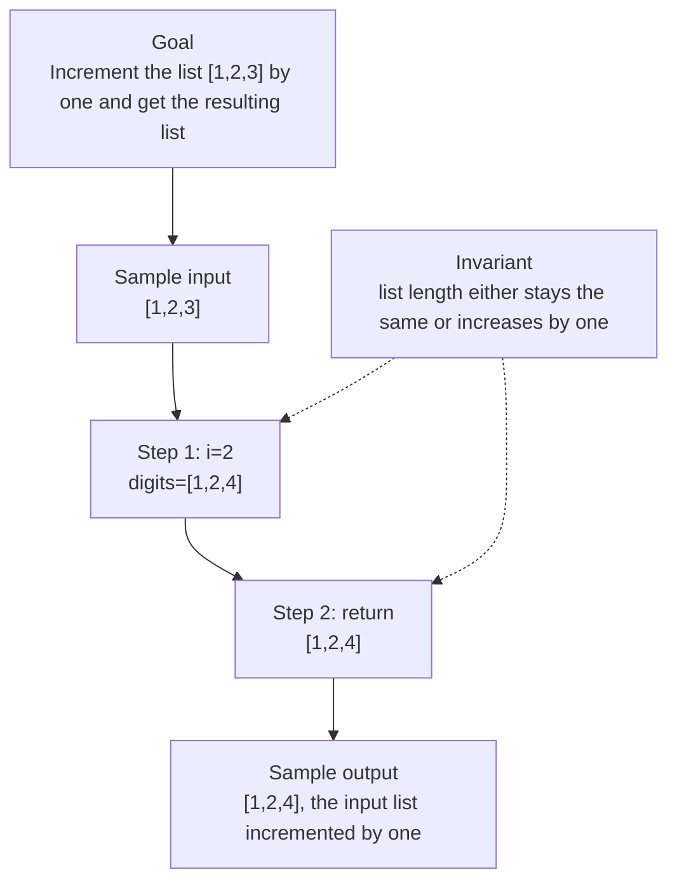

# 0. Plus One

[View problem on LeetCode](https://leetcode.com/problems/plus-one/submissions/2098509941/)

- **Difficulty:** Unknown
- **Language:** Python3
- **Solved:** 2026-08-07 23:30 UTC
- **Runtime:** —
- **Memory:** —

## Interview overview

**Patterns:** iteration, carry-over

Increment a list of digits by one, handling carry-over values. The function iterates through the list in reverse order. If a digit plus one equals ten, it sets the digit to zero and continues to the next digit.

### Solution replay

### Approach

1. Start from the end of the list and iterate backwards
2. Check if the current digit plus one is not equal to ten
3. If true, increment the digit and return the list
4. If false, set the digit to zero and continue to the previous digit
5. If all digits are nine, add a new most significant digit with value one

### Complexity

- **Time:** O(n), where n is the number of digits
- **Space:** O(1), excluding the space required for the output

### Complexity self-check

- **Verdict:** optimal
- **Intended:** O(n) time and O(1) space
- already optimal for this problem

### Edge cases

- empty list
- single digit list
- list with all nines

_AI-generated with Groq; verify the analysis before relying on it._

---
_Synced by [LeetRepo](https://github.com/)_