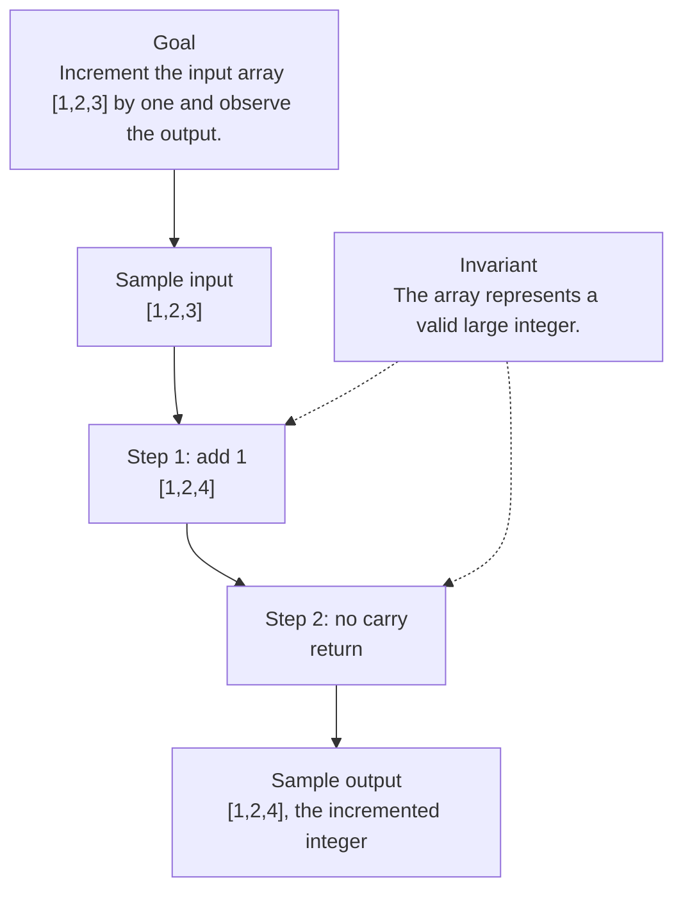

# 0. Plus One

[View problem on LeetCode](https://leetcode.com/problems/plus-one/submissions/2098510171/)

- **Difficulty:** Easy
- **Language:** C++
- **Solved:** 2026-08-07 23:30 UTC
- **Runtime:** 0 ms
- **Memory:** —

## Interview overview

**Patterns:** array iteration, carry propagation

Increment a large integer represented as an array of digits by one. The array is ordered from most significant to least significant. The function iterates through the array from right to left, adding one to each digit until it finds a digit that does not result in a carry.

### Solution replay

### Approach

1. Start from the least significant digit (rightmost) and add one to it.
2. If the result is not 10, return the updated array.
3. If the result is 10, set the current digit to 0 and propagate the carry to the next most significant digit.
4. Repeat the process until a digit does not result in a carry or the most significant digit is reached.
5. If the most significant digit results in a carry, insert a new most significant digit with a value of 1.

### Complexity

- **Time:** O(n), where n is the number of digits in the input array, because in the worst case, we need to iterate through all digits.
- **Space:** O(1), because we only use a constant amount of space to store the loop variable and the carry, except in the case where we need to insert a new most significant digit, which is still O(n) in the worst case but can be considered as part of the output.

### Complexity self-check

- **Verdict:** optimal
- **Intended:** O(n) time and O(1) space for the auxiliary space (not counting the space needed for the output)
- The space complexity could be considered O(n) if we include the output array.

### Edge cases

- Input array with a single digit
- Input array with all digits being 9
- Input array with no digits (empty array)

_AI-generated with Groq; verify the analysis before relying on it._

---
_Synced by [LeetRepo](https://github.com/)_