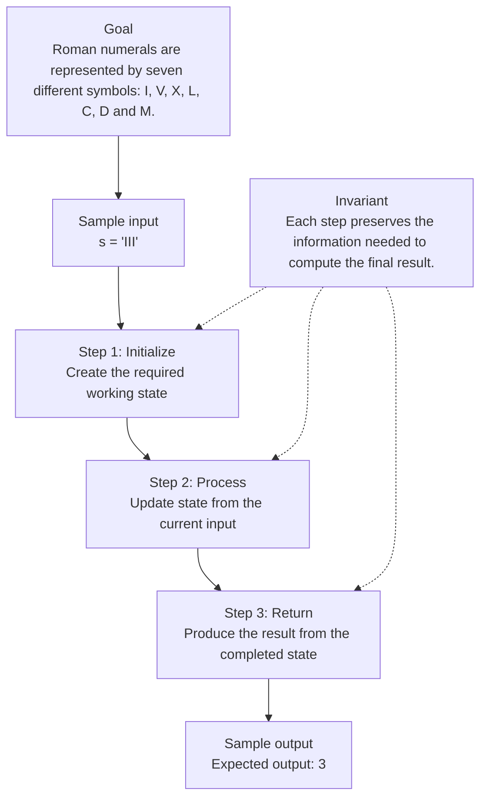

# 0. Roman To Integer

[View problem on LeetCode](https://leetcode.com/problems/roman-to-integer/submissions/2098491391/)

- **Difficulty:** Easy
- **Language:** Code
- **Solved:** 2026-08-07 20:23 UTC
- **Runtime:** —
- **Memory:** —

## Interview overview

**Patterns:** Problem-specific reasoning

Use problem-specific reasoning to organize the key decisions, then verify the invariants against an edge case.

### Solution replay

### Approach

1. State the direct approach and identify its bottleneck.
2. Explain why problem-specific reasoning fits the constraints.
3. Walk through one edge case and justify the final complexity.

---
_Synced by [LeetRepo](https://github.com/)_