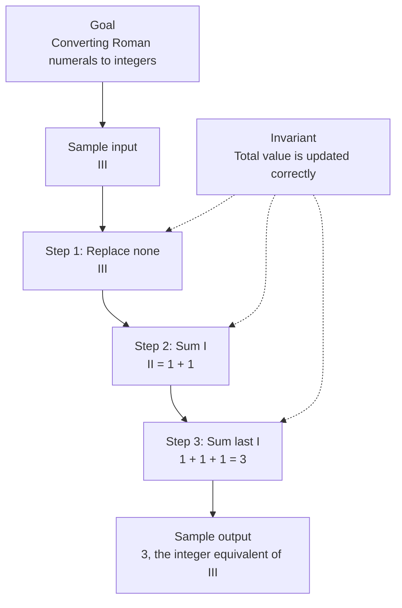

# 0. Roman To Integer

[View problem on LeetCode](https://leetcode.com/problems/roman-to-integer/submissions/2098491391/)

- **Difficulty:** Easy
- **Language:** Code
- **Solved:** 2026-08-07 20:23 UTC
- **Runtime:** —
- **Memory:** —

## Interview overview

**Patterns:** Hash Table, String Replacement

Convert Roman numerals to integers by replacing subtractive notation and summing values.

### Solution replay

### Approach

1. Create a hash table to map Roman numerals to integers
2. Replace subtractive notations with additive equivalents
3. Iterate over the modified string and sum the integer values
4. Return the total integer value

### Complexity

- **Time:** O(n), where n is the length of the input string
- **Space:** O(1), as the hash table has a constant size

### Complexity self-check

- **Verdict:** optimal
- **Intended:** O(n) time and O(1) space
- Linear time complexity due to string iteration

### Edge cases

- Empty input string
- Invalid Roman numerals
- Single-character input

_AI-generated with Groq; verify the analysis before relying on it._

---
_Synced by [LeetRepo](https://github.com/)_