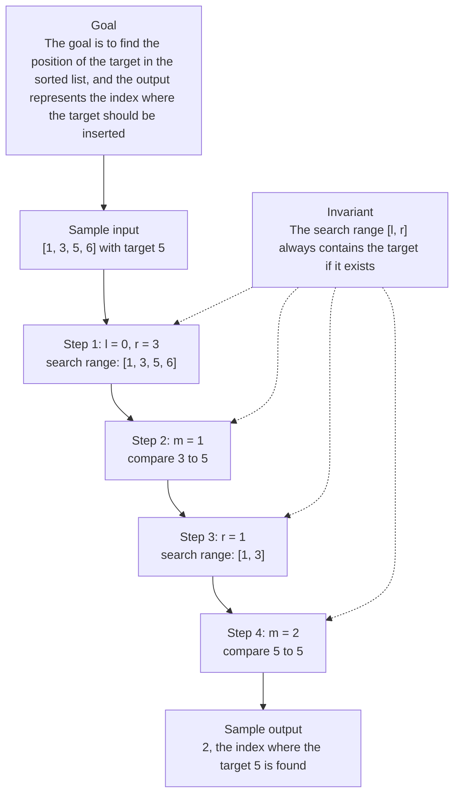

# 0. Search Insert Position

[View problem on LeetCode](https://leetcode.com/problems/search-insert-position/submissions/2098469873/)

- **Difficulty:** Unknown
- **Language:** Code
- **Runtime:** —
- **Memory:** —

## Interview overview

**Patterns:** Binary Search

This solution uses binary search to find the position of a target in a sorted list. If the target is found, its index is returned; otherwise, the index where it should be inserted is returned. The algorithm maintains a search range [l, r] and iteratively narrows it down.

### Solution replay

### Approach

1. Initialize the search range [l, r] to the entire list
2. Calculate the middle index m of the current search range
3. Compare the middle element to the target and adjust the search range accordingly
4. Repeat the comparison and adjustment until the target is found or the search range is empty
5. If the target is not found, return the index where it should be inserted

### Complexity

- **Time:** O(log n) because the algorithm divides the search space in half at each step
- **Space:** O(1) because only a constant amount of space is used

### Complexity self-check

- **Verdict:** optimal
- **Intended:** O(log n) time and O(1) space
- This is the best possible time complexity for searching in a sorted list

### Edge cases

- An empty list
- A list with a single element
- A list where the target is the smallest or largest element

_AI-generated with Groq; verify the analysis before relying on it._

## Personal notes

this is basically just binary search

---
_Synced by [LeetRepo](https://github.com/)_