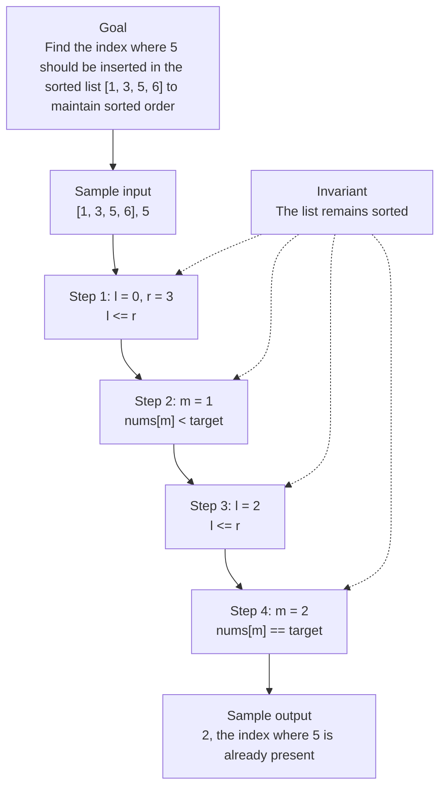

# 0. Search Insert Position

[View problem on LeetCode](https://leetcode.com/problems/search-insert-position/)

- **Difficulty:** Unknown
- **Language:** Code
- **Solved:** 2026-08-07 22:00 UTC
- **Runtime:** —
- **Memory:** —

## Interview overview

**Patterns:** Binary Search

This solution finds the index where a target value should be inserted in a sorted list to maintain sorted order. It uses a binary search approach to achieve this. The function returns the index where the target should be inserted.

### Solution replay

### Approach

1. Initialize two pointers, left and right, to the start and end of the list
2. Loop until left is less than or equal to right
3. Calculate the middle index and compare the middle element to the target
4. If the middle element is equal to the target, return the middle index
5. If the middle element is greater than the target, update the right pointer to the index before the middle
6. If the middle element is less than the target, update the left pointer to the index after the middle

### Complexity

- **Time:** O(log n), where n is the number of elements in the list, because we divide the search space in half at each step
- **Space:** O(1), because we only use a constant amount of space to store the pointers and the target

### Complexity self-check

- **Verdict:** optimal
- **Intended:** O(log n) time and O(1) space
- This is the best possible time complexity for this problem because we must examine each element at least once in the worst case

### Edge cases

- An empty list
- A list with one element
- A list with duplicate elements
- A target that is less than the smallest element in the list

_AI-generated with Groq; verify the analysis before relying on it._

## Personal notes

this is basically just binary search

---
_Synced by [LeetRepo](https://github.com/)_