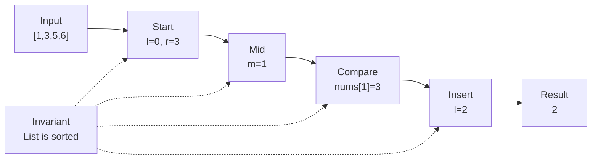

# 0. Search Insert Position

[View problem on LeetCode](https://leetcode.com/problems/search-insert-position/submissions/2098469873/)

- **Difficulty:** Unknown
- **Language:** Code
- **Runtime:** —
- **Memory:** —

## Interview overview

**Patterns:** Binary Search

This solution uses binary search to find the target in a sorted list. If the target is found, its index is returned; otherwise, the index where it should be inserted is returned. The list is assumed to be sorted in ascending order.

### Solution replay

### Approach

1. Initialize two pointers, one at the start and one at the end of the list
2. Calculate the middle index and compare the middle element to the target
3. If the middle element is equal to the target, return the middle index
4. If the middle element is greater than the target, move the right pointer to the left of the middle index
5. If the middle element is less than the target, move the left pointer to the right of the middle index
6. Repeat the process until the left pointer is greater than the right pointer, then return the left pointer as the insertion index

### Complexity

- **Time:** O(log n) because the solution uses binary search, which reduces the search space by half at each step
- **Space:** O(1) because the solution only uses a constant amount of space to store the pointers and the target

### Complexity self-check

- **Verdict:** optimal
- **Intended:** O(log n) time and O(1) space
- This is the best possible time complexity for searching in a sorted list

### Edge cases

- An empty list
- A list with one element
- A list with duplicate elements
- A target that is not in the list

_AI-generated with Groq; verify the analysis before relying on it._

## Personal notes

this is basically just binary search

---
_Synced by [LeetRepo](https://github.com/)_