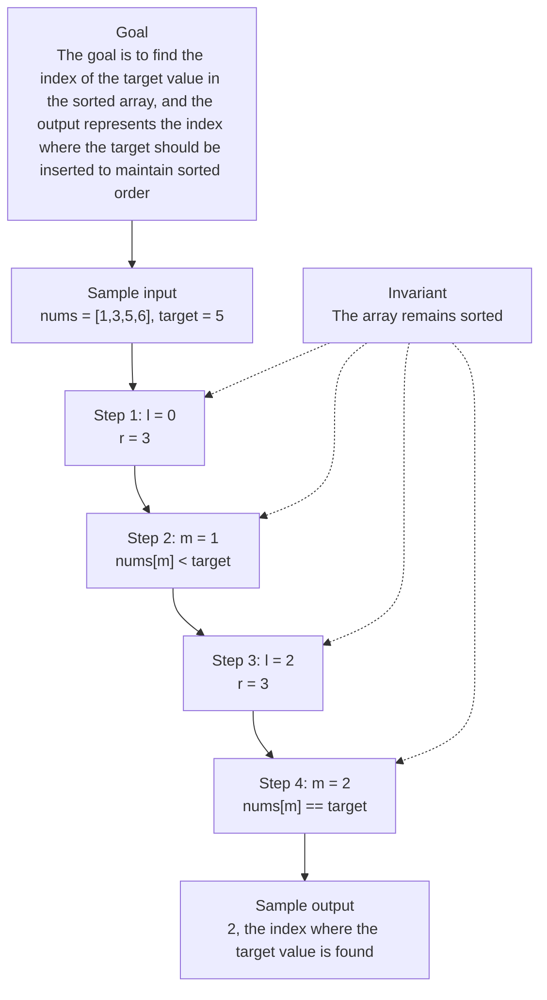

# 0. Search Insert Position

[View problem on LeetCode](https://leetcode.com/problems/search-insert-position/)

- **Difficulty:** Easy
- **Language:** Code
- **Solved:** 2026-08-07 22:00 UTC
- **Runtime:** 0 ms
- **Memory:** —

## Interview overview

**Patterns:** Binary Search

This solution uses binary search to find the index of a target value in a sorted array. If the target is not found, it returns the index where it should be inserted to maintain sorted order. The algorithm iteratively narrows down the search range until the target is found or the correct insertion point is determined.

### Solution replay

### Approach

1. Initialize two pointers, one at the start and one at the end of the array
2. Calculate the middle index and compare the middle element to the target
3. If the middle element matches the target, return its index
4. If the middle element is greater than the target, move the right pointer to the left of the middle
5. If the middle element is less than the target, move the left pointer to the right of the middle
6. Repeat the comparison and pointer adjustment until the target is found or the correct insertion point is determined

### Complexity

- **Time:** O(log n), because the algorithm divides the search space in half with each iteration
- **Space:** O(1), because the algorithm only uses a constant amount of space to store the pointers and the target

### Complexity self-check

- **Verdict:** optimal
- **Intended:** O(log n) time and O(1) space
- This is the best possible time complexity for searching a sorted array

### Edge cases

- An empty array
- An array with a single element
- An array with duplicate elements (not applicable in this case, since the problem states the array has distinct integers)
- A target value that is less than the smallest element in the array

_AI-generated with Groq; verify the analysis before relying on it._

## Personal notes

this is basically just binary search

---
_Synced by [LeetRepo](https://github.com/)_