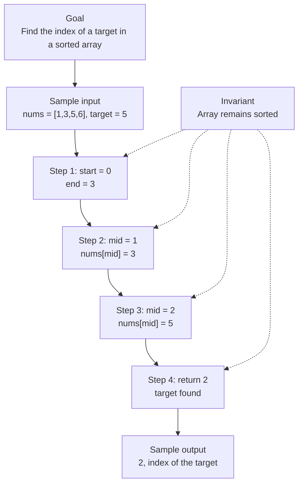

# 0. Search Insert Position

[View problem on LeetCode](https://leetcode.com/problems/search-insert-position/submissions/2098498832/)

- **Difficulty:** Easy
- **Language:** Code
- **Solved:** 2026-08-07 22:00 UTC
- **Runtime:** —
- **Memory:** —

## Interview overview

**Patterns:** Binary Search

Find the index of a target in a sorted array or where it should be inserted. The array contains distinct integers and is sorted in ascending order. The solution returns the index where the target is found or should be inserted.

### Solution replay

### Approach

1. Initialize two pointers, one at the start and one at the end of the array
2. Compare the target with the middle element and adjust the pointers accordingly
3. Repeat the comparison until the target is found or the pointers meet
4. If the target is not found, return the index where it should be inserted
5. Use a loop to perform the binary search
6. Handle edge cases where the target is less than the first element or greater than the last element

### Complexity

- **Time:** O(log n) because binary search divides the search space in half at each step
- **Space:** O(1) because only a constant amount of space is used to store the pointers and the target

### Complexity self-check

- **Verdict:** optimal
- **Intended:** O(log n) time and O(1) space
- Binary search is the most efficient algorithm for this problem

### Edge cases

- Target is less than the first element
- Target is greater than the last element
- Target is equal to an element in the array

_AI-generated with Groq; verify the analysis before relying on it._

## Personal notes

this is basically just binary search

---
_Synced by [LeetRepo](https://github.com/)_