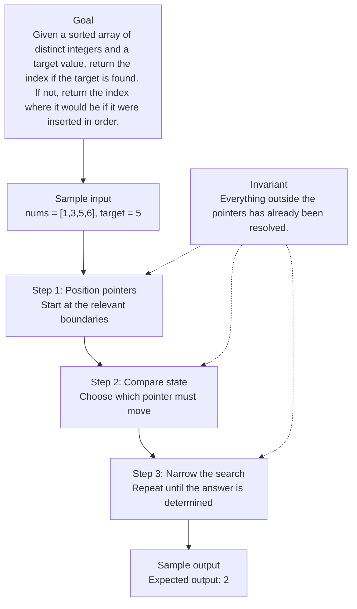

# 0. Search Insert Position

[View problem on LeetCode](https://leetcode.com/problems/search-insert-position/submissions/2098490476/)

- **Difficulty:** Easy
- **Language:** Code
- **Solved:** 2026-08-07 22:00 UTC
- **Runtime:** 0 ms
- **Memory:** —

## Interview overview

**Patterns:** Two Pointers, Sliding Window, Binary Search

Use two pointers to organize the key decisions, then verify the invariants against an edge case.

### Solution replay

### Approach

1. State the direct approach and identify its bottleneck.
2. Explain why two pointers fits the constraints.
3. Walk through one edge case and justify the final complexity.

## Personal notes

this is basically just binary search

---
_Synced by [LeetRepo](https://github.com/)_