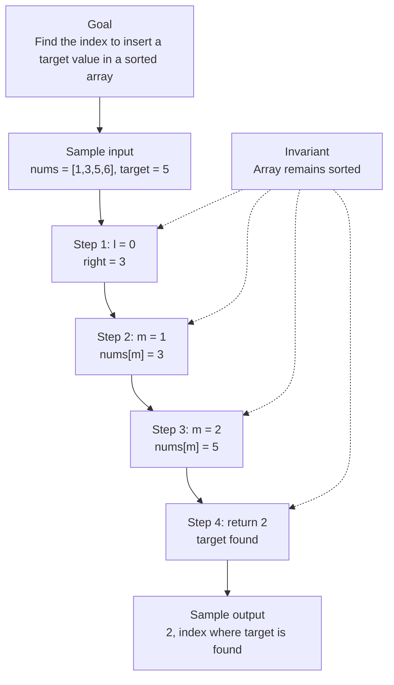

# 0. Search Insert Position

[View problem on LeetCode](https://leetcode.com/problems/search-insert-position/submissions/2098505708/)

- **Difficulty:** Easy
- **Language:** Python3
- **Solved:** 2026-08-07 22:00 UTC
- **Runtime:** —
- **Memory:** —

## Interview overview

**Patterns:** Binary Search

This solution uses binary search to find the target in a sorted array. If the target is found, its index is returned. If not, the index where it should be inserted is returned.

### Solution replay

### Approach

1. Initialize two pointers, one at the start and one at the end of the array
2. Calculate the middle index and compare the middle element with the target
3. If the target is found, return the middle index
4. If the target is less than the middle element, move the right pointer to the left
5. If the target is greater than the middle element, move the left pointer to the right
6. If the target is not found, return the left pointer as the insertion index

### Complexity

- **Time:** O(log n) because binary search reduces the search space by half at each step
- **Space:** O(1) because only a constant amount of space is used

### Complexity self-check

- **Verdict:** optimal
- **Intended:** O(log n) time and O(1) space
- This solution achieves the intended complexity

### Edge cases

- Empty array
- Target is less than the smallest element
- Target is greater than the largest element
- Target is equal to an element in the array

_AI-generated with Groq; verify the analysis before relying on it._

## Personal notes

this is basically just binary search

---
_Synced by [LeetRepo](https://github.com/)_