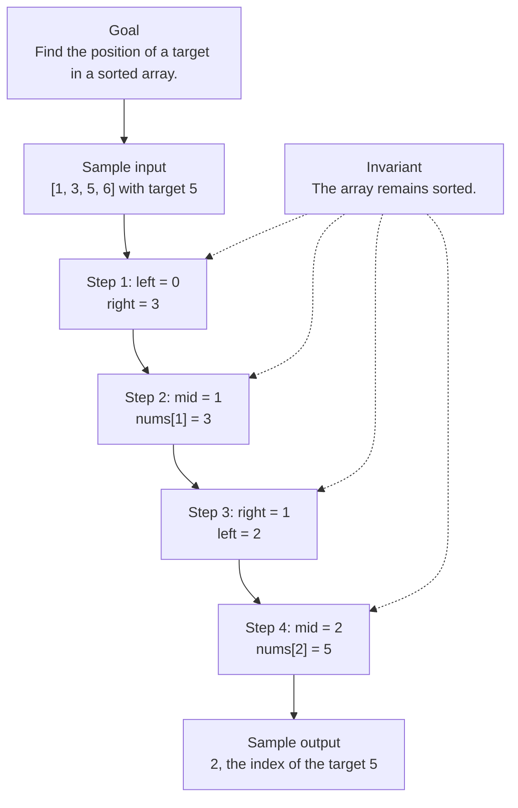

# 0. Search Insert Position

[View problem on LeetCode](https://leetcode.com/problems/search-insert-position/submissions/2098508470/)

- **Difficulty:** Unknown
- **Language:** C++
- **Solved:** 2026-08-07 22:00 UTC
- **Runtime:** —
- **Memory:** —

## Interview overview

**Patterns:** Binary Search

This solution uses binary search to find the position of a target in a sorted array. If the target is found, its index is returned; otherwise, the index where it should be inserted to maintain sorted order is returned.

### Solution replay

### Approach

1. Initialize two pointers, left and right, to the start and end of the array.
2. Loop until left is greater than right.
3. Calculate the middle index and compare the middle element to the target.
4. If the target is found, return its index; if the middle element is greater than the target, move the right pointer; otherwise, move the left pointer.
5. If the loop ends without finding the target, return the left pointer as the insertion point.

### Complexity

- **Time:** O(log n), where n is the number of elements in the array, because binary search divides the search space in half at each step.
- **Space:** O(1), because only a constant amount of space is used to store the pointers and the target.

### Complexity self-check

- **Verdict:** optimal
- **Intended:** O(log n) time and O(1) space
- This is the best time complexity for searching in a sorted array.

### Edge cases

- An empty array
- An array with a single element
- An array with duplicate elements
- The target is the smallest or largest element in the array

_AI-generated with Groq; verify the analysis before relying on it._

## Personal notes

this is basically just binary search

---
_Synced by [LeetRepo](https://github.com/)_