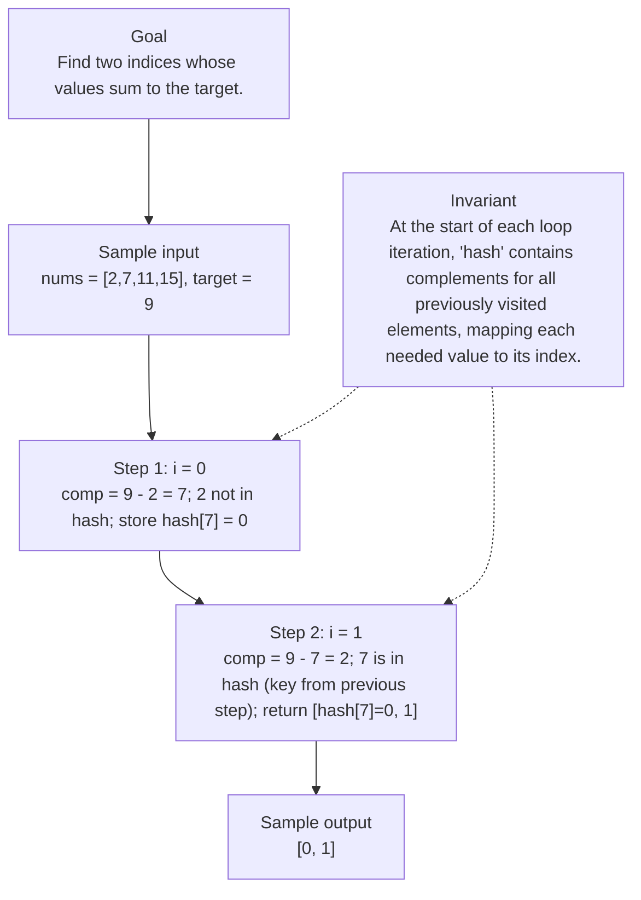

# 1. Two Sum

[View problem on LeetCode](https://leetcode.com/problems/two-sum/submissions/2122553637/)

## Solution metadata

- **Difficulty:** Easy
- **Language:** Python3
- **Topics:** Array, Hash Table
- **Solved:** 2026-08-19 21:26 UTC
- **Runtime:** 0 ms
- **Memory:** —
- **Solution:** [Python3](./python/solution.py)

## Problem description

> Problem details captured from [LeetCode](https://leetcode.com/problems/two-sum/submissions/2122553637/).

You are given an array of integers nums and an integer target, return indices of the two numbers such that they add up to target.
You may assume that each input would have exactly one solution, and you may not use the same element twice.
You can return the answer in any order.

## Examples

### Example 1

```text
Input:
nums = [2,7,11,15], target = 9

Output:
[0,1]
```

**Explanation:** Because nums[0] + nums[1] == 9, we return [0, 1].

### Example 2

```text
Input:
nums = [3,2,4], target = 6

Output:
[1,2]
```

### Example 3

```text
Input:
nums = [3,3], target = 6

Output:
[0,1]
```

## Constraints

- `2 <= nums.length <= 104`
- `109 <= nums[i] <= 109`
- `109 <= target <= 109`
- Only one valid answer exists.

## Follow-up

Can you come up with an algorithm that is less than O(n2) time complexity?

## Interview overview

> Generated from the submitted solution and the official problem details above. Verify AI analysis before relying on it.

The solution scans the array once while storing each number's complement (target - num) in a hash map. When a number appears that matches a previously stored complement, the pair of indices is returned. This works because the problem guarantees exactly one solution, so the first match is the answer.

### Solution replay



### Approach

1. Initialize an empty dictionary `hash` to map needed complements to their indices.
2. Iterate over the array with index `i`:
3. Compute `comp = target - nums[i]`.
4. If `nums[i]` already exists as a key in `hash`, a matching complement was seen earlier; return `[hash[nums[i]], i]`.
5. Otherwise, store the complement: `hash[comp] = i` and continue.

### Complexity

- **Time:** O(n)
- **Space:** O(n)

### Complexity self-check

- **Verdict:** optimal
- **Intended:** Linear time using a hash table.
- Each element is processed once and dictionary operations are O(1) on average.

### Edge cases

- Array of length 2, e.g., nums = [1, 1], target = 2.
- Negative numbers, e.g., nums = [-3, 4, 1], target = 1.
- Duplicate values where the solution uses two different indices, e.g., nums = [3, 3], target = 6.
- Large magnitude values near the constraint limits.

_AI-generated with Groq; verify the analysis before relying on it._

## Study guide

Before reopening the solution:

1. Identify why **Hash Table** fits the problem constraints.
2. State the invariant that makes the algorithm correct.
3. Replay the first example without looking at the implementation.
4. Derive the time and space complexity from the implementation.
5. Name an edge case that would break a weaker approach.

---
_Synced by [LeetRepo](https://github.com/)_

<!-- leetrepo:data:v1
eyJ2ZXJzaW9uIjoxLCJzdWJtaXNzaW9uIjp7ImlkIjoiMS10d28tc3VtIiwibnVtYmVyIjoiMSIsInRpdGxlIjoiVHdvIFN1bSIsInNsdWciOiJ0d28tc3VtIiwiZGlmZmljdWx0eSI6IkVhc3kiLCJ0YWdzIjpbIkFycmF5IiwiSGFzaCBUYWJsZSJdLCJsYW5ndWFnZSI6IlB5dGhvbjMiLCJleHRlbnNpb24iOiJweSIsInBhdGgiOiIwMDAxLXR3by1zdW0vcHl0aG9uL3NvbHV0aW9uLnB5IiwiY29kZSI6ImNsYXNzwqBTb2x1dGlvbjpcbsKgwqDCoMKgZGVmwqB0d29TdW0oc2VsZizCoG51bXM6wqBMaXN0W2ludF0swqB0YXJnZXQ6wqBpbnQpwqAtPsKgTGlzdFtpbnRdOlxuwqDCoMKgwqDCoMKgwqDCoGhhc2jCoD3CoHt9XG5cbsKgwqDCoMKgwqDCoMKgwqBmb3LCoGnCoGluwqByYW5nZShsZW4obnVtcykpOlxuwqDCoMKgwqDCoMKgwqDCoMKgwqDCoMKgY29tcMKgPcKgdGFyZ2V0wqAtwqBudW1zW2ldXG7CoMKgwqDCoMKgwqDCoMKgwqDCoMKgwqBcbsKgwqDCoMKgwqDCoMKgwqDCoMKgwqDCoGlmwqBudW1zW2ldwqBpbsKgaGFzaDpcbsKgwqDCoMKgwqDCoMKgwqDCoMKgwqDCoMKgwqDCoMKgcmV0dXJuwqBbaGFzaFtudW1zW2ldXSzCoGldXG5cbsKgwqDCoMKgwqDCoMKgwqDCoMKgwqDCoGhhc2hbY29tcF3CoD3CoGkiLCJydW50aW1lIjoiMCBtcyIsIm1lbW9yeSI6IuKAlCIsInN0YXR1cyI6IkFjY2VwdGVkIiwidXJsIjoiaHR0cHM6Ly9sZWV0Y29kZS5jb20vcHJvYmxlbXMvdHdvLXN1bS9zdWJtaXNzaW9ucy8yMTIyNTUzNjM3LyIsInByb2JsZW1EZXNjcmlwdGlvbiI6IllvdSBhcmUgZ2l2ZW4gYW4gYXJyYXkgb2YgaW50ZWdlcnMgbnVtcyBhbmQgYW4gaW50ZWdlciB0YXJnZXQsIHJldHVybiBpbmRpY2VzIG9mIHRoZSB0d28gbnVtYmVycyBzdWNoIHRoYXQgdGhleSBhZGQgdXAgdG8gdGFyZ2V0LlxuWW91IG1heSBhc3N1bWUgdGhhdCBlYWNoIGlucHV0IHdvdWxkIGhhdmUgZXhhY3RseSBvbmUgc29sdXRpb24sIGFuZCB5b3UgbWF5IG5vdCB1c2UgdGhlIHNhbWUgZWxlbWVudCB0d2ljZS5cbllvdSBjYW4gcmV0dXJuIHRoZSBhbnN3ZXIgaW4gYW55IG9yZGVyLiIsInByb2JsZW1Db250ZXh0IjoiWW91IGFyZSBnaXZlbiBhbiBhcnJheSBvZiBpbnRlZ2VycyBudW1zIGFuZCBhbiBpbnRlZ2VyIHRhcmdldCwgcmV0dXJuIGluZGljZXMgb2YgdGhlIHR3byBudW1iZXJzIHN1Y2ggdGhhdCB0aGV5IGFkZCB1cCB0byB0YXJnZXQuXG5Zb3UgbWF5IGFzc3VtZSB0aGF0IGVhY2ggaW5wdXQgd291bGQgaGF2ZSBleGFjdGx5IG9uZSBzb2x1dGlvbiwgYW5kIHlvdSBtYXkgbm90IHVzZSB0aGUgc2FtZSBlbGVtZW50IHR3aWNlLlxuWW91IGNhbiByZXR1cm4gdGhlIGFuc3dlciBpbiBhbnkgb3JkZXIuIiwiZXhhbXBsZXMiOlt7ImlucHV0IjoibnVtcyA9IFsyLDcsMTEsMTVdLCB0YXJnZXQgPSA5Iiwib3V0cHV0IjoiWzAsMV0iLCJleHBsYW5hdGlvbiI6IkJlY2F1c2UgbnVtc1swXSArIG51bXNbMV0gPT0gOSwgd2UgcmV0dXJuIFswLCAxXS4ifSx7ImlucHV0IjoibnVtcyA9IFszLDIsNF0sIHRhcmdldCA9IDYiLCJvdXRwdXQiOiJbMSwyXSIsImV4cGxhbmF0aW9uIjoiIn0seyJpbnB1dCI6Im51bXMgPSBbMywzXSwgdGFyZ2V0ID0gNiIsIm91dHB1dCI6IlswLDFdIiwiZXhwbGFuYXRpb24iOiIifV0sImV4YW1wbGVJbnB1dCI6Im51bXMgPSBbMiw3LDExLDE1XSwgdGFyZ2V0ID0gOSIsImV4YW1wbGVPdXRwdXQiOiJbMCwxXSIsImNvbnN0cmFpbnRzIjpbIjIgPD0gbnVtcy5sZW5ndGggPD0gMTA0IiwiMTA5IDw9IG51bXNbaV0gPD0gMTA5IiwiMTA5IDw9IHRhcmdldCA8PSAxMDkiLCJPbmx5IG9uZSB2YWxpZCBhbnN3ZXIgZXhpc3RzLiJdLCJoaW50cyI6W10sImZvbGxvd1VwIjoiQ2FuIHlvdSBjb21lIHVwIHdpdGggYW4gYWxnb3JpdGhtIHRoYXQgaXMgbGVzcyB0aGFuIE8objIpIHRpbWUgY29tcGxleGl0eT8iLCJzb2x2ZWRBdCI6IjIwMjYtMDgtMTlUMjE6MjY6MjdaIiwic3luY2VkQXQiOiIyMDI2LTA4LTI4VDA1OjA4OjU4Ljc5NloiLCJjb21taXRVcmwiOiJodHRwczovL2dpdGh1Yi5jb20vZGFhbm5paWxsL2xlZXRjb2RlX3NvbHMvdHJlZS9tYWluLzAwMDEtdHdvLXN1bSIsImNvbW1pdFNoYSI6IjkwNTgyYzg2MGFkOWY2OTAzMTZjNGVkZDdhODg5ZTE4YzMzMTc1YjAiLCJub3RlcyI6IiIsInJldmlldyI6eyJzdW1tYXJ5IjoiVGhlIHNvbHV0aW9uIHNjYW5zIHRoZSBhcnJheSBvbmNlIHdoaWxlIHN0b3JpbmcgZWFjaCBudW1iZXIncyBjb21wbGVtZW50ICh0YXJnZXQgLSBudW0pIGluIGEgaGFzaCBtYXAuIFdoZW4gYSBudW1iZXIgYXBwZWFycyB0aGF0IG1hdGNoZXMgYSBwcmV2aW91c2x5IHN0b3JlZCBjb21wbGVtZW50LCB0aGUgcGFpciBvZiBpbmRpY2VzIGlzIHJldHVybmVkLiBUaGlzIHdvcmtzIGJlY2F1c2UgdGhlIHByb2JsZW0gZ3VhcmFudGVlcyBleGFjdGx5IG9uZSBzb2x1dGlvbiwgc28gdGhlIGZpcnN0IG1hdGNoIGlzIHRoZSBhbnN3ZXIuIiwiYXBwcm9hY2giOlsiSW5pdGlhbGl6ZSBhbiBlbXB0eSBkaWN0aW9uYXJ5IGBoYXNoYCB0byBtYXAgbmVlZGVkIGNvbXBsZW1lbnRzIHRvIHRoZWlyIGluZGljZXMuIiwiSXRlcmF0ZSBvdmVyIHRoZSBhcnJheSB3aXRoIGluZGV4IGBpYDoiLCJDb21wdXRlIGBjb21wID0gdGFyZ2V0IC0gbnVtc1tpXWAuIiwiSWYgYG51bXNbaV1gIGFscmVhZHkgZXhpc3RzIGFzIGEga2V5IGluIGBoYXNoYCwgYSBtYXRjaGluZyBjb21wbGVtZW50IHdhcyBzZWVuIGVhcmxpZXI7IHJldHVybiBgW2hhc2hbbnVtc1tpXV0sIGldYC4iLCJPdGhlcndpc2UsIHN0b3JlIHRoZSBjb21wbGVtZW50OiBgaGFzaFtjb21wXSA9IGlgIGFuZCBjb250aW51ZS4iXSwiY29tcGxleGl0eSI6eyJ0aW1lIjoiTyhuKSIsInNwYWNlIjoiTyhuKSJ9LCJjb21wbGV4aXR5Q2hlY2siOnsidmVyZGljdCI6Im9wdGltYWwiLCJpbnRlbmRlZCI6IkxpbmVhciB0aW1lIHVzaW5nIGEgaGFzaCB0YWJsZS4iLCJub3RlIjoiRWFjaCBlbGVtZW50IGlzIHByb2Nlc3NlZCBvbmNlIGFuZCBkaWN0aW9uYXJ5IG9wZXJhdGlvbnMgYXJlIE8oMSkgb24gYXZlcmFnZS4ifSwiZWRnZUNhc2VzIjpbIkFycmF5IG9mIGxlbmd0aCAyLCBlLmcuLCBudW1zID0gWzEsIDFdLCB0YXJnZXQgPSAyLiIsIk5lZ2F0aXZlIG51bWJlcnMsIGUuZy4sIG51bXMgPSBbLTMsIDQsIDFdLCB0YXJnZXQgPSAxLiIsIkR1cGxpY2F0ZSB2YWx1ZXMgd2hlcmUgdGhlIHNvbHV0aW9uIHVzZXMgdHdvIGRpZmZlcmVudCBpbmRpY2VzLCBlLmcuLCBudW1zID0gWzMsIDNdLCB0YXJnZXQgPSA2LiIsIkxhcmdlIG1hZ25pdHVkZSB2YWx1ZXMgbmVhciB0aGUgY29uc3RyYWludCBsaW1pdHMuIl0sInZpc3VhbCI6eyJjb250ZXh0IjoiRmluZCB0d28gaW5kaWNlcyB3aG9zZSB2YWx1ZXMgc3VtIHRvIHRoZSB0YXJnZXQuIiwiaW5wdXQiOiJudW1zID0gWzIsNywxMSwxNV0sIHRhcmdldCA9IDkiLCJpbnZhcmlhbnQiOiJBdCB0aGUgc3RhcnQgb2YgZWFjaCBsb29wIGl0ZXJhdGlvbiwgYGhhc2hgIGNvbnRhaW5zIGNvbXBsZW1lbnRzIGZvciBhbGwgcHJldmlvdXNseSB2aXNpdGVkIGVsZW1lbnRzLCBtYXBwaW5nIGVhY2ggbmVlZGVkIHZhbHVlIHRvIGl0cyBpbmRleC4iLCJzdGVwcyI6W3sibGFiZWwiOiJpID0gMCIsInN0YXRlIjoiY29tcCA9IDkgLSAyID0gNzsgMiBub3QgaW4gaGFzaDsgc3RvcmUgaGFzaFs3XSA9IDAifSx7ImxhYmVsIjoiaSA9IDEiLCJzdGF0ZSI6ImNvbXAgPSA5IC0gNyA9IDI7IDcgaXMgaW4gaGFzaCAoa2V5IGZyb20gcHJldmlvdXMgc3RlcCk7IHJldHVybiBbaGFzaFs3XT0wLCAxXSJ9XSwicmVzdWx0IjoiWzAsIDFdIn0sImdlbmVyYXRlZEJ5IjoiR3JvcSJ9LCJyZXZpZXdEdWVBdCI6IjIwMjYtMDktMjdUMDU6MDg6NTguNzk2WiIsImxhc3RSZXZpZXdlZEF0IjpudWxsLCJyZXZpZXdJbnRlcnZhbERheXMiOm51bGwsInJldmlld0NvdW50IjowLCJyZXZpZXdMYXBzZXMiOjAsImxhc3RSZXZpZXdSYXRpbmciOm51bGwsInJldmlld0V2ZW50cyI6W10sInNvbHV0aW9ucyI6W3sia2V5IjoicHl0aG9uMzpweSIsInBhdGgiOiIwMDAxLXR3by1zdW0vcHl0aG9uL3NvbHV0aW9uLnB5IiwibGFuZ3VhZ2UiOiJQeXRob24zIiwiZXh0ZW5zaW9uIjoicHkiLCJkaWZmaWN1bHR5IjoiRWFzeSIsImNvZGUiOiJjbGFzc8KgU29sdXRpb246XG7CoMKgwqDCoGRlZsKgdHdvU3VtKHNlbGYswqBudW1zOsKgTGlzdFtpbnRdLMKgdGFyZ2V0OsKgaW50KcKgLT7CoExpc3RbaW50XTpcbsKgwqDCoMKgwqDCoMKgwqBoYXNowqA9wqB7fVxuXG7CoMKgwqDCoMKgwqDCoMKgZm9ywqBpwqBpbsKgcmFuZ2UobGVuKG51bXMpKTpcbsKgwqDCoMKgwqDCoMKgwqDCoMKgwqDCoGNvbXDCoD3CoHRhcmdldMKgLcKgbnVtc1tpXVxuwqDCoMKgwqDCoMKgwqDCoMKgwqDCoMKgXG7CoMKgwqDCoMKgwqDCoMKgwqDCoMKgwqBpZsKgbnVtc1tpXcKgaW7CoGhhc2g6XG7CoMKgwqDCoMKgwqDCoMKgwqDCoMKgwqDCoMKgwqDCoHJldHVybsKgW2hhc2hbbnVtc1tpXV0swqBpXVxuXG7CoMKgwqDCoMKgwqDCoMKgwqDCoMKgwqBoYXNoW2NvbXBdwqA9wqBpIiwicnVudGltZSI6IjAgbXMiLCJtZW1vcnkiOiLigJQiLCJzdGF0dXMiOiJBY2NlcHRlZCIsInNvbHZlZEF0IjoiMjAyNi0wOC0xOVQyMToyNjoyN1oiLCJzeW5jZWRBdCI6IjIwMjYtMDgtMjhUMDU6MDg6NTguNzk2WiIsImNvbW1pdFVybCI6Imh0dHBzOi8vZ2l0aHViLmNvbS9kYWFubmlpbGwvbGVldGNvZGVfc29scy90cmVlL21haW4vMDAwMS10d28tc3VtIiwiY29tbWl0U2hhIjoiOTA1ODJjODYwYWQ5ZjY5MDMxNmM0ZWRkN2E4ODllMThjMzMxNzViMCIsInJldmlldyI6eyJzdW1tYXJ5IjoiVGhlIHNvbHV0aW9uIHNjYW5zIHRoZSBhcnJheSBvbmNlIHdoaWxlIHN0b3JpbmcgZWFjaCBudW1iZXIncyBjb21wbGVtZW50ICh0YXJnZXQgLSBudW0pIGluIGEgaGFzaCBtYXAuIFdoZW4gYSBudW1iZXIgYXBwZWFycyB0aGF0IG1hdGNoZXMgYSBwcmV2aW91c2x5IHN0b3JlZCBjb21wbGVtZW50LCB0aGUgcGFpciBvZiBpbmRpY2VzIGlzIHJldHVybmVkLiBUaGlzIHdvcmtzIGJlY2F1c2UgdGhlIHByb2JsZW0gZ3VhcmFudGVlcyBleGFjdGx5IG9uZSBzb2x1dGlvbiwgc28gdGhlIGZpcnN0IG1hdGNoIGlzIHRoZSBhbnN3ZXIuIiwiYXBwcm9hY2giOlsiSW5pdGlhbGl6ZSBhbiBlbXB0eSBkaWN0aW9uYXJ5IGBoYXNoYCB0byBtYXAgbmVlZGVkIGNvbXBsZW1lbnRzIHRvIHRoZWlyIGluZGljZXMuIiwiSXRlcmF0ZSBvdmVyIHRoZSBhcnJheSB3aXRoIGluZGV4IGBpYDoiLCJDb21wdXRlIGBjb21wID0gdGFyZ2V0IC0gbnVtc1tpXWAuIiwiSWYgYG51bXNbaV1gIGFscmVhZHkgZXhpc3RzIGFzIGEga2V5IGluIGBoYXNoYCwgYSBtYXRjaGluZyBjb21wbGVtZW50IHdhcyBzZWVuIGVhcmxpZXI7IHJldHVybiBgW2hhc2hbbnVtc1tpXV0sIGldYC4iLCJPdGhlcndpc2UsIHN0b3JlIHRoZSBjb21wbGVtZW50OiBgaGFzaFtjb21wXSA9IGlgIGFuZCBjb250aW51ZS4iXSwiY29tcGxleGl0eSI6eyJ0aW1lIjoiTyhuKSIsInNwYWNlIjoiTyhuKSJ9LCJjb21wbGV4aXR5Q2hlY2siOnsidmVyZGljdCI6Im9wdGltYWwiLCJpbnRlbmRlZCI6IkxpbmVhciB0aW1lIHVzaW5nIGEgaGFzaCB0YWJsZS4iLCJub3RlIjoiRWFjaCBlbGVtZW50IGlzIHByb2Nlc3NlZCBvbmNlIGFuZCBkaWN0aW9uYXJ5IG9wZXJhdGlvbnMgYXJlIE8oMSkgb24gYXZlcmFnZS4ifSwiZWRnZUNhc2VzIjpbIkFycmF5IG9mIGxlbmd0aCAyLCBlLmcuLCBudW1zID0gWzEsIDFdLCB0YXJnZXQgPSAyLiIsIk5lZ2F0aXZlIG51bWJlcnMsIGUuZy4sIG51bXMgPSBbLTMsIDQsIDFdLCB0YXJnZXQgPSAxLiIsIkR1cGxpY2F0ZSB2YWx1ZXMgd2hlcmUgdGhlIHNvbHV0aW9uIHVzZXMgdHdvIGRpZmZlcmVudCBpbmRpY2VzLCBlLmcuLCBudW1zID0gWzMsIDNdLCB0YXJnZXQgPSA2LiIsIkxhcmdlIG1hZ25pdHVkZSB2YWx1ZXMgbmVhciB0aGUgY29uc3RyYWludCBsaW1pdHMuIl0sInZpc3VhbCI6eyJjb250ZXh0IjoiRmluZCB0d28gaW5kaWNlcyB3aG9zZSB2YWx1ZXMgc3VtIHRvIHRoZSB0YXJnZXQuIiwiaW5wdXQiOiJudW1zID0gWzIsNywxMSwxNV0sIHRhcmdldCA9IDkiLCJpbnZhcmlhbnQiOiJBdCB0aGUgc3RhcnQgb2YgZWFjaCBsb29wIGl0ZXJhdGlvbiwgYGhhc2hgIGNvbnRhaW5zIGNvbXBsZW1lbnRzIGZvciBhbGwgcHJldmlvdXNseSB2aXNpdGVkIGVsZW1lbnRzLCBtYXBwaW5nIGVhY2ggbmVlZGVkIHZhbHVlIHRvIGl0cyBpbmRleC4iLCJzdGVwcyI6W3sibGFiZWwiOiJpID0gMCIsInN0YXRlIjoiY29tcCA9IDkgLSAyID0gNzsgMiBub3QgaW4gaGFzaDsgc3RvcmUgaGFzaFs3XSA9IDAifSx7ImxhYmVsIjoiaSA9IDEiLCJzdGF0ZSI6ImNvbXAgPSA5IC0gNyA9IDI7IDcgaXMgaW4gaGFzaCAoa2V5IGZyb20gcHJldmlvdXMgc3RlcCk7IHJldHVybiBbaGFzaFs3XT0wLCAxXSJ9XSwicmVzdWx0IjoiWzAsIDFdIn0sImdlbmVyYXRlZEJ5IjoiR3JvcSJ9fV0sImtleSI6InB5dGhvbjM6cHkifX0=
leetrepo:data:end -->