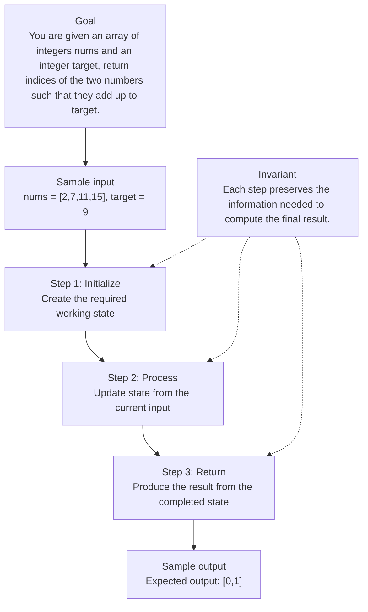

# 1. Two Sum

[View problem on LeetCode](https://leetcode.com/problems/two-sum/submissions/2106010860/)

- **Difficulty:** Easy
- **Language:** Python3
- **Solved:** 2026-08-13 23:40 UTC
- **Runtime:** —
- **Memory:** —

## Problem description

You are given an array of integers nums and an integer target, return indices of the two numbers such that they add up to target.

## Interview overview

**Patterns:** hash‑map lookup, single‑pass complement search

The solution scans the list once, storing each number with its index in a hash map. For each element it checks if the complement (target‑num) already exists, returning the pair of indices when found.

### Solution replay

### Approach

1. Initialize empty hash map
2. Iterate over indices i from 0 to len(nums)-1
3. Compute complement = target - nums[i]
4. If complement is in hash map, return [hashmap[complement], i]
5. Otherwise store nums[i] with index i in the map

### Complexity

- **Time:** O(n) – each element is processed once with O(1) look‑ups
- **Space:** O(n) – worst‑case storage of all elements in the hash map

### Complexity self-check

- **Verdict:** optimal
- **Intended:** O(n) time, O(n) space
- Sorting + two‑pointer could reduce space but changes problem constraints

_AI-generated with Groq; verify the analysis before relying on it._

---
_Synced by [LeetRepo](https://github.com/)_