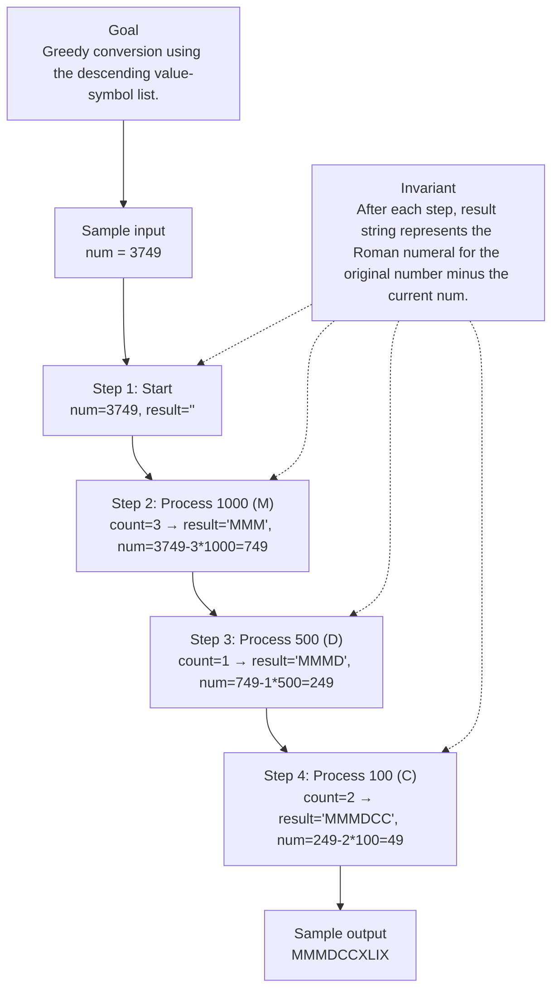

# 12. Integer to Roman

[View problem on LeetCode](https://leetcode.com/problems/integer-to-roman/submissions/2115739521/)

## Solution metadata

- **Difficulty:** Medium
- **Language:** Python3
- **Topics:** Hash Table, Math, String
- **Solved:** 2026-08-22 05:36 UTC
- **Runtime:** 3ms
- **Memory:** —
- **Solution:** [Python3](./python/solution.py)

## Problem description

> Problem details captured from [LeetCode](https://leetcode.com/problems/integer-to-roman/submissions/2115739521/).

Seven different symbols represent Roman numerals with the following values:
SymbolValueI1V5X10L50C100D500M1000
Roman numerals are formed by appending the conversions of decimal place values from highest to lowest. Converting a decimal place value into a Roman numeral has the following rules:
If the value does not start with 4 or 9, select the symbol of the maximal value that can be subtracted from the input, append that symbol to the result, subtract its value, and convert the remainder to a Roman numeral.
If the value starts with 4 or 9 use the subtractive form representing one symbol subtracted from the following symbol, for example, 4 is 1 (I) less than 5 (V): IV and 9 is 1 (I) less than 10 (X): IX. Only the following subtractive forms are used: 4 (IV), 9 (IX), 40 (XL), 90 (XC), 400 (CD) and 900 (CM).
Only powers of 10 (I, X, C, M) can be appended consecutively at most 3 times to represent multiples of 10. You cannot append 5 (V), 50 (L), or 500 (D) multiple times. If you need to append a symbol 4 times use the subtractive form.
Given an integer, convert it to a Roman numeral.

## Examples

### Example 1

```text
Input:
num = 3749

Output:
"MMMDCCXLIX"
```

**Explanation:** 3000 = MMM as 1000 (M) + 1000 (M) + 1000 (M)
700 = DCC as 500 (D) + 100 (C) + 100 (C)
40 = XL as 10 (X) less of 50 (L)
9 = IX as 1 (I) less of 10 (X)
Note: 49 is not 1 (I) less of 50 (L) because the conversion is based on decimal places

### Example 2

```text
Input:
num = 58

Output:
"LVIII"
```

**Explanation:** 50 = L
8 = VIII

### Example 3

```text
Input:
num = 1994

Output:
"MCMXCIV"
```

**Explanation:** 1000 = M
900 = CM
90 = XC
4 = IV

## Constraints

- `1 <= num <= 3999`

## Interview overview

> Generated from the submitted solution and the official problem details above. Verify AI analysis before relying on it.

The solution greedily consumes the largest possible Roman value (including subtractive pairs) from the remaining integer. Because the Roman numeral system is defined by a fixed descending list of value-symbol pairs, repeatedly taking the quotient and reducing the number yields the correct representation in linear time.

### Solution replay



### Approach

1. Create a descending list of (value, symbol) pairs that includes both standard and subtractive forms.
2. Iterate over each pair:
3. Compute how many times the current value fits into the remaining number (count = num // value).
4. Append the symbol repeated count times to the result list.
5. Subtract count * value from num.
6. Stop early if num becomes zero.
7. Join the list of symbols into the final string.

### Complexity

- **Time:** O(1) – the loop runs over a constant 13 pairs, independent of input size.
- **Space:** O(1) – the output string length is bounded (max 15 characters for 3999).

### Complexity self-check

- **Verdict:** optimal
- **Intended:** The algorithm runs in constant time and space because the Roman numeral system has a fixed set of symbols.
- No better asymptotic bound exists; any correct conversion must at least produce the output string.

### Edge cases

- num = 1 → "I" (smallest value)
- num = 4 → "IV" (subtractive form)
- num = 3999 → "MMMCMXCIX" (largest allowed input)
- num = 40 → "XL" (subtractive form for tens)

_AI-generated with Groq; verify the analysis before relying on it._

## Study guide

Before reopening the solution:

1. Identify why **Hash Table** fits the problem constraints.
2. State the invariant that makes the algorithm correct.
3. Replay the first example without looking at the implementation.
4. Derive the time and space complexity from the implementation.
5. Name an edge case that would break a weaker approach.

---
_Synced by [LeetRepo](https://github.com/)_