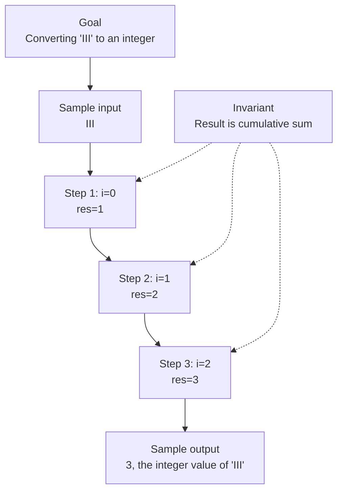

# 13. Roman to Integer

[View problem on LeetCode](https://leetcode.com/problems/roman-to-integer/submissions/2098518654/)

- **Difficulty:** Easy
- **Language:** JavaScript
- **Solved:** 2026-08-08 00:05 UTC
- **Runtime:** —
- **Memory:** —

## Interview overview

**Patterns:** Hash Table, Greedy Algorithm

Convert Roman numerals to integers by iterating through the string and adding or subtracting values based on the current and next characters. The conversion uses a dictionary to map Roman numerals to their integer values.

### Solution replay

### Approach

1. Create a dictionary to map Roman numerals to their integer values
2. Initialize a variable to store the result
3. Iterate through the string, comparing each character with the next one
4. Add or subtract the current character's value based on the comparison
5. Add the last character's value to the result

### Complexity

- **Time:** O(n), where n is the length of the string
- **Space:** O(1), as the dictionary has a constant size

### Complexity self-check

- **Verdict:** optimal
- **Intended:** O(n) time and O(1) space
- Linear time complexity due to a single pass through the string

### Edge cases

- Empty string
- Single character
- String with only one type of numeral
- String with subtractive notation (e.g., IV)

_AI-generated with Groq; verify the analysis before relying on it._

---
_Synced by [LeetRepo](https://github.com/)_