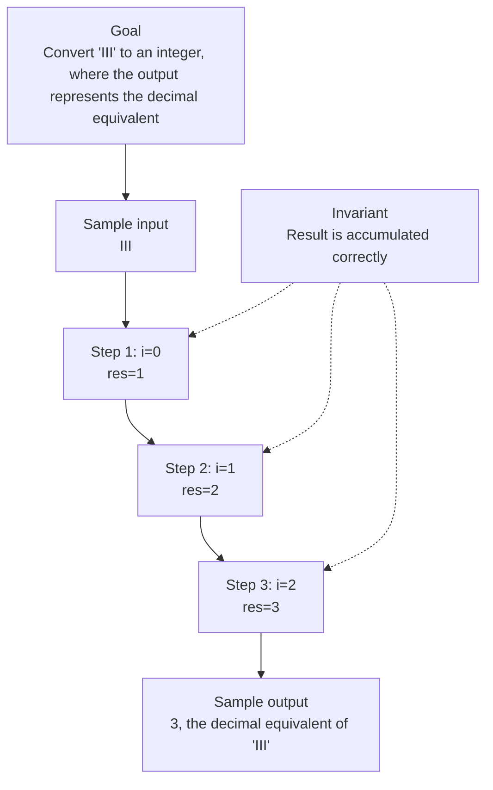

# 13. Roman to Integer

[View problem on LeetCode](https://leetcode.com/problems/roman-to-integer/description/)

- **Difficulty:** Easy
- **Language:** JavaScript
- **Solved:** 2026-08-08 00:05 UTC
- **Runtime:** —
- **Memory:** —

## Interview overview

**Patterns:** Hash Table, Greedy Algorithm

Converts Roman numerals to integers by iterating through the string and adding or subtracting values based on the current and next characters. It uses a dictionary to map Roman numerals to their integer values. The function handles cases where a smaller numeral appears before a larger one, indicating subtraction.

### Solution replay

### Approach

1. Create a dictionary to map Roman numerals to their integer values
2. Initialize a variable to store the result
3. Iterate through the input string, comparing each character with the next one
4. Add or subtract the current numeral's value based on the comparison
5. Handle the last character in the string after the loop

### Complexity

- **Time:** O(n), where n is the length of the input string, because we make a single pass through the string
- **Space:** O(1), because the space used does not grow with the size of the input, as the dictionary has a fixed size

### Complexity self-check

- **Verdict:** optimal
- **Intended:** O(n) time and O(1) space
- The algorithm's linear time complexity is optimal for this problem, as we must examine each character at least once

### Edge cases

- Empty string
- Single-character string
- String with only one type of numeral
- String with a smaller numeral before a larger one

_AI-generated with Groq; verify the analysis before relying on it._

---
_Synced by [LeetRepo](https://github.com/)_