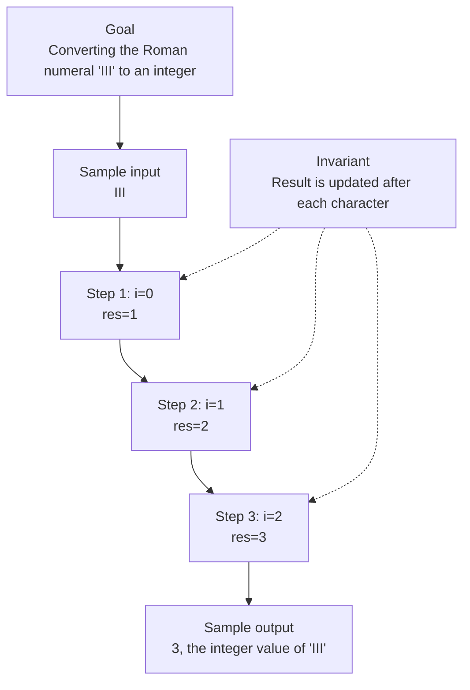

# 13. Roman to Integer

[View problem on LeetCode](https://leetcode.com/problems/roman-to-integer/submissions/2098518468/)

- **Difficulty:** Easy
- **Language:** C++
- **Solved:** 2026-08-08 00:05 UTC
- **Runtime:** —
- **Memory:** —

## Interview overview

**Patterns:** Hashmap, Iteration

Converts Roman numerals to integers by iterating through the string and adding or subtracting values based on the current and next characters. It uses a hashmap to store the Roman numeral values. The result is calculated by summing up the values of the Roman numerals.

### Solution replay

### Approach

1. Create a hashmap to store the Roman numeral values
2. Initialize a variable to store the result
3. Iterate through the string, comparing each character with the next one
4. Add or subtract the value of the current character based on the comparison
5. Add the value of the last character to the result

### Complexity

- **Time:** O(n), where n is the length of the string, because we are iterating through the string once
- **Space:** O(1), because the hashmap has a constant size of 7

### Complexity self-check

- **Verdict:** optimal
- **Intended:** O(n) time and O(1) space
- The algorithm has a linear time complexity and constant space complexity, making it efficient for large inputs

### Edge cases

- Empty string
- Single character
- Invalid Roman numerals

_AI-generated with Groq; verify the analysis before relying on it._

---
_Synced by [LeetRepo](https://github.com/)_