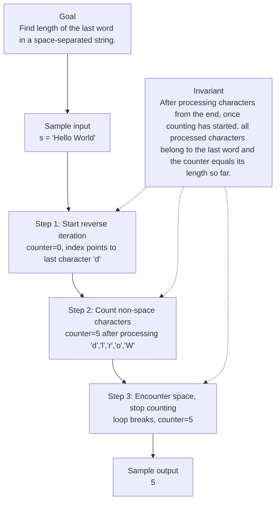

# 58. Length of Last Word

[View problem on LeetCode](https://leetcode.com/problems/length-of-last-word/submissions/2120203555/)

## Solution metadata

- **Difficulty:** Easy
- **Language:** Python3
- **Topics:** String
- **Solved:** 2026-08-25 22:35 UTC
- **Runtime:** 0 ms
- **Memory:** —
- **Solution:** [Python3](./python/solution.py)

## Problem description

> Problem details captured from [LeetCode](https://leetcode.com/problems/length-of-last-word/submissions/2120203555/).

Given a string s consisting of words and spaces, return the length of the last word in the string.
A word is a maximal substring consisting of non-space characters only.

## Examples

### Example 1

```text
Input:
s = "Hello World"

Output:
5
```

**Explanation:** The last word is "World" with length 5.

### Example 2

```text
Input:
s = " fly me to the moon "

Output:
4
```

**Explanation:** The last word is "moon" with length 4.

### Example 3

```text
Input:
s = "luffy is still joyboy"

Output:
6
```

**Explanation:** The last word is "joyboy" with length 6.

## Constraints

- `1 <= s.length <= 104`
- s consists of only English letters and spaces ' '.
- There will be at least one word in s.

## Interview overview

> Generated from the submitted solution and the official problem details above. Verify AI analysis before relying on it.

The key insight is to scan the string from the end, skipping any trailing spaces, and then count consecutive non‑space characters until the next space (or the start). This directly yields the length of the last word without extra storage or splitting.

### Solution replay



### Approach

1. Initialize a counter to 0.
2. Iterate over the characters of the string in reverse order.
3. Skip characters while they are spaces and the counter is still 0 (trailing spaces).
4. For each non‑space character, increment the counter.
5. Stop the loop when a space is encountered after counting has started (the word boundary).
6. Return the counter as the length of the last word.

### Complexity

- **Time:** O(n) – each character is examined at most once, where n = s.length
- **Space:** O(1) – only a few integer variables are used

### Complexity self-check

- **Verdict:** optimal
- **Intended:** O(n) time, O(1) extra space
- Any solution must look at each character in the worst case, so linear time is optimal; constant extra space is also optimal.

### Edge cases

- "Hello" – single word, no spaces
- "Hello " – trailing spaces after the last word
- " fly me to the moon " – multiple spaces between words and at ends

_AI-generated with Groq; verify the analysis before relying on it._

## Study guide

Before reopening the solution:

1. Identify why **String** fits the problem constraints.
2. State the invariant that makes the algorithm correct.
3. Replay the first example without looking at the implementation.
4. Derive the time and space complexity from the implementation.
5. Name an edge case that would break a weaker approach.

---
_Synced by [LeetRepo](https://github.com/)_