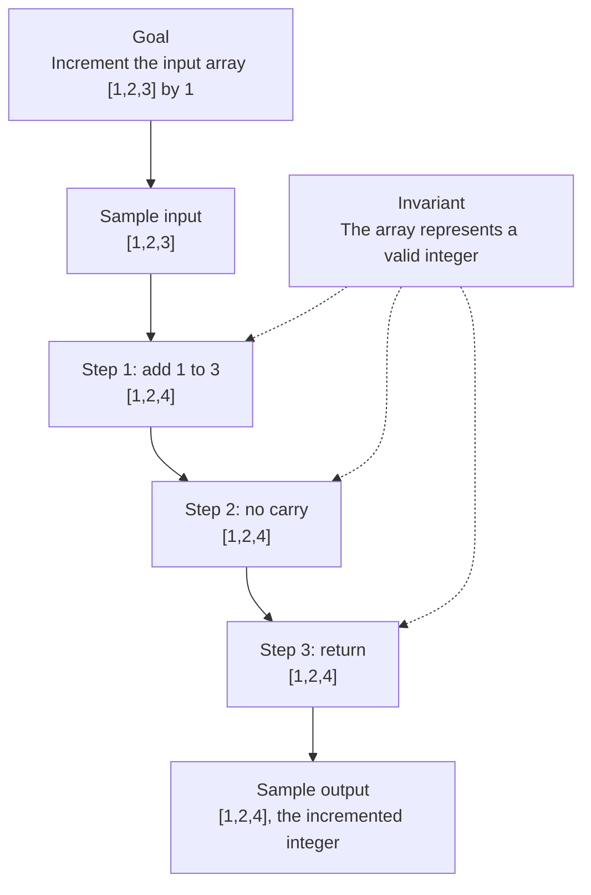

# 66. Plus One

[View problem on LeetCode](https://leetcode.com/problems/plus-one/submissions/2099675269/)

- **Difficulty:** Easy
- **Language:** C++
- **Solved:** 2026-08-09 00:51 UTC
- **Runtime:** —
- **Memory:** —

## Interview overview

**Patterns:** array iteration, carry propagation

Increment a large integer represented as an array of digits by 1. Iterate through the array from right to left, adding 1 to each digit until a non-carrying addition is found. If all digits require a carry, add a new most significant digit.

### Solution replay

### Approach

1. Start from the least significant digit
2. Add 1 to the current digit
3. If the result is not 10, return the updated array
4. Otherwise, set the current digit to 0 and propagate the carry to the next digit
5. If all digits require a carry, add a new most significant digit

### Complexity

- **Time:** O(n), where n is the number of digits
- **Space:** O(1), excluding the output array, or O(n) in the worst case when a new digit is added

### Complexity self-check

- **Verdict:** optimal
- **Intended:** O(n) time and O(1) space
- The algorithm only needs to traverse the array once

### Edge cases

- Input array with a single digit
- Input array with all digits being 9
- Input array with no digits

_AI-generated with Groq; verify the analysis before relying on it._

---
_Synced by [LeetRepo](https://github.com/)_