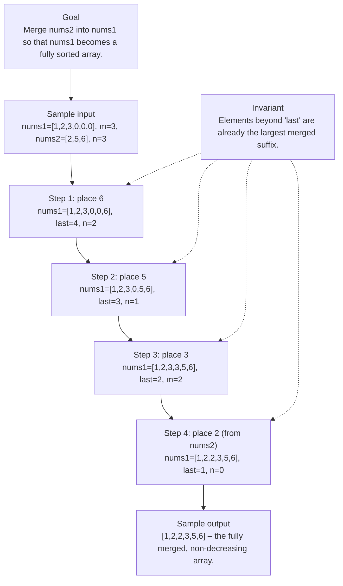

# 88. Merge Sorted Array

[View problem on LeetCode](https://leetcode.com/problems/merge-sorted-array/submissions/2113232894/)

- **Difficulty:** Easy
- **Language:** Python3
- **Solved:** 2026-08-19 20:50 UTC
- **Runtime:** 0 ms
- **Memory:** —

## Problem description

You are given two integer arrays nums1 and nums2, sorted in non-decreasing order, and two integers m and n, representing the number of elements in nums1 and nums2 respectively.

## Interview overview

**Patterns:** Two‑pointer technique (from the back), In‑place array manipulation, Greedy selection of larger element

Merge two sorted arrays in-place by filling nums1 from the end with the larger of the two current elements. This avoids extra space and preserves the sorted order.

### Solution replay

### Approach

1. Set a write pointer `last` at the end of the combined length (m + n - 1).
2. While both arrays have unprocessed elements, compare nums1[m‑1] and nums2[n‑1].
3. Write the larger value into nums1[last] and move the corresponding pointer and `last` backwards.
4. If nums2 still has leftovers after nums1 is exhausted, copy them into the front of nums1.
5. Terminate; nums1 now contains the merged sorted sequence.

### Complexity

- **Time:** O(m + n) – each element is examined at most once.
- **Space:** O(1) – only a few index variables are used.

### Complexity self-check

- **Verdict:** optimal
- **Intended:** O(m + n) time and O(1) extra space
- Any faster solution would require fewer than linear scans, which is impossible for merging.

### Edge cases

- n = 0 (nothing to merge)
- m = 0 (nums1 initially empty, fill with nums2)
- All elements of nums2 are smaller than nums1's
- Duplicate values across the two arrays

_AI-generated with Groq; verify the analysis before relying on it._

---
_Synced by [LeetRepo](https://github.com/)_