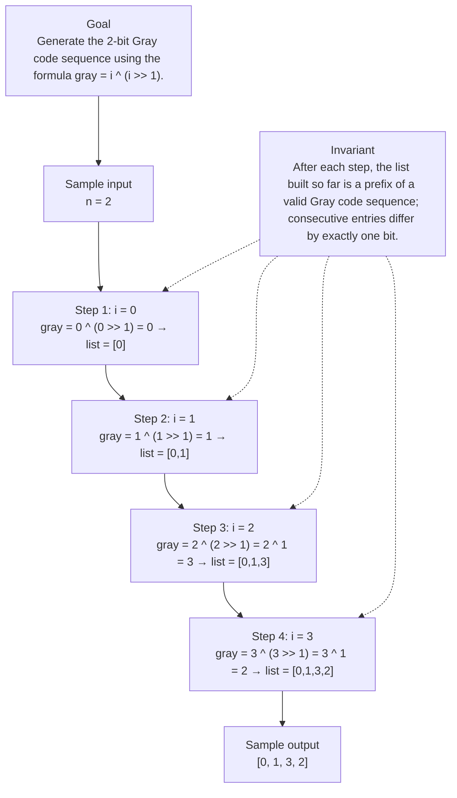

# 89. Gray Code

[View problem on LeetCode](https://leetcode.com/problems/gray-code/submissions/2120211440/)

## Solution metadata

- **Difficulty:** Medium
- **Language:** Python3
- **Topics:** Math, Backtracking, Bit Manipulation
- **Solved:** 2026-08-25 23:01 UTC
- **Runtime:** —
- **Memory:** —
- **Solution:** [Python3](./python/solution.py)

## Problem description

> Problem details captured from [LeetCode](https://leetcode.com/problems/gray-code/submissions/2120211440/).

An n-bit gray code sequence is a sequence of 2n integers where:
Every integer is in the inclusive range [0, 2n - 1],
The first integer is 0,
An integer appears no more than once in the sequence,
The binary representation of every pair of adjacent integers differs by exactly one bit, and
The binary representation of the first and last integers differs by exactly one bit.
Given an integer n, return any valid n-bit gray code sequence.

## Examples

### Example 1

```text
Input:
n = 2

Output:
[0,1,3,2]
```

**Explanation:** The binary representation of [0,1,3,2] is [00,01,11,10].
- 00 and 01 differ by one bit
- 01 and 11 differ by one bit
- 11 and 10 differ by one bit
- 10 and 00 differ by one bit
[0,2,3,1] is also a valid gray code sequence, whose binary representation is [00,10,11,01].
- 00 and 10 differ by one bit
- 10 and 11 differ by one bit
- 11 and 01 differ by one bit
- 01 and 00 differ by one bit

### Example 2

```text
Input:
n = 1

Output:
[0,1]
```

## Constraints

- `1 <= n <= 16`

## Interview overview

> Generated from the submitted solution and the official problem details above. Verify AI analysis before relying on it.

The solution leverages the mathematical formula Gray(i) = i XOR (i >> 1) which directly maps each integer i in [0, 2^n) to its n‑bit Gray code representation. Because the formula guarantees a one‑bit difference between consecutive values, the generated list satisfies all Gray code constraints.

### Solution replay



### Approach

1. Iterate i from 0 to (1 << n) - 1 (i.e., all numbers with n bits).
2. For each i compute gray = i ^ (i >> 1).
3. Collect each gray value into a list preserving the iteration order.
4. Return the list as the Gray code sequence.

### Complexity

- **Time:** O(2^n)
- **Space:** O(2^n)

### Complexity self-check

- **Verdict:** optimal
- **Intended:** O(2^n) time and O(2^n) extra space to store the sequence.
- Generating all 2^n codes is unavoidable; the formula makes each step O(1).

### Edge cases

- n = 1 → output [0,1]
- n = 2 (official example) → output [0,1,3,2]
- Maximum n = 16 → produces 65,536 entries, still within constraints.

_AI-generated with Groq; verify the analysis before relying on it._

## Study guide

Before reopening the solution:

1. Identify why **Backtracking** fits the problem constraints.
2. State the invariant that makes the algorithm correct.
3. Replay the first example without looking at the implementation.
4. Derive the time and space complexity from the implementation.
5. Name an edge case that would break a weaker approach.

---
_Synced by [LeetRepo](https://github.com/)_

<!-- leetrepo:data:v1
eyJ2ZXJzaW9uIjoxLCJzdWJtaXNzaW9uIjp7ImlkIjoiODktZ3JheS1jb2RlIiwibnVtYmVyIjoiODkiLCJ0aXRsZSI6IkdyYXkgQ29kZSIsInNsdWciOiJncmF5LWNvZGUiLCJkaWZmaWN1bHR5IjoiTWVkaXVtIiwidGFncyI6WyJNYXRoIiwiQmFja3RyYWNraW5nIiwiQml0IE1hbmlwdWxhdGlvbiJdLCJsYW5ndWFnZSI6IlB5dGhvbjMiLCJleHRlbnNpb24iOiJweSIsInBhdGgiOiIwMDg5LWdyYXktY29kZS9weXRob24vc29sdXRpb24ucHkiLCJjb2RlIjoiY2xhc3PCoFNvbHV0aW9uOlxuwqDCoMKgwqBkZWbCoGdyYXlDb2RlKHNlbGYswqBuOsKgaW50KcKgLT7CoExpc3RbaW50XTpcbsKgwqDCoMKgwqDCoMKgwqByZXR1cm7CoFtpwqBewqAoacKgPj7CoDEpwqBmb3LCoGnCoGluwqByYW5nZSgxwqA8PMKgbildIiwicnVudGltZSI6IuKAlCIsIm1lbW9yeSI6IuKAlCIsInN0YXR1cyI6IkFjY2VwdGVkIiwidXJsIjoiaHR0cHM6Ly9sZWV0Y29kZS5jb20vcHJvYmxlbXMvZ3JheS1jb2RlL3N1Ym1pc3Npb25zLzIxMjAyMTE0NDAvIiwicHJvYmxlbURlc2NyaXB0aW9uIjoiQW4gbi1iaXQgZ3JheSBjb2RlIHNlcXVlbmNlIGlzIGEgc2VxdWVuY2Ugb2YgMm4gaW50ZWdlcnMgd2hlcmU6XG5FdmVyeSBpbnRlZ2VyIGlzIGluIHRoZSBpbmNsdXNpdmUgcmFuZ2UgWzAsIDJuIC0gMV0sXG5UaGUgZmlyc3QgaW50ZWdlciBpcyAwLFxuQW4gaW50ZWdlciBhcHBlYXJzIG5vIG1vcmUgdGhhbiBvbmNlIGluIHRoZSBzZXF1ZW5jZSxcblRoZSBiaW5hcnkgcmVwcmVzZW50YXRpb24gb2YgZXZlcnkgcGFpciBvZiBhZGphY2VudCBpbnRlZ2VycyBkaWZmZXJzIGJ5IGV4YWN0bHkgb25lIGJpdCwgYW5kXG5UaGUgYmluYXJ5IHJlcHJlc2VudGF0aW9uIG9mIHRoZSBmaXJzdCBhbmQgbGFzdCBpbnRlZ2VycyBkaWZmZXJzIGJ5IGV4YWN0bHkgb25lIGJpdC5cbkdpdmVuIGFuIGludGVnZXIgbiwgcmV0dXJuIGFueSB2YWxpZCBuLWJpdCBncmF5IGNvZGUgc2VxdWVuY2UuIiwicHJvYmxlbUNvbnRleHQiOiJBbiBuLWJpdCBncmF5IGNvZGUgc2VxdWVuY2UgaXMgYSBzZXF1ZW5jZSBvZiAybiBpbnRlZ2VycyB3aGVyZTpcbkV2ZXJ5IGludGVnZXIgaXMgaW4gdGhlIGluY2x1c2l2ZSByYW5nZSBbMCwgMm4gLSAxXSxcblRoZSBmaXJzdCBpbnRlZ2VyIGlzIDAsXG5BbiBpbnRlZ2VyIGFwcGVhcnMgbm8gbW9yZSB0aGFuIG9uY2UgaW4gdGhlIHNlcXVlbmNlLFxuVGhlIGJpbmFyeSByZXByZXNlbnRhdGlvbiBvZiBldmVyeSBwYWlyIG9mIGFkamFjZW50IGludGVnZXJzIGRpZmZlcnMgYnkgZXhhY3RseSBvbmUgYml0LCBhbmRcblRoZSBiaW5hcnkgcmVwcmVzZW50YXRpb24gb2YgdGhlIGZpcnN0IGFuZCBsYXN0IGludGVnZXJzIGRpZmZlcnMgYnkgZXhhY3RseSBvbmUgYml0LlxuR2l2ZW4gYW4gaW50ZWdlciBuLCByZXR1cm4gYW55IHZhbGlkIG4tYml0IGdyYXkgY29kZSBzZXF1ZW5jZS4iLCJleGFtcGxlcyI6W3siaW5wdXQiOiJuID0gMiIsIm91dHB1dCI6IlswLDEsMywyXSIsImV4cGxhbmF0aW9uIjoiVGhlIGJpbmFyeSByZXByZXNlbnRhdGlvbiBvZiBbMCwxLDMsMl0gaXMgWzAwLDAxLDExLDEwXS5cbi0gMDAgYW5kIDAxIGRpZmZlciBieSBvbmUgYml0XG4tIDAxIGFuZCAxMSBkaWZmZXIgYnkgb25lIGJpdFxuLSAxMSBhbmQgMTAgZGlmZmVyIGJ5IG9uZSBiaXRcbi0gMTAgYW5kIDAwIGRpZmZlciBieSBvbmUgYml0XG5bMCwyLDMsMV0gaXMgYWxzbyBhIHZhbGlkIGdyYXkgY29kZSBzZXF1ZW5jZSwgd2hvc2UgYmluYXJ5IHJlcHJlc2VudGF0aW9uIGlzIFswMCwxMCwxMSwwMV0uXG4tIDAwIGFuZCAxMCBkaWZmZXIgYnkgb25lIGJpdFxuLSAxMCBhbmQgMTEgZGlmZmVyIGJ5IG9uZSBiaXRcbi0gMTEgYW5kIDAxIGRpZmZlciBieSBvbmUgYml0XG4tIDAxIGFuZCAwMCBkaWZmZXIgYnkgb25lIGJpdCJ9LHsiaW5wdXQiOiJuID0gMSIsIm91dHB1dCI6IlswLDFdIiwiZXhwbGFuYXRpb24iOiIifV0sImV4YW1wbGVJbnB1dCI6Im4gPSAyIiwiZXhhbXBsZU91dHB1dCI6IlswLDEsMywyXSIsImNvbnN0cmFpbnRzIjpbIjEgPD0gbiA8PSAxNiJdLCJoaW50cyI6W10sImZvbGxvd1VwIjoiIiwic29sdmVkQXQiOiIyMDI2LTA4LTI1VDIzOjAxOjM4LjU5NVoiLCJzeW5jZWRBdCI6IjIwMjYtMDgtMjVUMjM6MDE6MzguNTk1WiIsImNvbW1pdFVybCI6IiIsImNvbW1pdFNoYSI6IiIsIm5vdGVzIjoiIiwicmV2aWV3Ijp7InN1bW1hcnkiOiJUaGUgc29sdXRpb24gbGV2ZXJhZ2VzIHRoZSBtYXRoZW1hdGljYWwgZm9ybXVsYSBHcmF5KGkpID0gaSBYT1IgKGkgPj4gMSkgd2hpY2ggZGlyZWN0bHkgbWFwcyBlYWNoIGludGVnZXIgaSBpbiBbMCwgMl5uKSB0byBpdHMgbuKAkWJpdCBHcmF5IGNvZGUgcmVwcmVzZW50YXRpb24uIEJlY2F1c2UgdGhlIGZvcm11bGEgZ3VhcmFudGVlcyBhIG9uZeKAkWJpdCBkaWZmZXJlbmNlIGJldHdlZW4gY29uc2VjdXRpdmUgdmFsdWVzLCB0aGUgZ2VuZXJhdGVkIGxpc3Qgc2F0aXNmaWVzIGFsbCBHcmF5IGNvZGUgY29uc3RyYWludHMuIiwiYXBwcm9hY2giOlsiSXRlcmF0ZSBpIGZyb20gMCB0byAoMSA8PCBuKSAtIDEgKGkuZS4sIGFsbCBudW1iZXJzIHdpdGggbiBiaXRzKS4iLCJGb3IgZWFjaCBpIGNvbXB1dGUgZ3JheSA9IGkgXiAoaSA+PiAxKS4iLCJDb2xsZWN0IGVhY2ggZ3JheSB2YWx1ZSBpbnRvIGEgbGlzdCBwcmVzZXJ2aW5nIHRoZSBpdGVyYXRpb24gb3JkZXIuIiwiUmV0dXJuIHRoZSBsaXN0IGFzIHRoZSBHcmF5IGNvZGUgc2VxdWVuY2UuIl0sImNvbXBsZXhpdHkiOnsidGltZSI6Ik8oMl5uKSIsInNwYWNlIjoiTygyXm4pIn0sImNvbXBsZXhpdHlDaGVjayI6eyJ2ZXJkaWN0Ijoib3B0aW1hbCIsImludGVuZGVkIjoiTygyXm4pIHRpbWUgYW5kIE8oMl5uKSBleHRyYSBzcGFjZSB0byBzdG9yZSB0aGUgc2VxdWVuY2UuIiwibm90ZSI6IkdlbmVyYXRpbmcgYWxsIDJebiBjb2RlcyBpcyB1bmF2b2lkYWJsZTsgdGhlIGZvcm11bGEgbWFrZXMgZWFjaCBzdGVwIE8oMSkuIn0sImVkZ2VDYXNlcyI6WyJuID0gMSDihpIgb3V0cHV0IFswLDFdIiwibiA9IDIgKG9mZmljaWFsIGV4YW1wbGUpIOKGkiBvdXRwdXQgWzAsMSwzLDJdIiwiTWF4aW11bSBuID0gMTYg4oaSIHByb2R1Y2VzIDY1LDUzNiBlbnRyaWVzLCBzdGlsbCB3aXRoaW4gY29uc3RyYWludHMuIl0sInZpc3VhbCI6eyJjb250ZXh0IjoiR2VuZXJhdGUgdGhlIDLigJFiaXQgR3JheSBjb2RlIHNlcXVlbmNlIHVzaW5nIHRoZSBmb3JtdWxhIGdyYXkgPSBpIF4gKGkgPj4gMSkuIiwiaW5wdXQiOiJuID0gMiIsImludmFyaWFudCI6IkFmdGVyIGVhY2ggc3RlcCwgdGhlIGxpc3QgYnVpbHQgc28gZmFyIGlzIGEgcHJlZml4IG9mIGEgdmFsaWQgR3JheSBjb2RlIHNlcXVlbmNlOyBjb25zZWN1dGl2ZSBlbnRyaWVzIGRpZmZlciBieSBleGFjdGx5IG9uZSBiaXQuIiwic3RlcHMiOlt7ImxhYmVsIjoiaSA9IDAiLCJzdGF0ZSI6ImdyYXkgPSAwIF4gKDAgPj4gMSkgPSAwIOKGkiBsaXN0ID0gWzBdIn0seyJsYWJlbCI6ImkgPSAxIiwic3RhdGUiOiJncmF5ID0gMSBeICgxID4+IDEpID0gMSDihpIgbGlzdCA9IFswLDFdIn0seyJsYWJlbCI6ImkgPSAyIiwic3RhdGUiOiJncmF5ID0gMiBeICgyID4+IDEpID0gMiBeIDEgPSAzIOKGkiBsaXN0ID0gWzAsMSwzXSJ9LHsibGFiZWwiOiJpID0gMyIsInN0YXRlIjoiZ3JheSA9IDMgXiAoMyA+PiAxKSA9IDMgXiAxID0gMiDihpIgbGlzdCA9IFswLDEsMywyXSJ9XSwicmVzdWx0IjoiWzAsIDEsIDMsIDJdIn0sImdlbmVyYXRlZEJ5IjoiR3JvcSJ9LCJyZXZpZXdEdWVBdCI6IjIwMjYtMDktMjRUMjM6MDE6MzguNTk1WiIsImxhc3RSZXZpZXdlZEF0IjpudWxsLCJyZXZpZXdJbnRlcnZhbERheXMiOm51bGwsInJldmlld0NvdW50IjowLCJyZXZpZXdMYXBzZXMiOjAsImxhc3RSZXZpZXdSYXRpbmciOm51bGwsInJldmlld0V2ZW50cyI6W10sInNvbHV0aW9ucyI6W3sia2V5IjoicHl0aG9uMzpweSIsInBhdGgiOiIwMDg5LWdyYXktY29kZS9weXRob24vc29sdXRpb24ucHkiLCJsYW5ndWFnZSI6IlB5dGhvbjMiLCJleHRlbnNpb24iOiJweSIsImRpZmZpY3VsdHkiOiJNZWRpdW0iLCJjb2RlIjoiY2xhc3PCoFNvbHV0aW9uOlxuwqDCoMKgwqBkZWbCoGdyYXlDb2RlKHNlbGYswqBuOsKgaW50KcKgLT7CoExpc3RbaW50XTpcbsKgwqDCoMKgwqDCoMKgwqByZXR1cm7CoFtpwqBewqAoacKgPj7CoDEpwqBmb3LCoGnCoGluwqByYW5nZSgxwqA8PMKgbildIiwicnVudGltZSI6IuKAlCIsIm1lbW9yeSI6IuKAlCIsInN0YXR1cyI6IkFjY2VwdGVkIiwic29sdmVkQXQiOiIyMDI2LTA4LTI1VDIzOjAxOjM4LjU5NVoiLCJzeW5jZWRBdCI6IjIwMjYtMDgtMjVUMjM6MDE6MzguNTk1WiIsImNvbW1pdFVybCI6IiIsImNvbW1pdFNoYSI6IiIsInJldmlldyI6eyJzdW1tYXJ5IjoiVGhlIHNvbHV0aW9uIGxldmVyYWdlcyB0aGUgbWF0aGVtYXRpY2FsIGZvcm11bGEgR3JheShpKSA9IGkgWE9SIChpID4+IDEpIHdoaWNoIGRpcmVjdGx5IG1hcHMgZWFjaCBpbnRlZ2VyIGkgaW4gWzAsIDJebikgdG8gaXRzIG7igJFiaXQgR3JheSBjb2RlIHJlcHJlc2VudGF0aW9uLiBCZWNhdXNlIHRoZSBmb3JtdWxhIGd1YXJhbnRlZXMgYSBvbmXigJFiaXQgZGlmZmVyZW5jZSBiZXR3ZWVuIGNvbnNlY3V0aXZlIHZhbHVlcywgdGhlIGdlbmVyYXRlZCBsaXN0IHNhdGlzZmllcyBhbGwgR3JheSBjb2RlIGNvbnN0cmFpbnRzLiIsImFwcHJvYWNoIjpbIkl0ZXJhdGUgaSBmcm9tIDAgdG8gKDEgPDwgbikgLSAxIChpLmUuLCBhbGwgbnVtYmVycyB3aXRoIG4gYml0cykuIiwiRm9yIGVhY2ggaSBjb21wdXRlIGdyYXkgPSBpIF4gKGkgPj4gMSkuIiwiQ29sbGVjdCBlYWNoIGdyYXkgdmFsdWUgaW50byBhIGxpc3QgcHJlc2VydmluZyB0aGUgaXRlcmF0aW9uIG9yZGVyLiIsIlJldHVybiB0aGUgbGlzdCBhcyB0aGUgR3JheSBjb2RlIHNlcXVlbmNlLiJdLCJjb21wbGV4aXR5Ijp7InRpbWUiOiJPKDJebikiLCJzcGFjZSI6Ik8oMl5uKSJ9LCJjb21wbGV4aXR5Q2hlY2siOnsidmVyZGljdCI6Im9wdGltYWwiLCJpbnRlbmRlZCI6Ik8oMl5uKSB0aW1lIGFuZCBPKDJebikgZXh0cmEgc3BhY2UgdG8gc3RvcmUgdGhlIHNlcXVlbmNlLiIsIm5vdGUiOiJHZW5lcmF0aW5nIGFsbCAyXm4gY29kZXMgaXMgdW5hdm9pZGFibGU7IHRoZSBmb3JtdWxhIG1ha2VzIGVhY2ggc3RlcCBPKDEpLiJ9LCJlZGdlQ2FzZXMiOlsibiA9IDEg4oaSIG91dHB1dCBbMCwxXSIsIm4gPSAyIChvZmZpY2lhbCBleGFtcGxlKSDihpIgb3V0cHV0IFswLDEsMywyXSIsIk1heGltdW0gbiA9IDE2IOKGkiBwcm9kdWNlcyA2NSw1MzYgZW50cmllcywgc3RpbGwgd2l0aGluIGNvbnN0cmFpbnRzLiJdLCJ2aXN1YWwiOnsiY29udGV4dCI6IkdlbmVyYXRlIHRoZSAy4oCRYml0IEdyYXkgY29kZSBzZXF1ZW5jZSB1c2luZyB0aGUgZm9ybXVsYSBncmF5ID0gaSBeIChpID4+IDEpLiIsImlucHV0IjoibiA9IDIiLCJpbnZhcmlhbnQiOiJBZnRlciBlYWNoIHN0ZXAsIHRoZSBsaXN0IGJ1aWx0IHNvIGZhciBpcyBhIHByZWZpeCBvZiBhIHZhbGlkIEdyYXkgY29kZSBzZXF1ZW5jZTsgY29uc2VjdXRpdmUgZW50cmllcyBkaWZmZXIgYnkgZXhhY3RseSBvbmUgYml0LiIsInN0ZXBzIjpbeyJsYWJlbCI6ImkgPSAwIiwic3RhdGUiOiJncmF5ID0gMCBeICgwID4+IDEpID0gMCDihpIgbGlzdCA9IFswXSJ9LHsibGFiZWwiOiJpID0gMSIsInN0YXRlIjoiZ3JheSA9IDEgXiAoMSA+PiAxKSA9IDEg4oaSIGxpc3QgPSBbMCwxXSJ9LHsibGFiZWwiOiJpID0gMiIsInN0YXRlIjoiZ3JheSA9IDIgXiAoMiA+PiAxKSA9IDIgXiAxID0gMyDihpIgbGlzdCA9IFswLDEsM10ifSx7ImxhYmVsIjoiaSA9IDMiLCJzdGF0ZSI6ImdyYXkgPSAzIF4gKDMgPj4gMSkgPSAzIF4gMSA9IDIg4oaSIGxpc3QgPSBbMCwxLDMsMl0ifV0sInJlc3VsdCI6IlswLCAxLCAzLCAyXSJ9LCJnZW5lcmF0ZWRCeSI6Ikdyb3EifX1dLCJrZXkiOiJweXRob24zOnB5In19
leetrepo:data:end -->