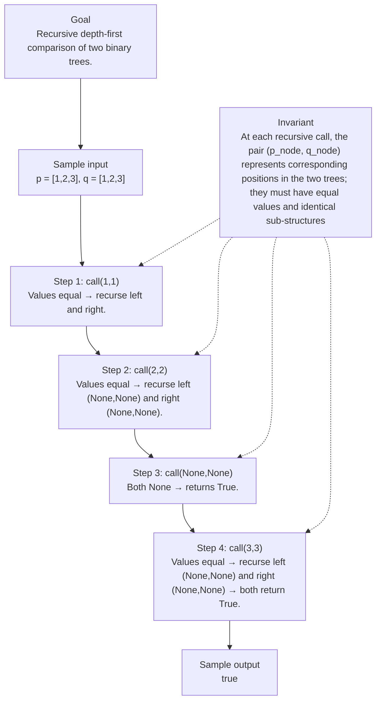

# 100. Same Tree

[View problem on LeetCode](https://leetcode.com/problems/same-tree/submissions/2121615020/)

## Solution metadata

- **Difficulty:** Easy
- **Language:** Python3
- **Topics:** Tree, Depth-First Search, Breadth-First Search, Binary Tree
- **Solved:** 2026-08-27 07:03 UTC
- **Runtime:** —
- **Memory:** —
- **Solution:** [Python3](./python/solution.py)

## Problem description

> Problem details captured from [LeetCode](https://leetcode.com/problems/same-tree/submissions/2121615020/).

Given the roots of two binary trees p and q, write a function to check if they are the same or not.
Two binary trees are considered the same if they are structurally identical, and the nodes have the same value.

## Examples

### Example 1

```text
Input:
p = [1,2,3], q = [1,2,3]

Output:
true
```

### Example 2

```text
Input:
p = [1,2], q = [1,null,2]

Output:
false
```

### Example 3

```text
Input:
p = [1,2,1], q = [1,1,2]

Output:
false
```

## Constraints

- `The number of nodes in both trees is in the range [0, 100].`
- `104 <= Node.val <= 104`

## Interview overview

> Generated from the submitted solution and the official problem details above. Verify AI analysis before relying on it.

The solution recursively traverses both trees in lockstep, comparing node values and structure. If both nodes are null the subtrees match; if both exist and values equal, it recurses on left and right children. Any mismatch returns false, guaranteeing exact structural and value equality.

### Solution replay



### Approach

1. Base case: if both current nodes are None, return True (empty subtrees are identical).
2. If exactly one node is None, return False (structure differs).
3. If both nodes exist, compare their values; if unequal, return False.
4. Recursively call isSameTree on the left children and on the right children.
5. Return the logical AND of the two recursive calls; both subtrees must match.

### Complexity

- **Time:** O(N)
- **Space:** O(H)

### Complexity self-check

- **Verdict:** optimal
- **Intended:** O(N) time, O(H) recursion stack where N is total nodes and H is tree height.
- Each node is visited once; no extra data structures are used beyond the call stack.

### Edge cases

- Both trees are empty (p = None, q = None) → true.
- One tree empty, the other non‑empty → false.
- Trees have same shape but a mismatched value at any node → false.
- Trees are deep (height = N) → recursion depth equals N.

_AI-generated with Groq; verify the analysis before relying on it._

## Study guide

Before reopening the solution:

1. Identify why **Tree** fits the problem constraints.
2. State the invariant that makes the algorithm correct.
3. Replay the first example without looking at the implementation.
4. Derive the time and space complexity from the implementation.
5. Name an edge case that would break a weaker approach.

---
_Synced by [LeetRepo](https://github.com/)_

<!-- leetrepo:data:v1
eyJ2ZXJzaW9uIjoxLCJzdWJtaXNzaW9uIjp7ImlkIjoiMTAwLXNhbWUtdHJlZSIsIm51bWJlciI6IjEwMCIsInRpdGxlIjoiU2FtZSBUcmVlIiwic2x1ZyI6InNhbWUtdHJlZSIsImRpZmZpY3VsdHkiOiJFYXN5IiwidGFncyI6WyJUcmVlIiwiRGVwdGgtRmlyc3QgU2VhcmNoIiwiQnJlYWR0aC1GaXJzdCBTZWFyY2giLCJCaW5hcnkgVHJlZSJdLCJsYW5ndWFnZSI6IlB5dGhvbjMiLCJleHRlbnNpb24iOiJweSIsInBhdGgiOiIwMTAwLXNhbWUtdHJlZS9weXRob24vc29sdXRpb24ucHkiLCJjb2RlIjoiI8KgRGVmaW5pdGlvbsKgZm9ywqBhwqBiaW5hcnnCoHRyZWXCoG5vZGUuXG4jwqBjbGFzc8KgVHJlZU5vZGU6XG4jwqDCoMKgwqDCoGRlZsKgX19pbml0X18oc2VsZizCoHZhbD0wLMKgbGVmdD1Ob25lLMKgcmlnaHQ9Tm9uZSk6XG4jwqDCoMKgwqDCoMKgwqDCoMKgc2VsZi52YWzCoD3CoHZhbFxuI8KgwqDCoMKgwqDCoMKgwqDCoHNlbGYubGVmdMKgPcKgbGVmdFxuI8KgwqDCoMKgwqDCoMKgwqDCoHNlbGYucmlnaHTCoD3CoHJpZ2h0XG5jbGFzc8KgU29sdXRpb246XG7CoMKgwqDCoGRlZsKgaXNTYW1lVHJlZShzZWxmLMKgcDrCoE9wdGlvbmFsW1RyZWVOb2RlXSzCoHE6wqBPcHRpb25hbFtUcmVlTm9kZV0pwqAtPsKgYm9vbDpcbsKgwqDCoMKgwqDCoMKgwqBpZsKgbm90wqBwwqBhbmTCoG5vdMKgcTpcbsKgwqDCoMKgwqDCoMKgwqDCoMKgwqDCoHJldHVybsKgVHJ1ZVxuwqDCoMKgwqDCoMKgwqDCoFxuwqDCoMKgwqDCoMKgwqDCoGlmwqBwwqBhbmTCoHHCoGFuZMKgcC52YWzCoD09wqBxLnZhbDpcbsKgwqDCoMKgwqDCoMKgwqDCoMKgwqDCoHJldHVybsKgc2VsZi5pc1NhbWVUcmVlKHAubGVmdCzCoHEubGVmdCnCoGFuZMKgc2VsZi5pc1NhbWVUcmVlKHAucmlnaHQswqBxLnJpZ2h0KVxuwqDCoMKgwqDCoMKgwqDCoFxuwqDCoMKgwqDCoMKgwqDCoHJldHVybsKgRmFsc2UiLCJydW50aW1lIjoi4oCUIiwibWVtb3J5Ijoi4oCUIiwic3RhdHVzIjoiQWNjZXB0ZWQiLCJ1cmwiOiJodHRwczovL2xlZXRjb2RlLmNvbS9wcm9ibGVtcy9zYW1lLXRyZWUvc3VibWlzc2lvbnMvMjEyMTYxNTAyMC8iLCJwcm9ibGVtRGVzY3JpcHRpb24iOiJHaXZlbiB0aGUgcm9vdHMgb2YgdHdvIGJpbmFyeSB0cmVlcyBwIGFuZCBxLCB3cml0ZSBhIGZ1bmN0aW9uIHRvIGNoZWNrIGlmIHRoZXkgYXJlIHRoZSBzYW1lIG9yIG5vdC5cblR3byBiaW5hcnkgdHJlZXMgYXJlIGNvbnNpZGVyZWQgdGhlIHNhbWUgaWYgdGhleSBhcmUgc3RydWN0dXJhbGx5IGlkZW50aWNhbCwgYW5kIHRoZSBub2RlcyBoYXZlIHRoZSBzYW1lIHZhbHVlLiIsInByb2JsZW1Db250ZXh0IjoiR2l2ZW4gdGhlIHJvb3RzIG9mIHR3byBiaW5hcnkgdHJlZXMgcCBhbmQgcSwgd3JpdGUgYSBmdW5jdGlvbiB0byBjaGVjayBpZiB0aGV5IGFyZSB0aGUgc2FtZSBvciBub3QuXG5Ud28gYmluYXJ5IHRyZWVzIGFyZSBjb25zaWRlcmVkIHRoZSBzYW1lIGlmIHRoZXkgYXJlIHN0cnVjdHVyYWxseSBpZGVudGljYWwsIGFuZCB0aGUgbm9kZXMgaGF2ZSB0aGUgc2FtZSB2YWx1ZS4iLCJleGFtcGxlcyI6W3siaW5wdXQiOiJwID0gWzEsMiwzXSwgcSA9IFsxLDIsM10iLCJvdXRwdXQiOiJ0cnVlIiwiZXhwbGFuYXRpb24iOiIifSx7ImlucHV0IjoicCA9IFsxLDJdLCBxID0gWzEsbnVsbCwyXSIsIm91dHB1dCI6ImZhbHNlIiwiZXhwbGFuYXRpb24iOiIifSx7ImlucHV0IjoicCA9IFsxLDIsMV0sIHEgPSBbMSwxLDJdIiwib3V0cHV0IjoiZmFsc2UiLCJleHBsYW5hdGlvbiI6IiJ9XSwiZXhhbXBsZUlucHV0IjoicCA9IFsxLDIsM10sIHEgPSBbMSwyLDNdIiwiZXhhbXBsZU91dHB1dCI6InRydWUiLCJjb25zdHJhaW50cyI6WyJUaGUgbnVtYmVyIG9mIG5vZGVzIGluIGJvdGggdHJlZXMgaXMgaW4gdGhlIHJhbmdlIFswLCAxMDBdLiIsIjEwNCA8PSBOb2RlLnZhbCA8PSAxMDQiXSwiaGludHMiOltdLCJmb2xsb3dVcCI6IiIsInNvbHZlZEF0IjoiMjAyNi0wOC0yN1QwNzowMzoxMy4yMDlaIiwic3luY2VkQXQiOiIyMDI2LTA4LTI3VDA3OjAzOjEzLjIwOVoiLCJjb21taXRVcmwiOiIiLCJjb21taXRTaGEiOiIiLCJub3RlcyI6IiIsInJldmlldyI6eyJzdW1tYXJ5IjoiVGhlIHNvbHV0aW9uIHJlY3Vyc2l2ZWx5IHRyYXZlcnNlcyBib3RoIHRyZWVzIGluIGxvY2tzdGVwLCBjb21wYXJpbmcgbm9kZSB2YWx1ZXMgYW5kIHN0cnVjdHVyZS4gSWYgYm90aCBub2RlcyBhcmUgbnVsbCB0aGUgc3VidHJlZXMgbWF0Y2g7IGlmIGJvdGggZXhpc3QgYW5kIHZhbHVlcyBlcXVhbCwgaXQgcmVjdXJzZXMgb24gbGVmdCBhbmQgcmlnaHQgY2hpbGRyZW4uIEFueSBtaXNtYXRjaCByZXR1cm5zIGZhbHNlLCBndWFyYW50ZWVpbmcgZXhhY3Qgc3RydWN0dXJhbCBhbmQgdmFsdWUgZXF1YWxpdHkuIiwiYXBwcm9hY2giOlsiQmFzZSBjYXNlOiBpZiBib3RoIGN1cnJlbnQgbm9kZXMgYXJlIE5vbmUsIHJldHVybiBUcnVlIChlbXB0eSBzdWJ0cmVlcyBhcmUgaWRlbnRpY2FsKS4iLCJJZiBleGFjdGx5IG9uZSBub2RlIGlzIE5vbmUsIHJldHVybiBGYWxzZSAoc3RydWN0dXJlIGRpZmZlcnMpLiIsIklmIGJvdGggbm9kZXMgZXhpc3QsIGNvbXBhcmUgdGhlaXIgdmFsdWVzOyBpZiB1bmVxdWFsLCByZXR1cm4gRmFsc2UuIiwiUmVjdXJzaXZlbHkgY2FsbCBpc1NhbWVUcmVlIG9uIHRoZSBsZWZ0IGNoaWxkcmVuIGFuZCBvbiB0aGUgcmlnaHQgY2hpbGRyZW4uIiwiUmV0dXJuIHRoZSBsb2dpY2FsIEFORCBvZiB0aGUgdHdvIHJlY3Vyc2l2ZSBjYWxsczsgYm90aCBzdWJ0cmVlcyBtdXN0IG1hdGNoLiJdLCJjb21wbGV4aXR5Ijp7InRpbWUiOiJPKE4pIiwic3BhY2UiOiJPKEgpIn0sImNvbXBsZXhpdHlDaGVjayI6eyJ2ZXJkaWN0Ijoib3B0aW1hbCIsImludGVuZGVkIjoiTyhOKSB0aW1lLCBPKEgpIHJlY3Vyc2lvbiBzdGFjayB3aGVyZSBOIGlzIHRvdGFsIG5vZGVzIGFuZCBIIGlzIHRyZWUgaGVpZ2h0LiIsIm5vdGUiOiJFYWNoIG5vZGUgaXMgdmlzaXRlZCBvbmNlOyBubyBleHRyYSBkYXRhIHN0cnVjdHVyZXMgYXJlIHVzZWQgYmV5b25kIHRoZSBjYWxsIHN0YWNrLiJ9LCJlZGdlQ2FzZXMiOlsiQm90aCB0cmVlcyBhcmUgZW1wdHkgKHAgPSBOb25lLCBxID0gTm9uZSkg4oaSIHRydWUuIiwiT25lIHRyZWUgZW1wdHksIHRoZSBvdGhlciBub27igJFlbXB0eSDihpIgZmFsc2UuIiwiVHJlZXMgaGF2ZSBzYW1lIHNoYXBlIGJ1dCBhIG1pc21hdGNoZWQgdmFsdWUgYXQgYW55IG5vZGUg4oaSIGZhbHNlLiIsIlRyZWVzIGFyZSBkZWVwIChoZWlnaHQgPSBOKSDihpIgcmVjdXJzaW9uIGRlcHRoIGVxdWFscyBOLiJdLCJ2aXN1YWwiOnsiY29udGV4dCI6IlJlY3Vyc2l2ZSBkZXB0aOKAkWZpcnN0IGNvbXBhcmlzb24gb2YgdHdvIGJpbmFyeSB0cmVlcy4iLCJpbnB1dCI6InAgPSBbMSwyLDNdLCBxID0gWzEsMiwzXSIsImludmFyaWFudCI6IkF0IGVhY2ggcmVjdXJzaXZlIGNhbGwsIHRoZSBwYWlyIChwX25vZGUsIHFfbm9kZSkgcmVwcmVzZW50cyBjb3JyZXNwb25kaW5nIHBvc2l0aW9ucyBpbiB0aGUgdHdvIHRyZWVzOyB0aGV5IG11c3QgaGF2ZSBlcXVhbCB2YWx1ZXMgYW5kIGlkZW50aWNhbCBzdWLigJFzdHJ1Y3R1cmVzICIsInN0ZXBzIjpbeyJsYWJlbCI6ImNhbGwoMSwxKSIsInN0YXRlIjoiVmFsdWVzIGVxdWFsIOKGkiByZWN1cnNlIGxlZnQgYW5kIHJpZ2h0LiJ9LHsibGFiZWwiOiJjYWxsKDIsMikiLCJzdGF0ZSI6IlZhbHVlcyBlcXVhbCDihpIgcmVjdXJzZSBsZWZ0IChOb25lLE5vbmUpIGFuZCByaWdodCAoTm9uZSxOb25lKS4ifSx7ImxhYmVsIjoiY2FsbChOb25lLE5vbmUpIiwic3RhdGUiOiJCb3RoIE5vbmUg4oaSIHJldHVybnMgVHJ1ZS4ifSx7ImxhYmVsIjoiY2FsbCgzLDMpIiwic3RhdGUiOiJWYWx1ZXMgZXF1YWwg4oaSIHJlY3Vyc2UgbGVmdCAoTm9uZSxOb25lKSBhbmQgcmlnaHQgKE5vbmUsTm9uZSkg4oaSIGJvdGggcmV0dXJuIFRydWUuIn1dLCJyZXN1bHQiOiJ0cnVlIn0sImdlbmVyYXRlZEJ5IjoiR3JvcSJ9LCJyZXZpZXdEdWVBdCI6IjIwMjYtMDktMjZUMDc6MDM6MTMuMjA5WiIsImxhc3RSZXZpZXdlZEF0IjpudWxsLCJyZXZpZXdJbnRlcnZhbERheXMiOm51bGwsInJldmlld0NvdW50IjowLCJyZXZpZXdMYXBzZXMiOjAsImxhc3RSZXZpZXdSYXRpbmciOm51bGwsInJldmlld0V2ZW50cyI6W10sInNvbHV0aW9ucyI6W3sia2V5IjoicHl0aG9uMzpweSIsInBhdGgiOiIwMTAwLXNhbWUtdHJlZS9weXRob24vc29sdXRpb24ucHkiLCJsYW5ndWFnZSI6IlB5dGhvbjMiLCJleHRlbnNpb24iOiJweSIsImRpZmZpY3VsdHkiOiJFYXN5IiwiY29kZSI6IiPCoERlZmluaXRpb27CoGZvcsKgYcKgYmluYXJ5wqB0cmVlwqBub2RlLlxuI8KgY2xhc3PCoFRyZWVOb2RlOlxuI8KgwqDCoMKgwqBkZWbCoF9faW5pdF9fKHNlbGYswqB2YWw9MCzCoGxlZnQ9Tm9uZSzCoHJpZ2h0PU5vbmUpOlxuI8KgwqDCoMKgwqDCoMKgwqDCoHNlbGYudmFswqA9wqB2YWxcbiPCoMKgwqDCoMKgwqDCoMKgwqBzZWxmLmxlZnTCoD3CoGxlZnRcbiPCoMKgwqDCoMKgwqDCoMKgwqBzZWxmLnJpZ2h0wqA9wqByaWdodFxuY2xhc3PCoFNvbHV0aW9uOlxuwqDCoMKgwqBkZWbCoGlzU2FtZVRyZWUoc2VsZizCoHA6wqBPcHRpb25hbFtUcmVlTm9kZV0swqBxOsKgT3B0aW9uYWxbVHJlZU5vZGVdKcKgLT7CoGJvb2w6XG7CoMKgwqDCoMKgwqDCoMKgaWbCoG5vdMKgcMKgYW5kwqBub3TCoHE6XG7CoMKgwqDCoMKgwqDCoMKgwqDCoMKgwqByZXR1cm7CoFRydWVcbsKgwqDCoMKgwqDCoMKgwqBcbsKgwqDCoMKgwqDCoMKgwqBpZsKgcMKgYW5kwqBxwqBhbmTCoHAudmFswqA9PcKgcS52YWw6XG7CoMKgwqDCoMKgwqDCoMKgwqDCoMKgwqByZXR1cm7CoHNlbGYuaXNTYW1lVHJlZShwLmxlZnQswqBxLmxlZnQpwqBhbmTCoHNlbGYuaXNTYW1lVHJlZShwLnJpZ2h0LMKgcS5yaWdodClcbsKgwqDCoMKgwqDCoMKgwqBcbsKgwqDCoMKgwqDCoMKgwqByZXR1cm7CoEZhbHNlIiwicnVudGltZSI6IuKAlCIsIm1lbW9yeSI6IuKAlCIsInN0YXR1cyI6IkFjY2VwdGVkIiwic29sdmVkQXQiOiIyMDI2LTA4LTI3VDA3OjAzOjEzLjIwOVoiLCJzeW5jZWRBdCI6IjIwMjYtMDgtMjdUMDc6MDM6MTMuMjA5WiIsImNvbW1pdFVybCI6IiIsImNvbW1pdFNoYSI6IiIsInJldmlldyI6eyJzdW1tYXJ5IjoiVGhlIHNvbHV0aW9uIHJlY3Vyc2l2ZWx5IHRyYXZlcnNlcyBib3RoIHRyZWVzIGluIGxvY2tzdGVwLCBjb21wYXJpbmcgbm9kZSB2YWx1ZXMgYW5kIHN0cnVjdHVyZS4gSWYgYm90aCBub2RlcyBhcmUgbnVsbCB0aGUgc3VidHJlZXMgbWF0Y2g7IGlmIGJvdGggZXhpc3QgYW5kIHZhbHVlcyBlcXVhbCwgaXQgcmVjdXJzZXMgb24gbGVmdCBhbmQgcmlnaHQgY2hpbGRyZW4uIEFueSBtaXNtYXRjaCByZXR1cm5zIGZhbHNlLCBndWFyYW50ZWVpbmcgZXhhY3Qgc3RydWN0dXJhbCBhbmQgdmFsdWUgZXF1YWxpdHkuIiwiYXBwcm9hY2giOlsiQmFzZSBjYXNlOiBpZiBib3RoIGN1cnJlbnQgbm9kZXMgYXJlIE5vbmUsIHJldHVybiBUcnVlIChlbXB0eSBzdWJ0cmVlcyBhcmUgaWRlbnRpY2FsKS4iLCJJZiBleGFjdGx5IG9uZSBub2RlIGlzIE5vbmUsIHJldHVybiBGYWxzZSAoc3RydWN0dXJlIGRpZmZlcnMpLiIsIklmIGJvdGggbm9kZXMgZXhpc3QsIGNvbXBhcmUgdGhlaXIgdmFsdWVzOyBpZiB1bmVxdWFsLCByZXR1cm4gRmFsc2UuIiwiUmVjdXJzaXZlbHkgY2FsbCBpc1NhbWVUcmVlIG9uIHRoZSBsZWZ0IGNoaWxkcmVuIGFuZCBvbiB0aGUgcmlnaHQgY2hpbGRyZW4uIiwiUmV0dXJuIHRoZSBsb2dpY2FsIEFORCBvZiB0aGUgdHdvIHJlY3Vyc2l2ZSBjYWxsczsgYm90aCBzdWJ0cmVlcyBtdXN0IG1hdGNoLiJdLCJjb21wbGV4aXR5Ijp7InRpbWUiOiJPKE4pIiwic3BhY2UiOiJPKEgpIn0sImNvbXBsZXhpdHlDaGVjayI6eyJ2ZXJkaWN0Ijoib3B0aW1hbCIsImludGVuZGVkIjoiTyhOKSB0aW1lLCBPKEgpIHJlY3Vyc2lvbiBzdGFjayB3aGVyZSBOIGlzIHRvdGFsIG5vZGVzIGFuZCBIIGlzIHRyZWUgaGVpZ2h0LiIsIm5vdGUiOiJFYWNoIG5vZGUgaXMgdmlzaXRlZCBvbmNlOyBubyBleHRyYSBkYXRhIHN0cnVjdHVyZXMgYXJlIHVzZWQgYmV5b25kIHRoZSBjYWxsIHN0YWNrLiJ9LCJlZGdlQ2FzZXMiOlsiQm90aCB0cmVlcyBhcmUgZW1wdHkgKHAgPSBOb25lLCBxID0gTm9uZSkg4oaSIHRydWUuIiwiT25lIHRyZWUgZW1wdHksIHRoZSBvdGhlciBub27igJFlbXB0eSDihpIgZmFsc2UuIiwiVHJlZXMgaGF2ZSBzYW1lIHNoYXBlIGJ1dCBhIG1pc21hdGNoZWQgdmFsdWUgYXQgYW55IG5vZGUg4oaSIGZhbHNlLiIsIlRyZWVzIGFyZSBkZWVwIChoZWlnaHQgPSBOKSDihpIgcmVjdXJzaW9uIGRlcHRoIGVxdWFscyBOLiJdLCJ2aXN1YWwiOnsiY29udGV4dCI6IlJlY3Vyc2l2ZSBkZXB0aOKAkWZpcnN0IGNvbXBhcmlzb24gb2YgdHdvIGJpbmFyeSB0cmVlcy4iLCJpbnB1dCI6InAgPSBbMSwyLDNdLCBxID0gWzEsMiwzXSIsImludmFyaWFudCI6IkF0IGVhY2ggcmVjdXJzaXZlIGNhbGwsIHRoZSBwYWlyIChwX25vZGUsIHFfbm9kZSkgcmVwcmVzZW50cyBjb3JyZXNwb25kaW5nIHBvc2l0aW9ucyBpbiB0aGUgdHdvIHRyZWVzOyB0aGV5IG11c3QgaGF2ZSBlcXVhbCB2YWx1ZXMgYW5kIGlkZW50aWNhbCBzdWLigJFzdHJ1Y3R1cmVzICIsInN0ZXBzIjpbeyJsYWJlbCI6ImNhbGwoMSwxKSIsInN0YXRlIjoiVmFsdWVzIGVxdWFsIOKGkiByZWN1cnNlIGxlZnQgYW5kIHJpZ2h0LiJ9LHsibGFiZWwiOiJjYWxsKDIsMikiLCJzdGF0ZSI6IlZhbHVlcyBlcXVhbCDihpIgcmVjdXJzZSBsZWZ0IChOb25lLE5vbmUpIGFuZCByaWdodCAoTm9uZSxOb25lKS4ifSx7ImxhYmVsIjoiY2FsbChOb25lLE5vbmUpIiwic3RhdGUiOiJCb3RoIE5vbmUg4oaSIHJldHVybnMgVHJ1ZS4ifSx7ImxhYmVsIjoiY2FsbCgzLDMpIiwic3RhdGUiOiJWYWx1ZXMgZXF1YWwg4oaSIHJlY3Vyc2UgbGVmdCAoTm9uZSxOb25lKSBhbmQgcmlnaHQgKE5vbmUsTm9uZSkg4oaSIGJvdGggcmV0dXJuIFRydWUuIn1dLCJyZXN1bHQiOiJ0cnVlIn0sImdlbmVyYXRlZEJ5IjoiR3JvcSJ9fV0sImtleSI6InB5dGhvbjM6cHkifX0=
leetrepo:data:end -->