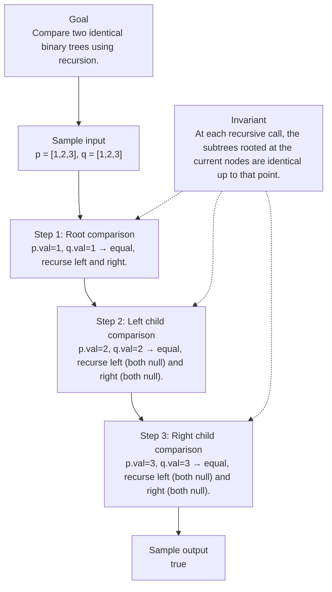

# 100. Same Tree

[View problem on LeetCode](https://leetcode.com/problems/same-tree/submissions/2121615020/)

## Solution metadata

- **Difficulty:** Easy
- **Language:** Python3
- **Topics:** Tree, Depth-First Search, Breadth-First Search, Binary Tree
- **Solved:** 2026-08-27 07:03 UTC
- **Runtime:** —
- **Memory:** —
- **Solution:** [Python3](./python/solution.py)

## Problem description

> Problem details captured from [LeetCode](https://leetcode.com/problems/same-tree/submissions/2121615020/).

Given the roots of two binary trees p and q, write a function to check if they are the same or not.
Two binary trees are considered the same if they are structurally identical, and the nodes have the same value.

## Examples

### Example 1

```text
Input:
p = [1,2,3], q = [1,2,3]

Output:
true
```

### Example 2

```text
Input:
p = [1,2], q = [1,null,2]

Output:
false
```

### Example 3

```text
Input:
p = [1,2,1], q = [1,1,2]

Output:
false
```

## Constraints

- `The number of nodes in both trees is in the range [0, 100].`
- `104 <= Node.val <= 104`

## Interview overview

> Generated from the submitted solution and the official problem details above. Verify AI analysis before relying on it.

Recursively compare corresponding nodes of the two trees. If both nodes are null they match; if both exist and have equal values, recurse on left and right children. Any mismatch returns false. This works because tree equality is defined by identical structure and values, which the recursion checks at every position.

### Solution replay



### Approach

1. If both current nodes are null, return true (base case).
2. If exactly one node is null, return false (structure differs).
3. If both nodes exist, compare their values; if unequal, return false.
4. Recursively call the function on the left children of both nodes.
5. Recursively call the function on the right children of both nodes.
6. Return the logical AND of the left and right recursive results.

### Complexity

- **Time:** O(N) where N is the number of nodes in the smaller tree (worst‑case both trees have the same size).
- **Space:** O(H) recursion stack, H being the height of the tree (O(N) in the worst case of a degenerate tree).

### Complexity self-check

- **Verdict:** optimal
- **Intended:** The solution visits each node at most once, which is the lower bound for checking tree equality.
- No extra data structures are used; recursion depth matches tree height.

### Edge cases

- Both p and q are null → true.
- One tree is null and the other is not → false.
- Trees have same shape but a node value differs → false.
- Trees have different shapes (e.g., one has a left child the other does not) → false.

_AI-generated with Groq; verify the analysis before relying on it._

## Study guide

Before reopening the solution:

1. Identify why **Tree** fits the problem constraints.
2. State the invariant that makes the algorithm correct.
3. Replay the first example without looking at the implementation.
4. Derive the time and space complexity from the implementation.
5. Name an edge case that would break a weaker approach.

---
_Synced by [LeetRepo](https://github.com/)_

<!-- leetrepo:data:v1
eyJ2ZXJzaW9uIjoxLCJzdWJtaXNzaW9uIjp7ImlkIjoiMTAwLXNhbWUtdHJlZSIsIm51bWJlciI6IjEwMCIsInRpdGxlIjoiU2FtZSBUcmVlIiwic2x1ZyI6InNhbWUtdHJlZSIsImRpZmZpY3VsdHkiOiJFYXN5IiwidGFncyI6WyJUcmVlIiwiRGVwdGgtRmlyc3QgU2VhcmNoIiwiQnJlYWR0aC1GaXJzdCBTZWFyY2giLCJCaW5hcnkgVHJlZSJdLCJsYW5ndWFnZSI6IlB5dGhvbjMiLCJleHRlbnNpb24iOiJweSIsInBhdGgiOiIwMTAwLXNhbWUtdHJlZS9weXRob24vc29sdXRpb24ucHkiLCJjb2RlIjoiI8KgRGVmaW5pdGlvbsKgZm9ywqBhwqBiaW5hcnnCoHRyZWXCoG5vZGUuXG4jwqBjbGFzc8KgVHJlZU5vZGU6XG4jwqDCoMKgwqDCoGRlZsKgX19pbml0X18oc2VsZizCoHZhbD0wLMKgbGVmdD1Ob25lLMKgcmlnaHQ9Tm9uZSk6XG4jwqDCoMKgwqDCoMKgwqDCoMKgc2VsZi52YWzCoD3CoHZhbFxuI8KgwqDCoMKgwqDCoMKgwqDCoHNlbGYubGVmdMKgPcKgbGVmdFxuI8KgwqDCoMKgwqDCoMKgwqDCoHNlbGYucmlnaHTCoD3CoHJpZ2h0XG5jbGFzc8KgU29sdXRpb246XG7CoMKgwqDCoGRlZsKgaXNTYW1lVHJlZShzZWxmLMKgcDrCoE9wdGlvbmFsW1RyZWVOb2RlXSzCoHE6wqBPcHRpb25hbFtUcmVlTm9kZV0pwqAtPsKgYm9vbDpcbsKgwqDCoMKgwqDCoMKgwqBpZsKgbm90wqBwwqBhbmTCoG5vdMKgcTpcbsKgwqDCoMKgwqDCoMKgwqDCoMKgwqDCoHJldHVybsKgVHJ1ZVxuwqDCoMKgwqDCoMKgwqDCoFxuwqDCoMKgwqDCoMKgwqDCoGlmwqBwwqBhbmTCoHHCoGFuZMKgcC52YWzCoD09wqBxLnZhbDpcbsKgwqDCoMKgwqDCoMKgwqDCoMKgwqDCoHJldHVybsKgc2VsZi5pc1NhbWVUcmVlKHAubGVmdCzCoHEubGVmdCnCoGFuZMKgc2VsZi5pc1NhbWVUcmVlKHAucmlnaHQswqBxLnJpZ2h0KVxuwqDCoMKgwqDCoMKgwqDCoFxuwqDCoMKgwqDCoMKgwqDCoHJldHVybsKgRmFsc2UiLCJydW50aW1lIjoi4oCUIiwibWVtb3J5Ijoi4oCUIiwic3RhdHVzIjoiQWNjZXB0ZWQiLCJ1cmwiOiJodHRwczovL2xlZXRjb2RlLmNvbS9wcm9ibGVtcy9zYW1lLXRyZWUvc3VibWlzc2lvbnMvMjEyMTYxNTAyMC8iLCJwcm9ibGVtRGVzY3JpcHRpb24iOiJHaXZlbiB0aGUgcm9vdHMgb2YgdHdvIGJpbmFyeSB0cmVlcyBwIGFuZCBxLCB3cml0ZSBhIGZ1bmN0aW9uIHRvIGNoZWNrIGlmIHRoZXkgYXJlIHRoZSBzYW1lIG9yIG5vdC5cblR3byBiaW5hcnkgdHJlZXMgYXJlIGNvbnNpZGVyZWQgdGhlIHNhbWUgaWYgdGhleSBhcmUgc3RydWN0dXJhbGx5IGlkZW50aWNhbCwgYW5kIHRoZSBub2RlcyBoYXZlIHRoZSBzYW1lIHZhbHVlLiIsInByb2JsZW1Db250ZXh0IjoiR2l2ZW4gdGhlIHJvb3RzIG9mIHR3byBiaW5hcnkgdHJlZXMgcCBhbmQgcSwgd3JpdGUgYSBmdW5jdGlvbiB0byBjaGVjayBpZiB0aGV5IGFyZSB0aGUgc2FtZSBvciBub3QuXG5Ud28gYmluYXJ5IHRyZWVzIGFyZSBjb25zaWRlcmVkIHRoZSBzYW1lIGlmIHRoZXkgYXJlIHN0cnVjdHVyYWxseSBpZGVudGljYWwsIGFuZCB0aGUgbm9kZXMgaGF2ZSB0aGUgc2FtZSB2YWx1ZS4iLCJleGFtcGxlcyI6W3siaW5wdXQiOiJwID0gWzEsMiwzXSwgcSA9IFsxLDIsM10iLCJvdXRwdXQiOiJ0cnVlIiwiZXhwbGFuYXRpb24iOiIifSx7ImlucHV0IjoicCA9IFsxLDJdLCBxID0gWzEsbnVsbCwyXSIsIm91dHB1dCI6ImZhbHNlIiwiZXhwbGFuYXRpb24iOiIifSx7ImlucHV0IjoicCA9IFsxLDIsMV0sIHEgPSBbMSwxLDJdIiwib3V0cHV0IjoiZmFsc2UiLCJleHBsYW5hdGlvbiI6IiJ9XSwiZXhhbXBsZUlucHV0IjoicCA9IFsxLDIsM10sIHEgPSBbMSwyLDNdIiwiZXhhbXBsZU91dHB1dCI6InRydWUiLCJjb25zdHJhaW50cyI6WyJUaGUgbnVtYmVyIG9mIG5vZGVzIGluIGJvdGggdHJlZXMgaXMgaW4gdGhlIHJhbmdlIFswLCAxMDBdLiIsIjEwNCA8PSBOb2RlLnZhbCA8PSAxMDQiXSwiaGludHMiOltdLCJmb2xsb3dVcCI6IiIsInNvbHZlZEF0IjoiMjAyNi0wOC0yN1QwNzowMzoxMy4yMDlaIiwic3luY2VkQXQiOiIyMDI2LTA4LTI3VDA3OjAzOjE4WiIsImNvbW1pdFVybCI6Imh0dHBzOi8vZ2l0aHViLmNvbS9kYWFubmlpbGwvbGVldGNvZGVfc29scy90cmVlL21haW4vMDEwMC1zYW1lLXRyZWUiLCJjb21taXRTaGEiOiI0MDhmNDQ4NGYyYzNmNWJjMzZlOGI3YmRkZGUxMjU3MTBjZDY4ZDRjIiwibm90ZXMiOiIiLCJyZXZpZXciOnsic3VtbWFyeSI6IlJlY3Vyc2l2ZWx5IGNvbXBhcmUgY29ycmVzcG9uZGluZyBub2RlcyBvZiB0aGUgdHdvIHRyZWVzLiBJZiBib3RoIG5vZGVzIGFyZSBudWxsIHRoZXkgbWF0Y2g7IGlmIGJvdGggZXhpc3QgYW5kIGhhdmUgZXF1YWwgdmFsdWVzLCByZWN1cnNlIG9uIGxlZnQgYW5kIHJpZ2h0IGNoaWxkcmVuLiBBbnkgbWlzbWF0Y2ggcmV0dXJucyBmYWxzZS4gVGhpcyB3b3JrcyBiZWNhdXNlIHRyZWUgZXF1YWxpdHkgaXMgZGVmaW5lZCBieSBpZGVudGljYWwgc3RydWN0dXJlIGFuZCB2YWx1ZXMsIHdoaWNoIHRoZSByZWN1cnNpb24gY2hlY2tzIGF0IGV2ZXJ5IHBvc2l0aW9uLiIsImFwcHJvYWNoIjpbIklmIGJvdGggY3VycmVudCBub2RlcyBhcmUgbnVsbCwgcmV0dXJuIHRydWUgKGJhc2UgY2FzZSkuIiwiSWYgZXhhY3RseSBvbmUgbm9kZSBpcyBudWxsLCByZXR1cm4gZmFsc2UgKHN0cnVjdHVyZSBkaWZmZXJzKS4iLCJJZiBib3RoIG5vZGVzIGV4aXN0LCBjb21wYXJlIHRoZWlyIHZhbHVlczsgaWYgdW5lcXVhbCwgcmV0dXJuIGZhbHNlLiIsIlJlY3Vyc2l2ZWx5IGNhbGwgdGhlIGZ1bmN0aW9uIG9uIHRoZSBsZWZ0IGNoaWxkcmVuIG9mIGJvdGggbm9kZXMuIiwiUmVjdXJzaXZlbHkgY2FsbCB0aGUgZnVuY3Rpb24gb24gdGhlIHJpZ2h0IGNoaWxkcmVuIG9mIGJvdGggbm9kZXMuIiwiUmV0dXJuIHRoZSBsb2dpY2FsIEFORCBvZiB0aGUgbGVmdCBhbmQgcmlnaHQgcmVjdXJzaXZlIHJlc3VsdHMuIl0sImNvbXBsZXhpdHkiOnsidGltZSI6Ik8oTikgd2hlcmUgTiBpcyB0aGUgbnVtYmVyIG9mIG5vZGVzIGluIHRoZSBzbWFsbGVyIHRyZWUgKHdvcnN04oCRY2FzZSBib3RoIHRyZWVzIGhhdmUgdGhlIHNhbWUgc2l6ZSkuIiwic3BhY2UiOiJPKEgpIHJlY3Vyc2lvbiBzdGFjaywgSCBiZWluZyB0aGUgaGVpZ2h0IG9mIHRoZSB0cmVlIChPKE4pIGluIHRoZSB3b3JzdCBjYXNlIG9mIGEgZGVnZW5lcmF0ZSB0cmVlKS4ifSwiY29tcGxleGl0eUNoZWNrIjp7InZlcmRpY3QiOiJvcHRpbWFsIiwiaW50ZW5kZWQiOiJUaGUgc29sdXRpb24gdmlzaXRzIGVhY2ggbm9kZSBhdCBtb3N0IG9uY2UsIHdoaWNoIGlzIHRoZSBsb3dlciBib3VuZCBmb3IgY2hlY2tpbmcgdHJlZSBlcXVhbGl0eS4iLCJub3RlIjoiTm8gZXh0cmEgZGF0YSBzdHJ1Y3R1cmVzIGFyZSB1c2VkOyByZWN1cnNpb24gZGVwdGggbWF0Y2hlcyB0cmVlIGhlaWdodC4ifSwiZWRnZUNhc2VzIjpbIkJvdGggcCBhbmQgcSBhcmUgbnVsbCDihpIgdHJ1ZS4iLCJPbmUgdHJlZSBpcyBudWxsIGFuZCB0aGUgb3RoZXIgaXMgbm90IOKGkiBmYWxzZS4iLCJUcmVlcyBoYXZlIHNhbWUgc2hhcGUgYnV0IGEgbm9kZSB2YWx1ZSBkaWZmZXJzIOKGkiBmYWxzZS4iLCJUcmVlcyBoYXZlIGRpZmZlcmVudCBzaGFwZXMgKGUuZy4sIG9uZSBoYXMgYSBsZWZ0IGNoaWxkIHRoZSBvdGhlciBkb2VzIG5vdCkg4oaSIGZhbHNlLiJdLCJ2aXN1YWwiOnsiY29udGV4dCI6IkNvbXBhcmUgdHdvIGlkZW50aWNhbCBiaW5hcnkgdHJlZXMgdXNpbmcgcmVjdXJzaW9uLiIsImlucHV0IjoicCA9IFsxLDIsM10sIHEgPSBbMSwyLDNdIiwiaW52YXJpYW50IjoiQXQgZWFjaCByZWN1cnNpdmUgY2FsbCwgdGhlIHN1YnRyZWVzIHJvb3RlZCBhdCB0aGUgY3VycmVudCBub2RlcyBhcmUgaWRlbnRpY2FsIHVwIHRvIHRoYXQgcG9pbnQuIiwic3RlcHMiOlt7ImxhYmVsIjoiUm9vdCBjb21wYXJpc29uIiwic3RhdGUiOiJwLnZhbD0xLCBxLnZhbD0xIOKGkiBlcXVhbCwgcmVjdXJzZSBsZWZ0IGFuZCByaWdodC4ifSx7ImxhYmVsIjoiTGVmdCBjaGlsZCBjb21wYXJpc29uIiwic3RhdGUiOiJwLnZhbD0yLCBxLnZhbD0yIOKGkiBlcXVhbCwgcmVjdXJzZSBsZWZ0IChib3RoIG51bGwpIGFuZCByaWdodCAoYm90aCBudWxsKS4ifSx7ImxhYmVsIjoiUmlnaHQgY2hpbGQgY29tcGFyaXNvbiIsInN0YXRlIjoicC52YWw9MywgcS52YWw9MyDihpIgZXF1YWwsIHJlY3Vyc2UgbGVmdCAoYm90aCBudWxsKSBhbmQgcmlnaHQgKGJvdGggbnVsbCkuIn1dLCJyZXN1bHQiOiJ0cnVlIn0sImdlbmVyYXRlZEJ5IjoiR3JvcSJ9LCJyZXZpZXdEdWVBdCI6IjIwMjYtMDktMjZUMDc6MDM6MTMuMjA5WiIsImxhc3RSZXZpZXdlZEF0IjpudWxsLCJyZXZpZXdJbnRlcnZhbERheXMiOm51bGwsInJldmlld0NvdW50IjowLCJyZXZpZXdMYXBzZXMiOjAsImxhc3RSZXZpZXdSYXRpbmciOm51bGwsInJldmlld0V2ZW50cyI6W10sInNvbHV0aW9ucyI6W3sia2V5IjoicHl0aG9uMzpweSIsInBhdGgiOiIwMTAwLXNhbWUtdHJlZS9weXRob24vc29sdXRpb24ucHkiLCJsYW5ndWFnZSI6IlB5dGhvbjMiLCJleHRlbnNpb24iOiJweSIsImRpZmZpY3VsdHkiOiJFYXN5IiwiY29kZSI6IiPCoERlZmluaXRpb27CoGZvcsKgYcKgYmluYXJ5wqB0cmVlwqBub2RlLlxuI8KgY2xhc3PCoFRyZWVOb2RlOlxuI8KgwqDCoMKgwqBkZWbCoF9faW5pdF9fKHNlbGYswqB2YWw9MCzCoGxlZnQ9Tm9uZSzCoHJpZ2h0PU5vbmUpOlxuI8KgwqDCoMKgwqDCoMKgwqDCoHNlbGYudmFswqA9wqB2YWxcbiPCoMKgwqDCoMKgwqDCoMKgwqBzZWxmLmxlZnTCoD3CoGxlZnRcbiPCoMKgwqDCoMKgwqDCoMKgwqBzZWxmLnJpZ2h0wqA9wqByaWdodFxuY2xhc3PCoFNvbHV0aW9uOlxuwqDCoMKgwqBkZWbCoGlzU2FtZVRyZWUoc2VsZizCoHA6wqBPcHRpb25hbFtUcmVlTm9kZV0swqBxOsKgT3B0aW9uYWxbVHJlZU5vZGVdKcKgLT7CoGJvb2w6XG7CoMKgwqDCoMKgwqDCoMKgaWbCoG5vdMKgcMKgYW5kwqBub3TCoHE6XG7CoMKgwqDCoMKgwqDCoMKgwqDCoMKgwqByZXR1cm7CoFRydWVcbsKgwqDCoMKgwqDCoMKgwqBcbsKgwqDCoMKgwqDCoMKgwqBpZsKgcMKgYW5kwqBxwqBhbmTCoHAudmFswqA9PcKgcS52YWw6XG7CoMKgwqDCoMKgwqDCoMKgwqDCoMKgwqByZXR1cm7CoHNlbGYuaXNTYW1lVHJlZShwLmxlZnQswqBxLmxlZnQpwqBhbmTCoHNlbGYuaXNTYW1lVHJlZShwLnJpZ2h0LMKgcS5yaWdodClcbsKgwqDCoMKgwqDCoMKgwqBcbsKgwqDCoMKgwqDCoMKgwqByZXR1cm7CoEZhbHNlIiwicnVudGltZSI6IuKAlCIsIm1lbW9yeSI6IuKAlCIsInN0YXR1cyI6IkFjY2VwdGVkIiwic29sdmVkQXQiOiIyMDI2LTA4LTI3VDA3OjAzOjEzLjIwOVoiLCJzeW5jZWRBdCI6IjIwMjYtMDgtMjdUMDc6MDM6MThaIiwiY29tbWl0VXJsIjoiaHR0cHM6Ly9naXRodWIuY29tL2RhYW5uaWlsbC9sZWV0Y29kZV9zb2xzL3RyZWUvbWFpbi8wMTAwLXNhbWUtdHJlZSIsImNvbW1pdFNoYSI6IjQwOGY0NDg0ZjJjM2Y1YmMzNmU4YjdiZGRkZTEyNTcxMGNkNjhkNGMiLCJyZXZpZXciOnsic3VtbWFyeSI6IlJlY3Vyc2l2ZWx5IGNvbXBhcmUgY29ycmVzcG9uZGluZyBub2RlcyBvZiB0aGUgdHdvIHRyZWVzLiBJZiBib3RoIG5vZGVzIGFyZSBudWxsIHRoZXkgbWF0Y2g7IGlmIGJvdGggZXhpc3QgYW5kIGhhdmUgZXF1YWwgdmFsdWVzLCByZWN1cnNlIG9uIGxlZnQgYW5kIHJpZ2h0IGNoaWxkcmVuLiBBbnkgbWlzbWF0Y2ggcmV0dXJucyBmYWxzZS4gVGhpcyB3b3JrcyBiZWNhdXNlIHRyZWUgZXF1YWxpdHkgaXMgZGVmaW5lZCBieSBpZGVudGljYWwgc3RydWN0dXJlIGFuZCB2YWx1ZXMsIHdoaWNoIHRoZSByZWN1cnNpb24gY2hlY2tzIGF0IGV2ZXJ5IHBvc2l0aW9uLiIsImFwcHJvYWNoIjpbIklmIGJvdGggY3VycmVudCBub2RlcyBhcmUgbnVsbCwgcmV0dXJuIHRydWUgKGJhc2UgY2FzZSkuIiwiSWYgZXhhY3RseSBvbmUgbm9kZSBpcyBudWxsLCByZXR1cm4gZmFsc2UgKHN0cnVjdHVyZSBkaWZmZXJzKS4iLCJJZiBib3RoIG5vZGVzIGV4aXN0LCBjb21wYXJlIHRoZWlyIHZhbHVlczsgaWYgdW5lcXVhbCwgcmV0dXJuIGZhbHNlLiIsIlJlY3Vyc2l2ZWx5IGNhbGwgdGhlIGZ1bmN0aW9uIG9uIHRoZSBsZWZ0IGNoaWxkcmVuIG9mIGJvdGggbm9kZXMuIiwiUmVjdXJzaXZlbHkgY2FsbCB0aGUgZnVuY3Rpb24gb24gdGhlIHJpZ2h0IGNoaWxkcmVuIG9mIGJvdGggbm9kZXMuIiwiUmV0dXJuIHRoZSBsb2dpY2FsIEFORCBvZiB0aGUgbGVmdCBhbmQgcmlnaHQgcmVjdXJzaXZlIHJlc3VsdHMuIl0sImNvbXBsZXhpdHkiOnsidGltZSI6Ik8oTikgd2hlcmUgTiBpcyB0aGUgbnVtYmVyIG9mIG5vZGVzIGluIHRoZSBzbWFsbGVyIHRyZWUgKHdvcnN04oCRY2FzZSBib3RoIHRyZWVzIGhhdmUgdGhlIHNhbWUgc2l6ZSkuIiwic3BhY2UiOiJPKEgpIHJlY3Vyc2lvbiBzdGFjaywgSCBiZWluZyB0aGUgaGVpZ2h0IG9mIHRoZSB0cmVlIChPKE4pIGluIHRoZSB3b3JzdCBjYXNlIG9mIGEgZGVnZW5lcmF0ZSB0cmVlKS4ifSwiY29tcGxleGl0eUNoZWNrIjp7InZlcmRpY3QiOiJvcHRpbWFsIiwiaW50ZW5kZWQiOiJUaGUgc29sdXRpb24gdmlzaXRzIGVhY2ggbm9kZSBhdCBtb3N0IG9uY2UsIHdoaWNoIGlzIHRoZSBsb3dlciBib3VuZCBmb3IgY2hlY2tpbmcgdHJlZSBlcXVhbGl0eS4iLCJub3RlIjoiTm8gZXh0cmEgZGF0YSBzdHJ1Y3R1cmVzIGFyZSB1c2VkOyByZWN1cnNpb24gZGVwdGggbWF0Y2hlcyB0cmVlIGhlaWdodC4ifSwiZWRnZUNhc2VzIjpbIkJvdGggcCBhbmQgcSBhcmUgbnVsbCDihpIgdHJ1ZS4iLCJPbmUgdHJlZSBpcyBudWxsIGFuZCB0aGUgb3RoZXIgaXMgbm90IOKGkiBmYWxzZS4iLCJUcmVlcyBoYXZlIHNhbWUgc2hhcGUgYnV0IGEgbm9kZSB2YWx1ZSBkaWZmZXJzIOKGkiBmYWxzZS4iLCJUcmVlcyBoYXZlIGRpZmZlcmVudCBzaGFwZXMgKGUuZy4sIG9uZSBoYXMgYSBsZWZ0IGNoaWxkIHRoZSBvdGhlciBkb2VzIG5vdCkg4oaSIGZhbHNlLiJdLCJ2aXN1YWwiOnsiY29udGV4dCI6IkNvbXBhcmUgdHdvIGlkZW50aWNhbCBiaW5hcnkgdHJlZXMgdXNpbmcgcmVjdXJzaW9uLiIsImlucHV0IjoicCA9IFsxLDIsM10sIHEgPSBbMSwyLDNdIiwiaW52YXJpYW50IjoiQXQgZWFjaCByZWN1cnNpdmUgY2FsbCwgdGhlIHN1YnRyZWVzIHJvb3RlZCBhdCB0aGUgY3VycmVudCBub2RlcyBhcmUgaWRlbnRpY2FsIHVwIHRvIHRoYXQgcG9pbnQuIiwic3RlcHMiOlt7ImxhYmVsIjoiUm9vdCBjb21wYXJpc29uIiwic3RhdGUiOiJwLnZhbD0xLCBxLnZhbD0xIOKGkiBlcXVhbCwgcmVjdXJzZSBsZWZ0IGFuZCByaWdodC4ifSx7ImxhYmVsIjoiTGVmdCBjaGlsZCBjb21wYXJpc29uIiwic3RhdGUiOiJwLnZhbD0yLCBxLnZhbD0yIOKGkiBlcXVhbCwgcmVjdXJzZSBsZWZ0IChib3RoIG51bGwpIGFuZCByaWdodCAoYm90aCBudWxsKS4ifSx7ImxhYmVsIjoiUmlnaHQgY2hpbGQgY29tcGFyaXNvbiIsInN0YXRlIjoicC52YWw9MywgcS52YWw9MyDihpIgZXF1YWwsIHJlY3Vyc2UgbGVmdCAoYm90aCBudWxsKSBhbmQgcmlnaHQgKGJvdGggbnVsbCkuIn1dLCJyZXN1bHQiOiJ0cnVlIn0sImdlbmVyYXRlZEJ5IjoiR3JvcSJ9fV0sImtleSI6InB5dGhvbjM6cHkifX0=
leetrepo:data:end -->