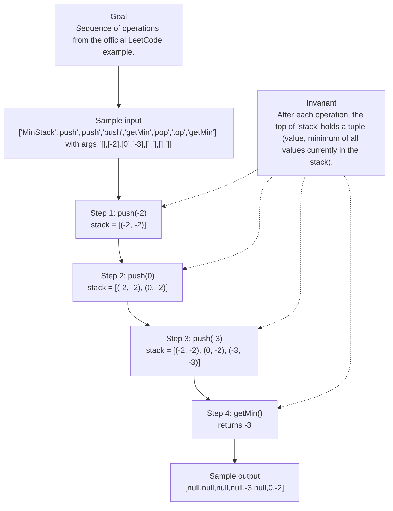

# 155. Min Stack

[View problem on LeetCode](https://leetcode.com/problems/min-stack/submissions/2150236891/)

## Solution metadata

- **Difficulty:** Medium
- **Language:** Python3
- **Topics:** Stack, Design
- **Solved:** 2026-09-22 21:36 UTC
- **Runtime:** 0 ms
- **Memory:** —
- **Solution:** [Python3](./python/solution.py)

## Problem description

> Problem details captured from [LeetCode](https://leetcode.com/problems/min-stack/submissions/2150236891/).

Design a stack that supports push, pop, top, and retrieving the minimum element in constant time.
Implement the MinStack class:
MinStack() initializes the stack object.
void push(int value) pushes the element value onto the stack.
void pop() removes the element on the top of the stack.
int top() gets the top element of the stack.
int getMin() retrieves the minimum element in the stack.
You must implement a solution with O(1) time complexity for each function.

## Constraints

- `231 <= val <= 231 - 1`
- Methods pop, top and getMin operations will always be called on non-empty stacks.
- `At most 3 * 104 calls will be made to push, pop, top, and getMin.`

## Interview overview

> Generated from the submitted solution and the official problem details above. Verify AI analysis before relying on it.

The solution stores each element together with the current minimum so far. By pushing a pair (value, currentMin) onto the stack, getMin() can simply read the second component of the top pair, guaranteeing O(1) time for all operations.

### Solution replay

### Approach

1. Maintain an internal list `stack` where each entry is a tuple (val, minSoFar).
2. When pushing `value`, compute `newMin = value` if the stack is empty else `min(value, stack[-1][1])` and append (value, newMin).
3. pop() removes the last tuple from `stack`.
4. top() returns `stack[-1][0]`, the stored value.
5. getMin() returns `stack[-1][1]`, the stored minimum.

### Complexity

- **Time:** O(1) for push, pop, top, and getMin
- **Space:** O(n) where n is the number of elements pushed

### Complexity self-check

- **Verdict:** optimal
- **Intended:** All operations run in constant time, which matches the problem requirement.
- No faster than O(1) per operation is possible for a stack that must support arbitrary pushes and pops while tracking the minimum.

### Edge cases

- Pushing a single element and calling getMin() – the min equals the only element.
- Pushing decreasing values (e.g., 5,4,3) and popping back to a larger value – getMin() updates correctly.
- Calling pop on a stack with exactly one element – stack becomes empty without error.

_AI-generated with Groq; verify the analysis before relying on it._

## Study guide

Before reopening the solution:

1. Identify why **Stack** fits the problem constraints.
2. State the invariant that makes the algorithm correct.
3. Walk through a representative input by hand.
4. Derive the time and space complexity from the implementation.
5. Name an edge case that would break a weaker approach.

---
_Synced by [LeetRepo](https://github.com/)_

<!-- leetrepo:data:v1
eyJ2ZXJzaW9uIjoxLCJzdWJtaXNzaW9uIjp7ImlkIjoiMTU1LW1pbi1zdGFjayIsIm51bWJlciI6IjE1NSIsInRpdGxlIjoiTWluIFN0YWNrIiwic2x1ZyI6Im1pbi1zdGFjayIsImRpZmZpY3VsdHkiOiJNZWRpdW0iLCJ0YWdzIjpbIlN0YWNrIiwiRGVzaWduIl0sImxhbmd1YWdlIjoiUHl0aG9uMyIsImV4dGVuc2lvbiI6InB5IiwicGF0aCI6IjAxNTUtbWluLXN0YWNrL3B5dGhvbi9zb2x1dGlvbi5weSIsImNvZGUiOiLCoMKgwqDCoGRlZsKgdG9wKHNlbGYpwqAtPsKgaW50OlxuwqDCoMKgwqDCoMKgwqDCoHJldHVybsKgc2VsZi5zdGFja1stMV1bMF1cblxuXG7CoMKgwqDCoMKgwqDCoMKgc2VsZi5zdGFja8KgPcKgc2VsZi5zdGFja1s6LTFdXG7CoMKgwqDCoGRlZsKgcG9wKHNlbGYpwqAtPsKgTm9uZTpcbsKgwqDCoMKgwqDCoMKgwqDCoMKgwqDCoHNlbGYuc3RhY2suYXBwZW5kKCh2YWx1ZSzCoG1pbih2YWx1ZSxzZWxmLnN0YWNrWy0xXVsxXSkpKVxuXG7CoMKgwqDCoMKgwqDCoMKgwqDCoMKgwqBzZWxmLnN0YWNrLmFwcGVuZCgodmFsdWUswqB2YWx1ZSkpXG7CoMKgwqDCoMKgwqDCoMKgZWxzZTpcbsKgwqDCoMKgwqDCoMKgwqBpZsKgbm90wqBzZWxmLnN0YWNrOlxuwqDCoMKgwqBkZWbCoHB1c2goc2VsZizCoHZhbHVlOsKgaW50KcKgLT7CoE5vbmU6XG5cbsKgwqDCoMKgZGVmwqBnZXRNaW4oc2VsZinCoC0+wqBpbnQ6XG7CoMKgwqDCoMKgwqDCoMKgcmV0dXJuwqBzZWxmLnN0YWNrWy0xXVsxXVxuXG5cbiPCoFlvdXLCoE1pblN0YWNrwqBvYmplY3TCoHdpbGzCoGJlwqBpbnN0YW50aWF0ZWTCoGFuZMKgY2FsbGVkwqBhc8Kgc3VjaDoiLCJydW50aW1lIjoiMCBtcyIsIm1lbW9yeSI6IuKAlCIsInN0YXR1cyI6IkFjY2VwdGVkIiwidXJsIjoiaHR0cHM6Ly9sZWV0Y29kZS5jb20vcHJvYmxlbXMvbWluLXN0YWNrL3N1Ym1pc3Npb25zLzIxNTAyMzY4OTEvIiwicHJvYmxlbURlc2NyaXB0aW9uIjoiRGVzaWduIGEgc3RhY2sgdGhhdCBzdXBwb3J0cyBwdXNoLCBwb3AsIHRvcCwgYW5kIHJldHJpZXZpbmcgdGhlIG1pbmltdW0gZWxlbWVudCBpbiBjb25zdGFudCB0aW1lLlxuSW1wbGVtZW50IHRoZSBNaW5TdGFjayBjbGFzczpcbk1pblN0YWNrKCkgaW5pdGlhbGl6ZXMgdGhlIHN0YWNrIG9iamVjdC5cbnZvaWQgcHVzaChpbnQgdmFsdWUpIHB1c2hlcyB0aGUgZWxlbWVudCB2YWx1ZSBvbnRvIHRoZSBzdGFjay5cbnZvaWQgcG9wKCkgcmVtb3ZlcyB0aGUgZWxlbWVudCBvbiB0aGUgdG9wIG9mIHRoZSBzdGFjay5cbmludCB0b3AoKSBnZXRzIHRoZSB0b3AgZWxlbWVudCBvZiB0aGUgc3RhY2suXG5pbnQgZ2V0TWluKCkgcmV0cmlldmVzIHRoZSBtaW5pbXVtIGVsZW1lbnQgaW4gdGhlIHN0YWNrLlxuWW91IG11c3QgaW1wbGVtZW50IGEgc29sdXRpb24gd2l0aCBPKDEpIHRpbWUgY29tcGxleGl0eSBmb3IgZWFjaCBmdW5jdGlvbi4iLCJwcm9ibGVtQ29udGV4dCI6IkRlc2lnbiBhIHN0YWNrIHRoYXQgc3VwcG9ydHMgcHVzaCwgcG9wLCB0b3AsIGFuZCByZXRyaWV2aW5nIHRoZSBtaW5pbXVtIGVsZW1lbnQgaW4gY29uc3RhbnQgdGltZS5cbkltcGxlbWVudCB0aGUgTWluU3RhY2sgY2xhc3M6XG5NaW5TdGFjaygpIGluaXRpYWxpemVzIHRoZSBzdGFjayBvYmplY3QuXG52b2lkIHB1c2goaW50IHZhbHVlKSBwdXNoZXMgdGhlIGVsZW1lbnQgdmFsdWUgb250byB0aGUgc3RhY2suXG52b2lkIHBvcCgpIHJlbW92ZXMgdGhlIGVsZW1lbnQgb24gdGhlIHRvcCBvZiB0aGUgc3RhY2suXG5pbnQgdG9wKCkgZ2V0cyB0aGUgdG9wIGVsZW1lbnQgb2YgdGhlIHN0YWNrLlxuaW50IGdldE1pbigpIHJldHJpZXZlcyB0aGUgbWluaW11bSBlbGVtZW50IGluIHRoZSBzdGFjay5cbllvdSBtdXN0IGltcGxlbWVudCBhIHNvbHV0aW9uIHdpdGggTygxKSB0aW1lIGNvbXBsZXhpdHkgZm9yIGVhY2ggZnVuY3Rpb24uIiwiZXhhbXBsZXMiOltdLCJleGFtcGxlSW5wdXQiOiIiLCJleGFtcGxlT3V0cHV0IjoiIiwiY29uc3RyYWludHMiOlsiMjMxIDw9IHZhbCA8PSAyMzEgLSAxIiwiTWV0aG9kcyBwb3AsIHRvcCBhbmQgZ2V0TWluIG9wZXJhdGlvbnMgd2lsbCBhbHdheXMgYmUgY2FsbGVkIG9uIG5vbi1lbXB0eSBzdGFja3MuIiwiQXQgbW9zdCAzICogMTA0IGNhbGxzIHdpbGwgYmUgbWFkZSB0byBwdXNoLCBwb3AsIHRvcCwgYW5kIGdldE1pbi4iXSwiaGludHMiOltdLCJmb2xsb3dVcCI6IiIsInNvbHZlZEF0IjoiMjAyNi0wOS0yMlQyMTozNjo0MS43OTNaIiwic3luY2VkQXQiOiIyMDI2LTA5LTIyVDIxOjM2OjQxLjc5M1oiLCJjb21taXRVcmwiOiIiLCJjb21taXRTaGEiOiIiLCJub3RlcyI6IiIsInJldmlldyI6eyJzdW1tYXJ5IjoiVGhlIHNvbHV0aW9uIHN0b3JlcyBlYWNoIGVsZW1lbnQgdG9nZXRoZXIgd2l0aCB0aGUgY3VycmVudCBtaW5pbXVtIHNvIGZhci4gQnkgcHVzaGluZyBhIHBhaXIgKHZhbHVlLCBjdXJyZW50TWluKSBvbnRvIHRoZSBzdGFjaywgZ2V0TWluKCkgY2FuIHNpbXBseSByZWFkIHRoZSBzZWNvbmQgY29tcG9uZW50IG9mIHRoZSB0b3AgcGFpciwgZ3VhcmFudGVlaW5nIE8oMSkgdGltZSBmb3IgYWxsIG9wZXJhdGlvbnMuIiwiYXBwcm9hY2giOlsiTWFpbnRhaW4gYW4gaW50ZXJuYWwgbGlzdCBgc3RhY2tgIHdoZXJlIGVhY2ggZW50cnkgaXMgYSB0dXBsZSAodmFsLCBtaW5Tb0ZhcikuIiwiV2hlbiBwdXNoaW5nIGB2YWx1ZWAsIGNvbXB1dGUgYG5ld01pbiA9IHZhbHVlYCBpZiB0aGUgc3RhY2sgaXMgZW1wdHkgZWxzZSBgbWluKHZhbHVlLCBzdGFja1stMV1bMV0pYCBhbmQgYXBwZW5kICh2YWx1ZSwgbmV3TWluKS4iLCJwb3AoKSByZW1vdmVzIHRoZSBsYXN0IHR1cGxlIGZyb20gYHN0YWNrYC4iLCJ0b3AoKSByZXR1cm5zIGBzdGFja1stMV1bMF1gLCB0aGUgc3RvcmVkIHZhbHVlLiIsImdldE1pbigpIHJldHVybnMgYHN0YWNrWy0xXVsxXWAsIHRoZSBzdG9yZWQgbWluaW11bS4iXSwiY29tcGxleGl0eSI6eyJ0aW1lIjoiTygxKSBmb3IgcHVzaCwgcG9wLCB0b3AsIGFuZCBnZXRNaW4iLCJzcGFjZSI6Ik8obikgd2hlcmUgbiBpcyB0aGUgbnVtYmVyIG9mIGVsZW1lbnRzIHB1c2hlZCJ9LCJjb21wbGV4aXR5Q2hlY2siOnsidmVyZGljdCI6Im9wdGltYWwiLCJpbnRlbmRlZCI6IkFsbCBvcGVyYXRpb25zIHJ1biBpbiBjb25zdGFudCB0aW1lLCB3aGljaCBtYXRjaGVzIHRoZSBwcm9ibGVtIHJlcXVpcmVtZW50LiIsIm5vdGUiOiJObyBmYXN0ZXIgdGhhbiBPKDEpIHBlciBvcGVyYXRpb24gaXMgcG9zc2libGUgZm9yIGEgc3RhY2sgdGhhdCBtdXN0IHN1cHBvcnQgYXJiaXRyYXJ5IHB1c2hlcyBhbmQgcG9wcyB3aGlsZSB0cmFja2luZyB0aGUgbWluaW11bS4ifSwiZWRnZUNhc2VzIjpbIlB1c2hpbmcgYSBzaW5nbGUgZWxlbWVudCBhbmQgY2FsbGluZyBnZXRNaW4oKSDigJMgdGhlIG1pbiBlcXVhbHMgdGhlIG9ubHkgZWxlbWVudC4iLCJQdXNoaW5nIGRlY3JlYXNpbmcgdmFsdWVzIChlLmcuLCA1LDQsMykgYW5kIHBvcHBpbmcgYmFjayB0byBhIGxhcmdlciB2YWx1ZSDigJMgZ2V0TWluKCkgdXBkYXRlcyBjb3JyZWN0bHkuIiwiQ2FsbGluZyBwb3Agb24gYSBzdGFjayB3aXRoIGV4YWN0bHkgb25lIGVsZW1lbnQg4oCTIHN0YWNrIGJlY29tZXMgZW1wdHkgd2l0aG91dCBlcnJvci4iXSwidmlzdWFsIjp7ImNvbnRleHQiOiJTZXF1ZW5jZSBvZiBvcGVyYXRpb25zIGZyb20gdGhlIG9mZmljaWFsIExlZXRDb2RlIGV4YW1wbGUuIiwiaW5wdXQiOiJbXCJNaW5TdGFja1wiLFwicHVzaFwiLFwicHVzaFwiLFwicHVzaFwiLFwiZ2V0TWluXCIsXCJwb3BcIixcInRvcFwiLFwiZ2V0TWluXCJdIHdpdGggYXJncyBbW10sWy0yXSxbMF0sWy0zXSxbXSxbXSxbXSxbXV0iLCJpbnZhcmlhbnQiOiJBZnRlciBlYWNoIG9wZXJhdGlvbiwgdGhlIHRvcCBvZiBgc3RhY2tgIGhvbGRzIGEgdHVwbGUgKHZhbHVlLCBtaW5pbXVtIG9mIGFsbCB2YWx1ZXMgY3VycmVudGx5IGluIHRoZSBzdGFjaykuIiwic3RlcHMiOlt7ImxhYmVsIjoicHVzaCgtMikiLCJzdGF0ZSI6InN0YWNrID0gWygtMiwgLTIpXSJ9LHsibGFiZWwiOiJwdXNoKDApIiwic3RhdGUiOiJzdGFjayA9IFsoLTIsIC0yKSwgKDAsIC0yKV0ifSx7ImxhYmVsIjoicHVzaCgtMykiLCJzdGF0ZSI6InN0YWNrID0gWygtMiwgLTIpLCAoMCwgLTIpLCAoLTMsIC0zKV0ifSx7ImxhYmVsIjoiZ2V0TWluKCkiLCJzdGF0ZSI6InJldHVybnMgLTMifV0sInJlc3VsdCI6IltudWxsLG51bGwsbnVsbCxudWxsLC0zLG51bGwsMCwtMl0ifSwiZ2VuZXJhdGVkQnkiOiJHcm9xIn0sInJldmlld0R1ZUF0IjoiMjAyNi0xMC0yMlQyMTozNjo0MS43OTNaIiwibGFzdFJldmlld2VkQXQiOm51bGwsInJldmlld0ludGVydmFsRGF5cyI6bnVsbCwicmV2aWV3Q291bnQiOjAsInJldmlld0xhcHNlcyI6MCwibGFzdFJldmlld1JhdGluZyI6bnVsbCwicmV2aWV3RXZlbnRzIjpbXSwic29sdXRpb25zIjpbeyJrZXkiOiJweXRob24zOnB5IiwicGF0aCI6IjAxNTUtbWluLXN0YWNrL3B5dGhvbi9zb2x1dGlvbi5weSIsImxhbmd1YWdlIjoiUHl0aG9uMyIsImV4dGVuc2lvbiI6InB5IiwiZGlmZmljdWx0eSI6Ik1lZGl1bSIsImNvZGUiOiLCoMKgwqDCoGRlZsKgdG9wKHNlbGYpwqAtPsKgaW50OlxuwqDCoMKgwqDCoMKgwqDCoHJldHVybsKgc2VsZi5zdGFja1stMV1bMF1cblxuXG7CoMKgwqDCoMKgwqDCoMKgc2VsZi5zdGFja8KgPcKgc2VsZi5zdGFja1s6LTFdXG7CoMKgwqDCoGRlZsKgcG9wKHNlbGYpwqAtPsKgTm9uZTpcbsKgwqDCoMKgwqDCoMKgwqDCoMKgwqDCoHNlbGYuc3RhY2suYXBwZW5kKCh2YWx1ZSzCoG1pbih2YWx1ZSxzZWxmLnN0YWNrWy0xXVsxXSkpKVxuXG7CoMKgwqDCoMKgwqDCoMKgwqDCoMKgwqBzZWxmLnN0YWNrLmFwcGVuZCgodmFsdWUswqB2YWx1ZSkpXG7CoMKgwqDCoMKgwqDCoMKgZWxzZTpcbsKgwqDCoMKgwqDCoMKgwqBpZsKgbm90wqBzZWxmLnN0YWNrOlxuwqDCoMKgwqBkZWbCoHB1c2goc2VsZizCoHZhbHVlOsKgaW50KcKgLT7CoE5vbmU6XG5cbsKgwqDCoMKgZGVmwqBnZXRNaW4oc2VsZinCoC0+wqBpbnQ6XG7CoMKgwqDCoMKgwqDCoMKgcmV0dXJuwqBzZWxmLnN0YWNrWy0xXVsxXVxuXG5cbiPCoFlvdXLCoE1pblN0YWNrwqBvYmplY3TCoHdpbGzCoGJlwqBpbnN0YW50aWF0ZWTCoGFuZMKgY2FsbGVkwqBhc8Kgc3VjaDoiLCJydW50aW1lIjoiMCBtcyIsIm1lbW9yeSI6IuKAlCIsInN0YXR1cyI6IkFjY2VwdGVkIiwic29sdmVkQXQiOiIyMDI2LTA5LTIyVDIxOjM2OjQxLjc5M1oiLCJzeW5jZWRBdCI6IjIwMjYtMDktMjJUMjE6MzY6NDEuNzkzWiIsImNvbW1pdFVybCI6IiIsImNvbW1pdFNoYSI6IiIsInJldmlldyI6eyJzdW1tYXJ5IjoiVGhlIHNvbHV0aW9uIHN0b3JlcyBlYWNoIGVsZW1lbnQgdG9nZXRoZXIgd2l0aCB0aGUgY3VycmVudCBtaW5pbXVtIHNvIGZhci4gQnkgcHVzaGluZyBhIHBhaXIgKHZhbHVlLCBjdXJyZW50TWluKSBvbnRvIHRoZSBzdGFjaywgZ2V0TWluKCkgY2FuIHNpbXBseSByZWFkIHRoZSBzZWNvbmQgY29tcG9uZW50IG9mIHRoZSB0b3AgcGFpciwgZ3VhcmFudGVlaW5nIE8oMSkgdGltZSBmb3IgYWxsIG9wZXJhdGlvbnMuIiwiYXBwcm9hY2giOlsiTWFpbnRhaW4gYW4gaW50ZXJuYWwgbGlzdCBgc3RhY2tgIHdoZXJlIGVhY2ggZW50cnkgaXMgYSB0dXBsZSAodmFsLCBtaW5Tb0ZhcikuIiwiV2hlbiBwdXNoaW5nIGB2YWx1ZWAsIGNvbXB1dGUgYG5ld01pbiA9IHZhbHVlYCBpZiB0aGUgc3RhY2sgaXMgZW1wdHkgZWxzZSBgbWluKHZhbHVlLCBzdGFja1stMV1bMV0pYCBhbmQgYXBwZW5kICh2YWx1ZSwgbmV3TWluKS4iLCJwb3AoKSByZW1vdmVzIHRoZSBsYXN0IHR1cGxlIGZyb20gYHN0YWNrYC4iLCJ0b3AoKSByZXR1cm5zIGBzdGFja1stMV1bMF1gLCB0aGUgc3RvcmVkIHZhbHVlLiIsImdldE1pbigpIHJldHVybnMgYHN0YWNrWy0xXVsxXWAsIHRoZSBzdG9yZWQgbWluaW11bS4iXSwiY29tcGxleGl0eSI6eyJ0aW1lIjoiTygxKSBmb3IgcHVzaCwgcG9wLCB0b3AsIGFuZCBnZXRNaW4iLCJzcGFjZSI6Ik8obikgd2hlcmUgbiBpcyB0aGUgbnVtYmVyIG9mIGVsZW1lbnRzIHB1c2hlZCJ9LCJjb21wbGV4aXR5Q2hlY2siOnsidmVyZGljdCI6Im9wdGltYWwiLCJpbnRlbmRlZCI6IkFsbCBvcGVyYXRpb25zIHJ1biBpbiBjb25zdGFudCB0aW1lLCB3aGljaCBtYXRjaGVzIHRoZSBwcm9ibGVtIHJlcXVpcmVtZW50LiIsIm5vdGUiOiJObyBmYXN0ZXIgdGhhbiBPKDEpIHBlciBvcGVyYXRpb24gaXMgcG9zc2libGUgZm9yIGEgc3RhY2sgdGhhdCBtdXN0IHN1cHBvcnQgYXJiaXRyYXJ5IHB1c2hlcyBhbmQgcG9wcyB3aGlsZSB0cmFja2luZyB0aGUgbWluaW11bS4ifSwiZWRnZUNhc2VzIjpbIlB1c2hpbmcgYSBzaW5nbGUgZWxlbWVudCBhbmQgY2FsbGluZyBnZXRNaW4oKSDigJMgdGhlIG1pbiBlcXVhbHMgdGhlIG9ubHkgZWxlbWVudC4iLCJQdXNoaW5nIGRlY3JlYXNpbmcgdmFsdWVzIChlLmcuLCA1LDQsMykgYW5kIHBvcHBpbmcgYmFjayB0byBhIGxhcmdlciB2YWx1ZSDigJMgZ2V0TWluKCkgdXBkYXRlcyBjb3JyZWN0bHkuIiwiQ2FsbGluZyBwb3Agb24gYSBzdGFjayB3aXRoIGV4YWN0bHkgb25lIGVsZW1lbnQg4oCTIHN0YWNrIGJlY29tZXMgZW1wdHkgd2l0aG91dCBlcnJvci4iXSwidmlzdWFsIjp7ImNvbnRleHQiOiJTZXF1ZW5jZSBvZiBvcGVyYXRpb25zIGZyb20gdGhlIG9mZmljaWFsIExlZXRDb2RlIGV4YW1wbGUuIiwiaW5wdXQiOiJbXCJNaW5TdGFja1wiLFwicHVzaFwiLFwicHVzaFwiLFwicHVzaFwiLFwiZ2V0TWluXCIsXCJwb3BcIixcInRvcFwiLFwiZ2V0TWluXCJdIHdpdGggYXJncyBbW10sWy0yXSxbMF0sWy0zXSxbXSxbXSxbXSxbXV0iLCJpbnZhcmlhbnQiOiJBZnRlciBlYWNoIG9wZXJhdGlvbiwgdGhlIHRvcCBvZiBgc3RhY2tgIGhvbGRzIGEgdHVwbGUgKHZhbHVlLCBtaW5pbXVtIG9mIGFsbCB2YWx1ZXMgY3VycmVudGx5IGluIHRoZSBzdGFjaykuIiwic3RlcHMiOlt7ImxhYmVsIjoicHVzaCgtMikiLCJzdGF0ZSI6InN0YWNrID0gWygtMiwgLTIpXSJ9LHsibGFiZWwiOiJwdXNoKDApIiwic3RhdGUiOiJzdGFjayA9IFsoLTIsIC0yKSwgKDAsIC0yKV0ifSx7ImxhYmVsIjoicHVzaCgtMykiLCJzdGF0ZSI6InN0YWNrID0gWygtMiwgLTIpLCAoMCwgLTIpLCAoLTMsIC0zKV0ifSx7ImxhYmVsIjoiZ2V0TWluKCkiLCJzdGF0ZSI6InJldHVybnMgLTMifV0sInJlc3VsdCI6IltudWxsLG51bGwsbnVsbCxudWxsLC0zLG51bGwsMCwtMl0ifSwiZ2VuZXJhdGVkQnkiOiJHcm9xIn19XSwia2V5IjoicHl0aG9uMzpweSJ9fQ==
leetrepo:data:end -->