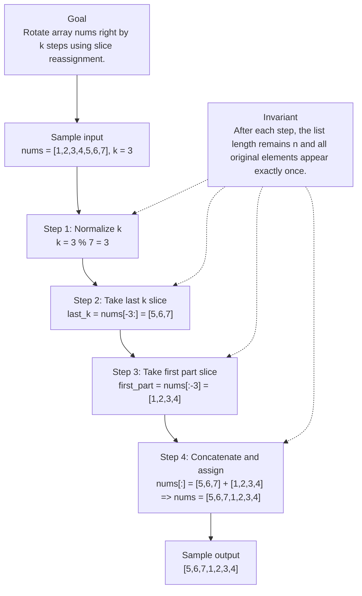

# 189. Rotate Array

[View problem on LeetCode](https://leetcode.com/problems/rotate-array/submissions/2150232380/)

## Solution metadata

- **Difficulty:** Medium
- **Language:** Python3
- **Topics:** Array, Math, Two Pointers
- **Solved:** 2026-09-22 21:24 UTC
- **Runtime:** 0 ms
- **Memory:** —
- **Solution:** [Python3](./python/solution.py)

## Problem description

> Problem details captured from [LeetCode](https://leetcode.com/problems/rotate-array/submissions/2150232380/).

Given an integer array nums, rotate the array to the right by k steps, where k is non-negative.

## Examples

### Example 1

```text
Input:
nums = [1,2,3,4,5,6,7], k = 3

Output:
[5,6,7,1,2,3,4]
```

**Explanation:** rotate 1 steps to the right: [7,1,2,3,4,5,6]
rotate 2 steps to the right: [6,7,1,2,3,4,5]
rotate 3 steps to the right: [5,6,7,1,2,3,4]

### Example 2

```text
Input:
nums = [-1,-100,3,99], k = 2

Output:
[3,99,-1,-100]
```

**Explanation:** rotate 1 steps to the right: [99,-1,-100,3]
rotate 2 steps to the right: [3,99,-1,-100]

## Constraints

- `1 <= nums.length <= 105`
- `231 <= nums[i] <= 231 - 1`
- `0 <= k <= 105`

## Follow-up

Try to come up with as many solutions as you can. There are at least three different ways to solve this problem.
Could you do it in-place with O(1) extra space?

## Interview overview

> Generated from the submitted solution and the official problem details above. Verify AI analysis before relying on it.

The solution leverages Python's slicing to compute the effective rotation (k % n) and then rewrites the entire list in one statement. By taking the last k elements and concatenating them with the first n‑k elements, the array is rotated right in O(n) time. The slice assignment (nums[:]=…) updates the original list in‑place, satisfying the problem's in‑place requirement, though it temporarily allocates a new list of size n.

### Solution replay



### Approach

1. Compute n = len(nums) and normalize k as k = k % n to handle k ≥ n and k = 0.
2. Create a slice of the last k elements: nums[-k:] (or nums[-k % n:] when k=0).
3. Create a slice of the first n‑k elements: nums[:-k] (or nums[:-k % n] when k=0).
4. Concatenate the two slices: rotated = last_k + first_part.
5. Assign the concatenated list back to the original list with nums[:] = rotated, which mutates the input list in‑place.

### Complexity

- **Time:** O(n) – each element is copied once during slicing and concatenation.
- **Space:** O(n) – the concatenated list temporarily holds n elements.

### Complexity self-check

- **Verdict:** suboptimal
- **Intended:** O(1) extra space
- Python slicing creates a new list of size n, so the solution uses O(n) auxiliary space despite the in‑place assignment.

### Edge cases

- k = 0 (no rotation, output equals input).
- k is a multiple of n (effective rotation is 0).
- nums contains a single element (rotation has no effect).
- k larger than n (handled by modulo).

_AI-generated with Groq; verify the analysis before relying on it._

## Study guide

Before reopening the solution:

1. Identify why **Two Pointers** fits the problem constraints.
2. State the invariant that makes the algorithm correct.
3. Replay the first example without looking at the implementation.
4. Derive the time and space complexity from the implementation.
5. Name an edge case that would break a weaker approach.

---
_Synced by [LeetRepo](https://github.com/)_

<!-- leetrepo:data:v1
eyJ2ZXJzaW9uIjoxLCJzdWJtaXNzaW9uIjp7ImlkIjoiMTg5LXJvdGF0ZS1hcnJheSIsIm51bWJlciI6IjE4OSIsInRpdGxlIjoiUm90YXRlIEFycmF5Iiwic2x1ZyI6InJvdGF0ZS1hcnJheSIsImRpZmZpY3VsdHkiOiJNZWRpdW0iLCJ0YWdzIjpbIkFycmF5IiwiTWF0aCIsIlR3byBQb2ludGVycyJdLCJsYW5ndWFnZSI6IlB5dGhvbjMiLCJleHRlbnNpb24iOiJweSIsInBhdGgiOiIwMTg5LXJvdGF0ZS1hcnJheS9weXRob24vc29sdXRpb24ucHkiLCJjb2RlIjoiY2xhc3PCoFNvbHV0aW9uOlxuwqDCoMKgwqBkZWbCoHJvdGF0ZShzZWxmLMKgbnVtczrCoGxpc3RbaW50XSzCoGs6wqBpbnQpwqAtPsKgTm9uZTpcbsKgwqDCoMKgwqDCoMKgwqBcIlwiXCJcbsKgwqDCoMKgwqDCoMKgwqBEb8Kgbm90wqByZXR1cm7CoGFueXRoaW5nLMKgbW9kaWZ5wqBudW1zwqBpbi1wbGFjZcKgaW5zdGVhZC5cbsKgwqDCoMKgwqDCoMKgwqBcIlwiXCJcbsKgwqDCoMKgwqDCoMKgwqBudW1zWzpdwqA9wqBudW1zWy1rwqAlwqBsZW4obnVtcyk6XcKgK8KgbnVtc1s6LWvCoCXCoGxlbihudW1zKV0iLCJydW50aW1lIjoiMCBtcyIsIm1lbW9yeSI6IuKAlCIsInN0YXR1cyI6IkFjY2VwdGVkIiwidXJsIjoiaHR0cHM6Ly9sZWV0Y29kZS5jb20vcHJvYmxlbXMvcm90YXRlLWFycmF5L3N1Ym1pc3Npb25zLzIxNTAyMzIzODAvIiwicHJvYmxlbURlc2NyaXB0aW9uIjoiR2l2ZW4gYW4gaW50ZWdlciBhcnJheSBudW1zLCByb3RhdGUgdGhlIGFycmF5IHRvIHRoZSByaWdodCBieSBrIHN0ZXBzLCB3aGVyZSBrIGlzIG5vbi1uZWdhdGl2ZS4iLCJwcm9ibGVtQ29udGV4dCI6IkdpdmVuIGFuIGludGVnZXIgYXJyYXkgbnVtcywgcm90YXRlIHRoZSBhcnJheSB0byB0aGUgcmlnaHQgYnkgayBzdGVwcywgd2hlcmUgayBpcyBub24tbmVnYXRpdmUuIiwiZXhhbXBsZXMiOlt7ImlucHV0IjoibnVtcyA9IFsxLDIsMyw0LDUsNiw3XSwgayA9IDMiLCJvdXRwdXQiOiJbNSw2LDcsMSwyLDMsNF0iLCJleHBsYW5hdGlvbiI6InJvdGF0ZSAxIHN0ZXBzIHRvIHRoZSByaWdodDogWzcsMSwyLDMsNCw1LDZdXG5yb3RhdGUgMiBzdGVwcyB0byB0aGUgcmlnaHQ6IFs2LDcsMSwyLDMsNCw1XVxucm90YXRlIDMgc3RlcHMgdG8gdGhlIHJpZ2h0OiBbNSw2LDcsMSwyLDMsNF0ifSx7ImlucHV0IjoibnVtcyA9IFstMSwtMTAwLDMsOTldLCBrID0gMiIsIm91dHB1dCI6IlszLDk5LC0xLC0xMDBdIiwiZXhwbGFuYXRpb24iOiJyb3RhdGUgMSBzdGVwcyB0byB0aGUgcmlnaHQ6IFs5OSwtMSwtMTAwLDNdXG5yb3RhdGUgMiBzdGVwcyB0byB0aGUgcmlnaHQ6IFszLDk5LC0xLC0xMDBdIn1dLCJleGFtcGxlSW5wdXQiOiJudW1zID0gWzEsMiwzLDQsNSw2LDddLCBrID0gMyIsImV4YW1wbGVPdXRwdXQiOiJbNSw2LDcsMSwyLDMsNF0iLCJjb25zdHJhaW50cyI6WyIxIDw9IG51bXMubGVuZ3RoIDw9IDEwNSIsIjIzMSA8PSBudW1zW2ldIDw9IDIzMSAtIDEiLCIwIDw9IGsgPD0gMTA1Il0sImhpbnRzIjpbXSwiZm9sbG93VXAiOiJUcnkgdG8gY29tZSB1cCB3aXRoIGFzIG1hbnkgc29sdXRpb25zIGFzIHlvdSBjYW4uIFRoZXJlIGFyZSBhdCBsZWFzdCB0aHJlZSBkaWZmZXJlbnQgd2F5cyB0byBzb2x2ZSB0aGlzIHByb2JsZW0uXG5Db3VsZCB5b3UgZG8gaXQgaW4tcGxhY2Ugd2l0aCBPKDEpIGV4dHJhIHNwYWNlPyIsInNvbHZlZEF0IjoiMjAyNi0wOS0yMlQyMToyNDoxOS44MjVaIiwic3luY2VkQXQiOiIyMDI2LTA5LTIyVDIxOjI0OjE5LjgyNVoiLCJjb21taXRVcmwiOiIiLCJjb21taXRTaGEiOiIiLCJub3RlcyI6IiIsInJldmlldyI6eyJzdW1tYXJ5IjoiVGhlIHNvbHV0aW9uIGxldmVyYWdlcyBQeXRob24ncyBzbGljaW5nIHRvIGNvbXB1dGUgdGhlIGVmZmVjdGl2ZSByb3RhdGlvbiAoayAlIG4pIGFuZCB0aGVuIHJld3JpdGVzIHRoZSBlbnRpcmUgbGlzdCBpbiBvbmUgc3RhdGVtZW50LiBCeSB0YWtpbmcgdGhlIGxhc3QgayBlbGVtZW50cyBhbmQgY29uY2F0ZW5hdGluZyB0aGVtIHdpdGggdGhlIGZpcnN0IG7igJFrIGVsZW1lbnRzLCB0aGUgYXJyYXkgaXMgcm90YXRlZCByaWdodCBpbiBPKG4pIHRpbWUuIFRoZSBzbGljZSBhc3NpZ25tZW50IChudW1zWzpdPeKApikgdXBkYXRlcyB0aGUgb3JpZ2luYWwgbGlzdCBpbuKAkXBsYWNlLCBzYXRpc2Z5aW5nIHRoZSBwcm9ibGVtJ3MgaW7igJFwbGFjZSByZXF1aXJlbWVudCwgdGhvdWdoIGl0IHRlbXBvcmFyaWx5IGFsbG9jYXRlcyBhIG5ldyBsaXN0IG9mIHNpemUgbi4iLCJhcHByb2FjaCI6WyJDb21wdXRlIG4gPSBsZW4obnVtcykgYW5kIG5vcm1hbGl6ZSBrIGFzIGsgPSBrICUgbiB0byBoYW5kbGUgayDiiaUgbiBhbmQgayA9IDAuIiwiQ3JlYXRlIGEgc2xpY2Ugb2YgdGhlIGxhc3QgayBlbGVtZW50czogbnVtc1stazpdIChvciBudW1zWy1rICUgbjpdIHdoZW4gaz0wKS4iLCJDcmVhdGUgYSBzbGljZSBvZiB0aGUgZmlyc3QgbuKAkWsgZWxlbWVudHM6IG51bXNbOi1rXSAob3IgbnVtc1s6LWsgJSBuXSB3aGVuIGs9MCkuIiwiQ29uY2F0ZW5hdGUgdGhlIHR3byBzbGljZXM6IHJvdGF0ZWQgPSBsYXN0X2sgKyBmaXJzdF9wYXJ0LiIsIkFzc2lnbiB0aGUgY29uY2F0ZW5hdGVkIGxpc3QgYmFjayB0byB0aGUgb3JpZ2luYWwgbGlzdCB3aXRoIG51bXNbOl0gPSByb3RhdGVkLCB3aGljaCBtdXRhdGVzIHRoZSBpbnB1dCBsaXN0IGlu4oCRcGxhY2UuIl0sImNvbXBsZXhpdHkiOnsidGltZSI6Ik8obikg4oCTIGVhY2ggZWxlbWVudCBpcyBjb3BpZWQgb25jZSBkdXJpbmcgc2xpY2luZyBhbmQgY29uY2F0ZW5hdGlvbi4iLCJzcGFjZSI6Ik8obikg4oCTIHRoZSBjb25jYXRlbmF0ZWQgbGlzdCB0ZW1wb3JhcmlseSBob2xkcyBuIGVsZW1lbnRzLiJ9LCJjb21wbGV4aXR5Q2hlY2siOnsidmVyZGljdCI6InN1Ym9wdGltYWwiLCJpbnRlbmRlZCI6Ik8oMSkgZXh0cmEgc3BhY2UiLCJub3RlIjoiUHl0aG9uIHNsaWNpbmcgY3JlYXRlcyBhIG5ldyBsaXN0IG9mIHNpemUgbiwgc28gdGhlIHNvbHV0aW9uIHVzZXMgTyhuKSBhdXhpbGlhcnkgc3BhY2UgZGVzcGl0ZSB0aGUgaW7igJFwbGFjZSBhc3NpZ25tZW50LiJ9LCJlZGdlQ2FzZXMiOlsiayA9IDAgKG5vIHJvdGF0aW9uLCBvdXRwdXQgZXF1YWxzIGlucHV0KS4iLCJrIGlzIGEgbXVsdGlwbGUgb2YgbiAoZWZmZWN0aXZlIHJvdGF0aW9uIGlzIDApLiIsIm51bXMgY29udGFpbnMgYSBzaW5nbGUgZWxlbWVudCAocm90YXRpb24gaGFzIG5vIGVmZmVjdCkuIiwiayBsYXJnZXIgdGhhbiBuIChoYW5kbGVkIGJ5IG1vZHVsbykuIl0sInZpc3VhbCI6eyJjb250ZXh0IjoiUm90YXRlIGFycmF5IG51bXMgcmlnaHQgYnkgayBzdGVwcyB1c2luZyBzbGljZSByZWFzc2lnbm1lbnQuIiwiaW5wdXQiOiJudW1zID0gWzEsMiwzLDQsNSw2LDddLCBrID0gMyIsImludmFyaWFudCI6IkFmdGVyIGVhY2ggc3RlcCwgdGhlIGxpc3QgbGVuZ3RoIHJlbWFpbnMgbiBhbmQgYWxsIG9yaWdpbmFsIGVsZW1lbnRzIGFwcGVhciBleGFjdGx5IG9uY2UuIiwic3RlcHMiOlt7ImxhYmVsIjoiTm9ybWFsaXplIGsiLCJzdGF0ZSI6ImsgPSAzICUgNyA9IDMifSx7ImxhYmVsIjoiVGFrZSBsYXN0IGsgc2xpY2UiLCJzdGF0ZSI6Imxhc3RfayA9IG51bXNbLTM6XSA9IFs1LDYsN10ifSx7ImxhYmVsIjoiVGFrZSBmaXJzdCBwYXJ0IHNsaWNlIiwic3RhdGUiOiJmaXJzdF9wYXJ0ID0gbnVtc1s6LTNdID0gWzEsMiwzLDRdIn0seyJsYWJlbCI6IkNvbmNhdGVuYXRlIGFuZCBhc3NpZ24iLCJzdGF0ZSI6Im51bXNbOl0gPSBbNSw2LDddICsgWzEsMiwzLDRdID0+IG51bXMgPSBbNSw2LDcsMSwyLDMsNF0ifV0sInJlc3VsdCI6Ils1LDYsNywxLDIsMyw0XSJ9LCJnZW5lcmF0ZWRCeSI6Ikdyb3EifSwicmV2aWV3RHVlQXQiOiIyMDI2LTEwLTIyVDIxOjI0OjE5LjgyNVoiLCJsYXN0UmV2aWV3ZWRBdCI6bnVsbCwicmV2aWV3SW50ZXJ2YWxEYXlzIjpudWxsLCJyZXZpZXdDb3VudCI6MCwicmV2aWV3TGFwc2VzIjowLCJsYXN0UmV2aWV3UmF0aW5nIjpudWxsLCJyZXZpZXdFdmVudHMiOltdLCJzb2x1dGlvbnMiOlt7ImtleSI6InB5dGhvbjM6cHkiLCJwYXRoIjoiMDE4OS1yb3RhdGUtYXJyYXkvcHl0aG9uL3NvbHV0aW9uLnB5IiwibGFuZ3VhZ2UiOiJQeXRob24zIiwiZXh0ZW5zaW9uIjoicHkiLCJkaWZmaWN1bHR5IjoiTWVkaXVtIiwiY29kZSI6ImNsYXNzwqBTb2x1dGlvbjpcbsKgwqDCoMKgZGVmwqByb3RhdGUoc2VsZizCoG51bXM6wqBsaXN0W2ludF0swqBrOsKgaW50KcKgLT7CoE5vbmU6XG7CoMKgwqDCoMKgwqDCoMKgXCJcIlwiXG7CoMKgwqDCoMKgwqDCoMKgRG/CoG5vdMKgcmV0dXJuwqBhbnl0aGluZyzCoG1vZGlmecKgbnVtc8KgaW4tcGxhY2XCoGluc3RlYWQuXG7CoMKgwqDCoMKgwqDCoMKgXCJcIlwiXG7CoMKgwqDCoMKgwqDCoMKgbnVtc1s6XcKgPcKgbnVtc1sta8KgJcKgbGVuKG51bXMpOl3CoCvCoG51bXNbOi1rwqAlwqBsZW4obnVtcyldIiwicnVudGltZSI6IjAgbXMiLCJtZW1vcnkiOiLigJQiLCJzdGF0dXMiOiJBY2NlcHRlZCIsInNvbHZlZEF0IjoiMjAyNi0wOS0yMlQyMToyNDoxOS44MjVaIiwic3luY2VkQXQiOiIyMDI2LTA5LTIyVDIxOjI0OjE5LjgyNVoiLCJjb21taXRVcmwiOiIiLCJjb21taXRTaGEiOiIiLCJyZXZpZXciOnsic3VtbWFyeSI6IlRoZSBzb2x1dGlvbiBsZXZlcmFnZXMgUHl0aG9uJ3Mgc2xpY2luZyB0byBjb21wdXRlIHRoZSBlZmZlY3RpdmUgcm90YXRpb24gKGsgJSBuKSBhbmQgdGhlbiByZXdyaXRlcyB0aGUgZW50aXJlIGxpc3QgaW4gb25lIHN0YXRlbWVudC4gQnkgdGFraW5nIHRoZSBsYXN0IGsgZWxlbWVudHMgYW5kIGNvbmNhdGVuYXRpbmcgdGhlbSB3aXRoIHRoZSBmaXJzdCBu4oCRayBlbGVtZW50cywgdGhlIGFycmF5IGlzIHJvdGF0ZWQgcmlnaHQgaW4gTyhuKSB0aW1lLiBUaGUgc2xpY2UgYXNzaWdubWVudCAobnVtc1s6XT3igKYpIHVwZGF0ZXMgdGhlIG9yaWdpbmFsIGxpc3QgaW7igJFwbGFjZSwgc2F0aXNmeWluZyB0aGUgcHJvYmxlbSdzIGlu4oCRcGxhY2UgcmVxdWlyZW1lbnQsIHRob3VnaCBpdCB0ZW1wb3JhcmlseSBhbGxvY2F0ZXMgYSBuZXcgbGlzdCBvZiBzaXplIG4uIiwiYXBwcm9hY2giOlsiQ29tcHV0ZSBuID0gbGVuKG51bXMpIGFuZCBub3JtYWxpemUgayBhcyBrID0gayAlIG4gdG8gaGFuZGxlIGsg4omlIG4gYW5kIGsgPSAwLiIsIkNyZWF0ZSBhIHNsaWNlIG9mIHRoZSBsYXN0IGsgZWxlbWVudHM6IG51bXNbLWs6XSAob3IgbnVtc1stayAlIG46XSB3aGVuIGs9MCkuIiwiQ3JlYXRlIGEgc2xpY2Ugb2YgdGhlIGZpcnN0IG7igJFrIGVsZW1lbnRzOiBudW1zWzota10gKG9yIG51bXNbOi1rICUgbl0gd2hlbiBrPTApLiIsIkNvbmNhdGVuYXRlIHRoZSB0d28gc2xpY2VzOiByb3RhdGVkID0gbGFzdF9rICsgZmlyc3RfcGFydC4iLCJBc3NpZ24gdGhlIGNvbmNhdGVuYXRlZCBsaXN0IGJhY2sgdG8gdGhlIG9yaWdpbmFsIGxpc3Qgd2l0aCBudW1zWzpdID0gcm90YXRlZCwgd2hpY2ggbXV0YXRlcyB0aGUgaW5wdXQgbGlzdCBpbuKAkXBsYWNlLiJdLCJjb21wbGV4aXR5Ijp7InRpbWUiOiJPKG4pIOKAkyBlYWNoIGVsZW1lbnQgaXMgY29waWVkIG9uY2UgZHVyaW5nIHNsaWNpbmcgYW5kIGNvbmNhdGVuYXRpb24uIiwic3BhY2UiOiJPKG4pIOKAkyB0aGUgY29uY2F0ZW5hdGVkIGxpc3QgdGVtcG9yYXJpbHkgaG9sZHMgbiBlbGVtZW50cy4ifSwiY29tcGxleGl0eUNoZWNrIjp7InZlcmRpY3QiOiJzdWJvcHRpbWFsIiwiaW50ZW5kZWQiOiJPKDEpIGV4dHJhIHNwYWNlIiwibm90ZSI6IlB5dGhvbiBzbGljaW5nIGNyZWF0ZXMgYSBuZXcgbGlzdCBvZiBzaXplIG4sIHNvIHRoZSBzb2x1dGlvbiB1c2VzIE8obikgYXV4aWxpYXJ5IHNwYWNlIGRlc3BpdGUgdGhlIGlu4oCRcGxhY2UgYXNzaWdubWVudC4ifSwiZWRnZUNhc2VzIjpbImsgPSAwIChubyByb3RhdGlvbiwgb3V0cHV0IGVxdWFscyBpbnB1dCkuIiwiayBpcyBhIG11bHRpcGxlIG9mIG4gKGVmZmVjdGl2ZSByb3RhdGlvbiBpcyAwKS4iLCJudW1zIGNvbnRhaW5zIGEgc2luZ2xlIGVsZW1lbnQgKHJvdGF0aW9uIGhhcyBubyBlZmZlY3QpLiIsImsgbGFyZ2VyIHRoYW4gbiAoaGFuZGxlZCBieSBtb2R1bG8pLiJdLCJ2aXN1YWwiOnsiY29udGV4dCI6IlJvdGF0ZSBhcnJheSBudW1zIHJpZ2h0IGJ5IGsgc3RlcHMgdXNpbmcgc2xpY2UgcmVhc3NpZ25tZW50LiIsImlucHV0IjoibnVtcyA9IFsxLDIsMyw0LDUsNiw3XSwgayA9IDMiLCJpbnZhcmlhbnQiOiJBZnRlciBlYWNoIHN0ZXAsIHRoZSBsaXN0IGxlbmd0aCByZW1haW5zIG4gYW5kIGFsbCBvcmlnaW5hbCBlbGVtZW50cyBhcHBlYXIgZXhhY3RseSBvbmNlLiIsInN0ZXBzIjpbeyJsYWJlbCI6Ik5vcm1hbGl6ZSBrIiwic3RhdGUiOiJrID0gMyAlIDcgPSAzIn0seyJsYWJlbCI6IlRha2UgbGFzdCBrIHNsaWNlIiwic3RhdGUiOiJsYXN0X2sgPSBudW1zWy0zOl0gPSBbNSw2LDddIn0seyJsYWJlbCI6IlRha2UgZmlyc3QgcGFydCBzbGljZSIsInN0YXRlIjoiZmlyc3RfcGFydCA9IG51bXNbOi0zXSA9IFsxLDIsMyw0XSJ9LHsibGFiZWwiOiJDb25jYXRlbmF0ZSBhbmQgYXNzaWduIiwic3RhdGUiOiJudW1zWzpdID0gWzUsNiw3XSArIFsxLDIsMyw0XSA9PiBudW1zID0gWzUsNiw3LDEsMiwzLDRdIn1dLCJyZXN1bHQiOiJbNSw2LDcsMSwyLDMsNF0ifSwiZ2VuZXJhdGVkQnkiOiJHcm9xIn19XSwia2V5IjoicHl0aG9uMzpweSJ9fQ==
leetrepo:data:end -->