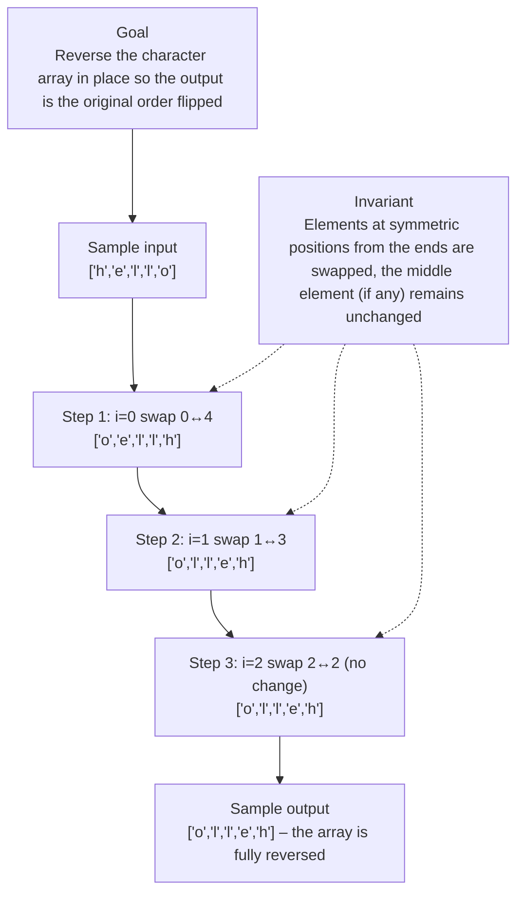

# 344. Reverse String

[View problem on LeetCode](https://leetcode.com/problems/reverse-string/submissions/2113213682/)

- **Difficulty:** Easy
- **Language:** Python3
- **Solved:** 2026-08-19 20:16 UTC
- **Runtime:** 0 ms
- **Memory:** —

## Problem description

Write a function that reverses a string. The input string is given as an array of characters s.

## Interview overview

**Patterns:** two‑pointer technique, in‑place array reversal, element swapping

The solution swaps characters from the ends toward the center using a two‑pointer in‑place approach. It iterates only up to the midpoint, achieving reversal without extra storage.

### Solution replay

### Approach

1. Compute last index `end = len(s)-1`
2. Loop `i` from 0 through `end//2` inclusive
3. Swap `s[i]` with `s[end‑i]` each iteration
4. Continue until the middle is reached

### Complexity

- **Time:** O(n) because each character is visited at most once
- **Space:** O(1) as only a few integer variables are used

### Complexity self-check

- **Verdict:** optimal
- **Intended:** O(n) time, O(1) extra space
- A Python slice `s[::-1]` would also be O(n) time but uses O(n) extra space; this method is optimal for in‑place requirement

### Edge cases

- Empty list []
- Single character ['a']
- Even length list e.g., ['a','b','c','d']
- Odd length list where middle stays unchanged

_AI-generated with Groq; verify the analysis before relying on it._

---
_Synced by [LeetRepo](https://github.com/)_