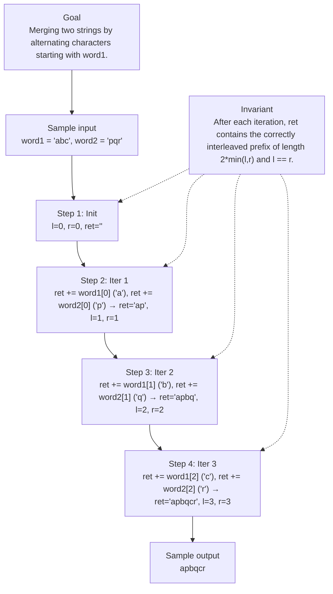

# 1768. Merge Strings Alternately

[View problem on LeetCode](https://leetcode.com/problems/merge-strings-alternately/submissions/2150225288/)

## Solution metadata

- **Difficulty:** Easy
- **Language:** Python3
- **Topics:** Two Pointers, String
- **Solved:** 2026-09-22 21:06 UTC
- **Runtime:** 46 ms
- **Memory:** —
- **Solution:** [Python3](./python/solution.py)

## Problem description

> Problem details captured from [LeetCode](https://leetcode.com/problems/merge-strings-alternately/submissions/2150225288/).

You are given two strings word1 and word2. Merge the strings by adding letters in alternating order, starting with word1. If a string is longer than the other, append the additional letters onto the end of the merged string.
Return the merged string.

## Examples

### Example 1

```text
Input:
word1 = "abc", word2 = "pqr"

Output:
"apbqcr"
```

**Explanation:** The merged string will be merged as so:
word1: a b c
word2: p q r
merged: a p b q c r

### Example 2

```text
Input:
word1 = "ab", word2 = "pqrs"

Output:
"apbqrs"
```

**Explanation:** Notice that as word2 is longer, "rs" is appended to the end.
word1: a b
word2: p q r s
merged: a p b q r s

### Example 3

```text
Input:
word1 = "abcd", word2 = "pq"

Output:
"apbqcd"
```

**Explanation:** Notice that as word1 is longer, "cd" is appended to the end.
word1: a b c d
word2: p q
merged: a p b q c d

## Constraints

- `1 <= word1.length, word2.length <= 100`
- `word1 and word2 consist of lowercase English letters.`

## Interview overview

> Generated from the submitted solution and the official problem details above. Verify AI analysis before relying on it.

Interleave the two strings by walking them with two indices. At each step append the current character from word1 then from word2, advancing both pointers. When one string runs out, append the remainder of the other. This single linear pass yields the merged string.

### Solution replay



### Approach

1. Initialize two pointers l and r at 0 and an empty result string ret.
2. Loop while both l < len(word1) and r < len(word2):
3. Append word1[l] to ret, then word2[r] to ret.
4. Increment both l and r.
5. After the loop, if l < len(word1) append word1[l:] to ret; if r < len(word2) append word2[r:] to ret.
6. Return ret.

### Complexity

- **Time:** O(|word1| + |word2|)
- **Space:** O(|word1| + |word2|) for the output string

### Complexity self-check

- **Verdict:** optimal
- **Intended:** Linear scan merging
- Each character is visited exactly once; no faster algorithm exists because the output itself is O(n+m) long.

### Edge cases

- word1 longer than word2, e.g., word1="abcd", word2="xy" → "axbycd"
- word2 longer than word1, e.g., word1="a", word2="xyz" → "axyz"
- Both strings of length 1, e.g., word1="a", word2="b" → "ab"

_AI-generated with Groq; verify the analysis before relying on it._

## Study guide

Before reopening the solution:

1. Identify why **Two Pointers** fits the problem constraints.
2. State the invariant that makes the algorithm correct.
3. Replay the first example without looking at the implementation.
4. Derive the time and space complexity from the implementation.
5. Name an edge case that would break a weaker approach.

---
_Synced by [LeetRepo](https://github.com/)_

<!-- leetrepo:data:v1
eyJ2ZXJzaW9uIjoxLCJzdWJtaXNzaW9uIjp7ImlkIjoiMTc2OC1tZXJnZS1zdHJpbmdzLWFsdGVybmF0ZWx5IiwibnVtYmVyIjoiMTc2OCIsInRpdGxlIjoiTWVyZ2UgU3RyaW5ncyBBbHRlcm5hdGVseSIsInNsdWciOiJtZXJnZS1zdHJpbmdzLWFsdGVybmF0ZWx5IiwiZGlmZmljdWx0eSI6IkVhc3kiLCJ0YWdzIjpbIlR3byBQb2ludGVycyIsIlN0cmluZyJdLCJsYW5ndWFnZSI6IlB5dGhvbjMiLCJleHRlbnNpb24iOiJweSIsInBhdGgiOiIxNzY4LW1lcmdlLXN0cmluZ3MtYWx0ZXJuYXRlbHkvcHl0aG9uL3NvbHV0aW9uLnB5IiwiY29kZSI6IsKgwqDCoMKgwqDCoMKgwqB3aGlsZcKgbMKgPMKgbGVuKHdvcmQxKcKgYW5kwqBywqA8wqBsZW4od29yZDIpOlxuwqDCoMKgwqDCoMKgwqDCoMKgwqDCoMKgcmV0wqArPcKgd29yZDFbbF1cbsKgwqDCoMKgwqDCoMKgwqDCoMKgwqDCoHJldMKgKz3CoHdvcmQyW3JdXG5cbsKgwqDCoMKgwqDCoMKgwqBpZsKgbMKgPMKgbGVuKHdvcmQxKTpcbsKgwqDCoMKgwqDCoMKgwqDCoMKgwqDCoHJldMKgKz3CoHdvcmQxW2w6XVxuwqDCoMKgwqDCoMKgwqDCoFxuwqDCoMKgwqDCoMKgwqDCoGlmwqBywqA8wqBsZW4od29yZDIpOlxuwqDCoMKgwqDCoMKgwqDCoMKgwqDCoMKgcmV0wqArPcKgd29yZDJbcjpdXG5cbsKgwqDCoMKgwqDCoMKgwqDCoMKgwqDCoGzCoCs9wqAxXG7CoMKgwqDCoMKgwqDCoMKgwqDCoMKgwqBywqArPcKgMVxuwqDCoMKgwqDCoMKgwqDCoHJldHVybsKgcmV0IiwicnVudGltZSI6IjQ2IG1zIiwibWVtb3J5Ijoi4oCUIiwic3RhdHVzIjoiQWNjZXB0ZWQiLCJ1cmwiOiJodHRwczovL2xlZXRjb2RlLmNvbS9wcm9ibGVtcy9tZXJnZS1zdHJpbmdzLWFsdGVybmF0ZWx5L3N1Ym1pc3Npb25zLzIxNTAyMjUyODgvIiwicHJvYmxlbURlc2NyaXB0aW9uIjoiWW91IGFyZSBnaXZlbiB0d28gc3RyaW5ncyB3b3JkMSBhbmQgd29yZDIuIE1lcmdlIHRoZSBzdHJpbmdzIGJ5IGFkZGluZyBsZXR0ZXJzIGluIGFsdGVybmF0aW5nIG9yZGVyLCBzdGFydGluZyB3aXRoIHdvcmQxLiBJZiBhIHN0cmluZyBpcyBsb25nZXIgdGhhbiB0aGUgb3RoZXIsIGFwcGVuZCB0aGUgYWRkaXRpb25hbCBsZXR0ZXJzIG9udG8gdGhlIGVuZCBvZiB0aGUgbWVyZ2VkIHN0cmluZy5cblJldHVybiB0aGUgbWVyZ2VkIHN0cmluZy4iLCJwcm9ibGVtQ29udGV4dCI6IllvdSBhcmUgZ2l2ZW4gdHdvIHN0cmluZ3Mgd29yZDEgYW5kIHdvcmQyLiBNZXJnZSB0aGUgc3RyaW5ncyBieSBhZGRpbmcgbGV0dGVycyBpbiBhbHRlcm5hdGluZyBvcmRlciwgc3RhcnRpbmcgd2l0aCB3b3JkMS4gSWYgYSBzdHJpbmcgaXMgbG9uZ2VyIHRoYW4gdGhlIG90aGVyLCBhcHBlbmQgdGhlIGFkZGl0aW9uYWwgbGV0dGVycyBvbnRvIHRoZSBlbmQgb2YgdGhlIG1lcmdlZCBzdHJpbmcuXG5SZXR1cm4gdGhlIG1lcmdlZCBzdHJpbmcuIiwiZXhhbXBsZXMiOlt7ImlucHV0Ijoid29yZDEgPSBcImFiY1wiLCB3b3JkMiA9IFwicHFyXCIiLCJvdXRwdXQiOiJcImFwYnFjclwiIiwiZXhwbGFuYXRpb24iOiJUaGUgbWVyZ2VkIHN0cmluZyB3aWxsIGJlIG1lcmdlZCBhcyBzbzpcbndvcmQxOiBhIGIgY1xud29yZDI6IHAgcSByXG5tZXJnZWQ6IGEgcCBiIHEgYyByIn0seyJpbnB1dCI6IndvcmQxID0gXCJhYlwiLCB3b3JkMiA9IFwicHFyc1wiIiwib3V0cHV0IjoiXCJhcGJxcnNcIiIsImV4cGxhbmF0aW9uIjoiTm90aWNlIHRoYXQgYXMgd29yZDIgaXMgbG9uZ2VyLCBcInJzXCIgaXMgYXBwZW5kZWQgdG8gdGhlIGVuZC5cbndvcmQxOiBhIGJcbndvcmQyOiBwIHEgciBzXG5tZXJnZWQ6IGEgcCBiIHEgciBzIn0seyJpbnB1dCI6IndvcmQxID0gXCJhYmNkXCIsIHdvcmQyID0gXCJwcVwiIiwib3V0cHV0IjoiXCJhcGJxY2RcIiIsImV4cGxhbmF0aW9uIjoiTm90aWNlIHRoYXQgYXMgd29yZDEgaXMgbG9uZ2VyLCBcImNkXCIgaXMgYXBwZW5kZWQgdG8gdGhlIGVuZC5cbndvcmQxOiBhIGIgYyBkXG53b3JkMjogcCBxXG5tZXJnZWQ6IGEgcCBiIHEgYyBkIn1dLCJleGFtcGxlSW5wdXQiOiJ3b3JkMSA9IFwiYWJjXCIsIHdvcmQyID0gXCJwcXJcIiIsImV4YW1wbGVPdXRwdXQiOiJcImFwYnFjclwiIiwiY29uc3RyYWludHMiOlsiMSA8PSB3b3JkMS5sZW5ndGgsIHdvcmQyLmxlbmd0aCA8PSAxMDAiLCJ3b3JkMSBhbmQgd29yZDIgY29uc2lzdCBvZiBsb3dlcmNhc2UgRW5nbGlzaCBsZXR0ZXJzLiJdLCJoaW50cyI6W10sImZvbGxvd1VwIjoiIiwic29sdmVkQXQiOiIyMDI2LTA5LTIyVDIxOjA2OjI1LjkwOFoiLCJzeW5jZWRBdCI6IjIwMjYtMDktMjJUMjE6MDY6MjUuOTA4WiIsImNvbW1pdFVybCI6IiIsImNvbW1pdFNoYSI6IiIsIm5vdGVzIjoiIiwicmV2aWV3Ijp7InN1bW1hcnkiOiJJbnRlcmxlYXZlIHRoZSB0d28gc3RyaW5ncyBieSB3YWxraW5nIHRoZW0gd2l0aCB0d28gaW5kaWNlcy4gQXQgZWFjaCBzdGVwIGFwcGVuZCB0aGUgY3VycmVudCBjaGFyYWN0ZXIgZnJvbSB3b3JkMSB0aGVuIGZyb20gd29yZDIsIGFkdmFuY2luZyBib3RoIHBvaW50ZXJzLiBXaGVuIG9uZSBzdHJpbmcgcnVucyBvdXQsIGFwcGVuZCB0aGUgcmVtYWluZGVyIG9mIHRoZSBvdGhlci4gVGhpcyBzaW5nbGUgbGluZWFyIHBhc3MgeWllbGRzIHRoZSBtZXJnZWQgc3RyaW5nLiIsImFwcHJvYWNoIjpbIkluaXRpYWxpemUgdHdvIHBvaW50ZXJzIGwgYW5kIHIgYXQgMCBhbmQgYW4gZW1wdHkgcmVzdWx0IHN0cmluZyByZXQuIiwiTG9vcCB3aGlsZSBib3RoIGwgPCBsZW4od29yZDEpIGFuZCByIDwgbGVuKHdvcmQyKToiLCJBcHBlbmQgd29yZDFbbF0gdG8gcmV0LCB0aGVuIHdvcmQyW3JdIHRvIHJldC4iLCJJbmNyZW1lbnQgYm90aCBsIGFuZCByLiIsIkFmdGVyIHRoZSBsb29wLCBpZiBsIDwgbGVuKHdvcmQxKSBhcHBlbmQgd29yZDFbbDpdIHRvIHJldDsgaWYgciA8IGxlbih3b3JkMikgYXBwZW5kIHdvcmQyW3I6XSB0byByZXQuIiwiUmV0dXJuIHJldC4iXSwiY29tcGxleGl0eSI6eyJ0aW1lIjoiTyh8d29yZDF8ICsgfHdvcmQyfCkiLCJzcGFjZSI6Ik8ofHdvcmQxfCArIHx3b3JkMnwpIGZvciB0aGUgb3V0cHV0IHN0cmluZyJ9LCJjb21wbGV4aXR5Q2hlY2siOnsidmVyZGljdCI6Im9wdGltYWwiLCJpbnRlbmRlZCI6IkxpbmVhciBzY2FuIG1lcmdpbmciLCJub3RlIjoiRWFjaCBjaGFyYWN0ZXIgaXMgdmlzaXRlZCBleGFjdGx5IG9uY2U7IG5vIGZhc3RlciBhbGdvcml0aG0gZXhpc3RzIGJlY2F1c2UgdGhlIG91dHB1dCBpdHNlbGYgaXMgTyhuK20pIGxvbmcuIn0sImVkZ2VDYXNlcyI6WyJ3b3JkMSBsb25nZXIgdGhhbiB3b3JkMiwgZS5nLiwgd29yZDE9XCJhYmNkXCIsIHdvcmQyPVwieHlcIiDihpIgXCJheGJ5Y2RcIiIsIndvcmQyIGxvbmdlciB0aGFuIHdvcmQxLCBlLmcuLCB3b3JkMT1cImFcIiwgd29yZDI9XCJ4eXpcIiDihpIgXCJheHl6XCIiLCJCb3RoIHN0cmluZ3Mgb2YgbGVuZ3RoIDEsIGUuZy4sIHdvcmQxPVwiYVwiLCB3b3JkMj1cImJcIiDihpIgXCJhYlwiIl0sInZpc3VhbCI6eyJjb250ZXh0IjoiTWVyZ2luZyB0d28gc3RyaW5ncyBieSBhbHRlcm5hdGluZyBjaGFyYWN0ZXJzIHN0YXJ0aW5nIHdpdGggd29yZDEuIiwiaW5wdXQiOiJ3b3JkMSA9IFwiYWJjXCIsIHdvcmQyID0gXCJwcXJcIiIsImludmFyaWFudCI6IkFmdGVyIGVhY2ggaXRlcmF0aW9uLCByZXQgY29udGFpbnMgdGhlIGNvcnJlY3RseSBpbnRlcmxlYXZlZCBwcmVmaXggb2YgbGVuZ3RoIDIqbWluKGwscikgYW5kIGwgPT0gci4iLCJzdGVwcyI6W3sibGFiZWwiOiJJbml0Iiwic3RhdGUiOiJsPTAsIHI9MCwgcmV0PVwiXCIifSx7ImxhYmVsIjoiSXRlciAxIiwic3RhdGUiOiJyZXQgKz0gd29yZDFbMF0gKCdhJyksIHJldCArPSB3b3JkMlswXSAoJ3AnKSDihpIgcmV0PVwiYXBcIiwgbD0xLCByPTEifSx7ImxhYmVsIjoiSXRlciAyIiwic3RhdGUiOiJyZXQgKz0gd29yZDFbMV0gKCdiJyksIHJldCArPSB3b3JkMlsxXSAoJ3EnKSDihpIgcmV0PVwiYXBicVwiLCBsPTIsIHI9MiJ9LHsibGFiZWwiOiJJdGVyIDMiLCJzdGF0ZSI6InJldCArPSB3b3JkMVsyXSAoJ2MnKSwgcmV0ICs9IHdvcmQyWzJdICgncicpIOKGkiByZXQ9XCJhcGJxY3JcIiwgbD0zLCByPTMifV0sInJlc3VsdCI6ImFwYnFjciJ9LCJnZW5lcmF0ZWRCeSI6Ikdyb3EifSwicmV2aWV3RHVlQXQiOiIyMDI2LTEwLTIyVDIxOjA2OjI1LjkwOFoiLCJsYXN0UmV2aWV3ZWRBdCI6bnVsbCwicmV2aWV3SW50ZXJ2YWxEYXlzIjpudWxsLCJyZXZpZXdDb3VudCI6MCwicmV2aWV3TGFwc2VzIjowLCJsYXN0UmV2aWV3UmF0aW5nIjpudWxsLCJyZXZpZXdFdmVudHMiOltdLCJzb2x1dGlvbnMiOlt7ImtleSI6InB5dGhvbjM6cHkiLCJwYXRoIjoiMTc2OC1tZXJnZS1zdHJpbmdzLWFsdGVybmF0ZWx5L3B5dGhvbi9zb2x1dGlvbi5weSIsImxhbmd1YWdlIjoiUHl0aG9uMyIsImV4dGVuc2lvbiI6InB5IiwiZGlmZmljdWx0eSI6IkVhc3kiLCJjb2RlIjoiwqDCoMKgwqDCoMKgwqDCoHdoaWxlwqBswqA8wqBsZW4od29yZDEpwqBhbmTCoHLCoDzCoGxlbih3b3JkMik6XG7CoMKgwqDCoMKgwqDCoMKgwqDCoMKgwqByZXTCoCs9wqB3b3JkMVtsXVxuwqDCoMKgwqDCoMKgwqDCoMKgwqDCoMKgcmV0wqArPcKgd29yZDJbcl1cblxuwqDCoMKgwqDCoMKgwqDCoGlmwqBswqA8wqBsZW4od29yZDEpOlxuwqDCoMKgwqDCoMKgwqDCoMKgwqDCoMKgcmV0wqArPcKgd29yZDFbbDpdXG7CoMKgwqDCoMKgwqDCoMKgXG7CoMKgwqDCoMKgwqDCoMKgaWbCoHLCoDzCoGxlbih3b3JkMik6XG7CoMKgwqDCoMKgwqDCoMKgwqDCoMKgwqByZXTCoCs9wqB3b3JkMltyOl1cblxuwqDCoMKgwqDCoMKgwqDCoMKgwqDCoMKgbMKgKz3CoDFcbsKgwqDCoMKgwqDCoMKgwqDCoMKgwqDCoHLCoCs9wqAxXG7CoMKgwqDCoMKgwqDCoMKgcmV0dXJuwqByZXQiLCJydW50aW1lIjoiNDYgbXMiLCJtZW1vcnkiOiLigJQiLCJzdGF0dXMiOiJBY2NlcHRlZCIsInNvbHZlZEF0IjoiMjAyNi0wOS0yMlQyMTowNjoyNS45MDhaIiwic3luY2VkQXQiOiIyMDI2LTA5LTIyVDIxOjA2OjI1LjkwOFoiLCJjb21taXRVcmwiOiIiLCJjb21taXRTaGEiOiIiLCJyZXZpZXciOnsic3VtbWFyeSI6IkludGVybGVhdmUgdGhlIHR3byBzdHJpbmdzIGJ5IHdhbGtpbmcgdGhlbSB3aXRoIHR3byBpbmRpY2VzLiBBdCBlYWNoIHN0ZXAgYXBwZW5kIHRoZSBjdXJyZW50IGNoYXJhY3RlciBmcm9tIHdvcmQxIHRoZW4gZnJvbSB3b3JkMiwgYWR2YW5jaW5nIGJvdGggcG9pbnRlcnMuIFdoZW4gb25lIHN0cmluZyBydW5zIG91dCwgYXBwZW5kIHRoZSByZW1haW5kZXIgb2YgdGhlIG90aGVyLiBUaGlzIHNpbmdsZSBsaW5lYXIgcGFzcyB5aWVsZHMgdGhlIG1lcmdlZCBzdHJpbmcuIiwiYXBwcm9hY2giOlsiSW5pdGlhbGl6ZSB0d28gcG9pbnRlcnMgbCBhbmQgciBhdCAwIGFuZCBhbiBlbXB0eSByZXN1bHQgc3RyaW5nIHJldC4iLCJMb29wIHdoaWxlIGJvdGggbCA8IGxlbih3b3JkMSkgYW5kIHIgPCBsZW4od29yZDIpOiIsIkFwcGVuZCB3b3JkMVtsXSB0byByZXQsIHRoZW4gd29yZDJbcl0gdG8gcmV0LiIsIkluY3JlbWVudCBib3RoIGwgYW5kIHIuIiwiQWZ0ZXIgdGhlIGxvb3AsIGlmIGwgPCBsZW4od29yZDEpIGFwcGVuZCB3b3JkMVtsOl0gdG8gcmV0OyBpZiByIDwgbGVuKHdvcmQyKSBhcHBlbmQgd29yZDJbcjpdIHRvIHJldC4iLCJSZXR1cm4gcmV0LiJdLCJjb21wbGV4aXR5Ijp7InRpbWUiOiJPKHx3b3JkMXwgKyB8d29yZDJ8KSIsInNwYWNlIjoiTyh8d29yZDF8ICsgfHdvcmQyfCkgZm9yIHRoZSBvdXRwdXQgc3RyaW5nIn0sImNvbXBsZXhpdHlDaGVjayI6eyJ2ZXJkaWN0Ijoib3B0aW1hbCIsImludGVuZGVkIjoiTGluZWFyIHNjYW4gbWVyZ2luZyIsIm5vdGUiOiJFYWNoIGNoYXJhY3RlciBpcyB2aXNpdGVkIGV4YWN0bHkgb25jZTsgbm8gZmFzdGVyIGFsZ29yaXRobSBleGlzdHMgYmVjYXVzZSB0aGUgb3V0cHV0IGl0c2VsZiBpcyBPKG4rbSkgbG9uZy4ifSwiZWRnZUNhc2VzIjpbIndvcmQxIGxvbmdlciB0aGFuIHdvcmQyLCBlLmcuLCB3b3JkMT1cImFiY2RcIiwgd29yZDI9XCJ4eVwiIOKGkiBcImF4YnljZFwiIiwid29yZDIgbG9uZ2VyIHRoYW4gd29yZDEsIGUuZy4sIHdvcmQxPVwiYVwiLCB3b3JkMj1cInh5elwiIOKGkiBcImF4eXpcIiIsIkJvdGggc3RyaW5ncyBvZiBsZW5ndGggMSwgZS5nLiwgd29yZDE9XCJhXCIsIHdvcmQyPVwiYlwiIOKGkiBcImFiXCIiXSwidmlzdWFsIjp7ImNvbnRleHQiOiJNZXJnaW5nIHR3byBzdHJpbmdzIGJ5IGFsdGVybmF0aW5nIGNoYXJhY3RlcnMgc3RhcnRpbmcgd2l0aCB3b3JkMS4iLCJpbnB1dCI6IndvcmQxID0gXCJhYmNcIiwgd29yZDIgPSBcInBxclwiIiwiaW52YXJpYW50IjoiQWZ0ZXIgZWFjaCBpdGVyYXRpb24sIHJldCBjb250YWlucyB0aGUgY29ycmVjdGx5IGludGVybGVhdmVkIHByZWZpeCBvZiBsZW5ndGggMiptaW4obCxyKSBhbmQgbCA9PSByLiIsInN0ZXBzIjpbeyJsYWJlbCI6IkluaXQiLCJzdGF0ZSI6Imw9MCwgcj0wLCByZXQ9XCJcIiJ9LHsibGFiZWwiOiJJdGVyIDEiLCJzdGF0ZSI6InJldCArPSB3b3JkMVswXSAoJ2EnKSwgcmV0ICs9IHdvcmQyWzBdICgncCcpIOKGkiByZXQ9XCJhcFwiLCBsPTEsIHI9MSJ9LHsibGFiZWwiOiJJdGVyIDIiLCJzdGF0ZSI6InJldCArPSB3b3JkMVsxXSAoJ2InKSwgcmV0ICs9IHdvcmQyWzFdICgncScpIOKGkiByZXQ9XCJhcGJxXCIsIGw9Miwgcj0yIn0seyJsYWJlbCI6Ikl0ZXIgMyIsInN0YXRlIjoicmV0ICs9IHdvcmQxWzJdICgnYycpLCByZXQgKz0gd29yZDJbMl0gKCdyJykg4oaSIHJldD1cImFwYnFjclwiLCBsPTMsIHI9MyJ9XSwicmVzdWx0IjoiYXBicWNyIn0sImdlbmVyYXRlZEJ5IjoiR3JvcSJ9fV0sImtleSI6InB5dGhvbjM6cHkifX0=
leetrepo:data:end -->