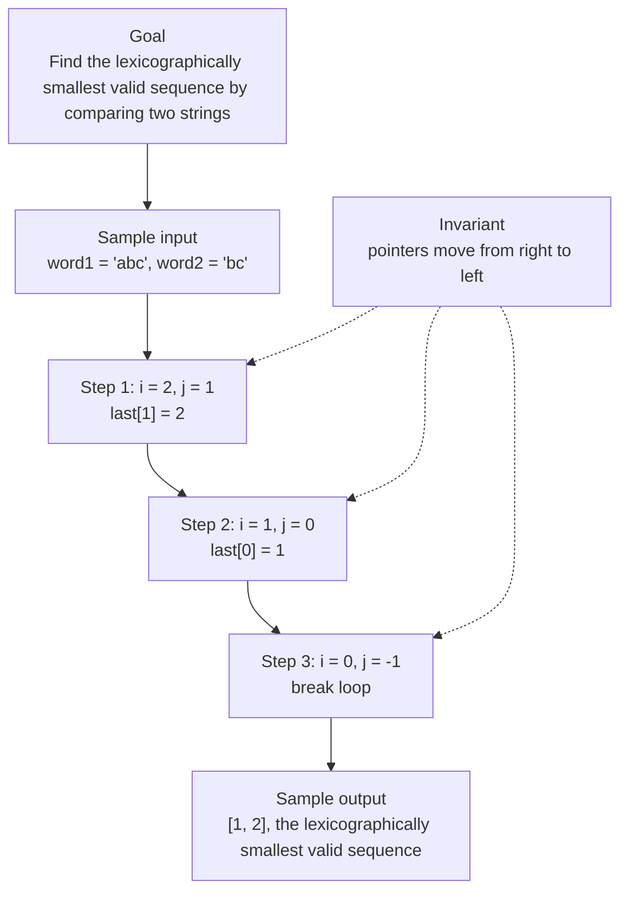

# 3302. Find the Lexicographically Smallest Valid Sequence

[View problem on LeetCode](https://leetcode.com/problems/find-the-lexicographically-smallest-valid-sequence/submissions/2099840524/)

- **Difficulty:** Medium
- **Language:** Python3
- **Solved:** 2026-08-09 03:48 UTC
- **Runtime:** —
- **Memory:** —

## Problem description

You are given two strings word1 and word2.

## Interview overview

**Patterns:** Two-Pointer Technique, String Comparison

This solution finds the lexicographically smallest valid sequence by comparing two input strings. It iterates through the strings from right to left. The goal is to find the longest common suffix.

### Solution replay

### Approach

1. Initialize two pointers at the end of each string
2. Compare characters from right to left and update the last occurrence index
3. Iterate through the second string to construct the result

### Complexity

- **Time:** O(n + m), where n and m are the lengths of the input strings
- **Space:** O(m), for storing the last occurrence index

### Complexity self-check

- **Verdict:** optimal
- **Intended:** O(n + m) time and O(m) space
- linear time complexity is the best for this problem

### Edge cases

- Empty strings
- Strings of different lengths
- Strings with no common characters

_AI-generated with Groq; verify the analysis before relying on it._

---
_Synced by [LeetRepo](https://github.com/)_